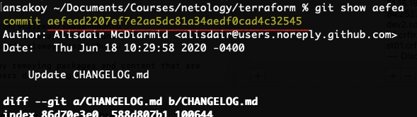
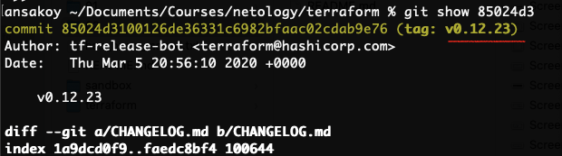
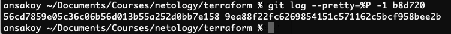
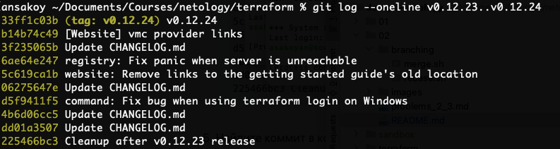
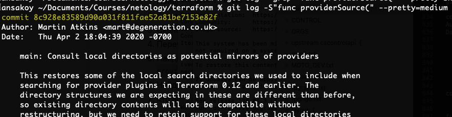
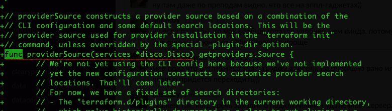
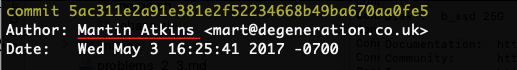
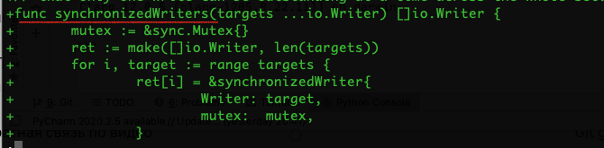

В соответствии с [заданием 2.1](https://github.com/netology-code/sysadm-homeworks/tree/devsys10/02-git-01-vcs), 
был создан [репозиторий на гитхабе](https://github.com/ansakoy/devops-netology)

## Домашнее задание к занятию «2.4. Инструменты Git»
### 2.1
**Задача**: Найдите полный хеш и комментарий коммита, хеш которого начинается на `aefea`  
**Метод**: `git show aefea`  
**Результат**: `aefead2207ef7e2aa5dc81a34aedf0cad4c32545`  


### 2.2
**Задача**: Какому тегу соответствует коммит `85024d3`?  
**Метод**: `git show 85024d3`  
**Результат**: `v0.12.23`  


### 2.3
**Задача**: Сколько родителей у коммита `b8d720`? Напишите их хеши.  
**Метод**: `git log --pretty=%P -1 b8d720`  
**Результат**: `56cd7859e05c36c06b56d013b55a252d0bb7e158`, `9ea88f22fc6269854151c571162c5bcf958bee2b`  


(Можно также использовать `git show -s  b8d720^@` для вывода списка всех родителей коммита)

### 2.4
**Задача**: Перечислите хеши и комментарии всех коммитов которые были сделаны между тегами v0.12.23 и v0.12.24.  
**Метод**: `git log --oneline v0.12.23..v0.12.24`
**Результат**: 
```
33ff1c03b (tag: v0.12.24) v0.12.24
b14b74c49 [Website] vmc provider links
3f235065b Update CHANGELOG.md
6ae64e247 registry: Fix panic when server is unreachable
5c619ca1b website: Remove links to the getting started guide's old location
06275647e Update CHANGELOG.md
d5f9411f5 command: Fix bug when using terraform login on Windows
4b6d06cc5 Update CHANGELOG.md
dd01a3507 Update CHANGELOG.md
225466bc3 Cleanup after v0.12.23 release
```


### 2.5
**Задача**: Найдите коммит в котором была создана функция func providerSource, 
ее определение в коде выглядит так func providerSource(...) 
(вместо троеточего перечислены аргументы).
**Метод**: `git log -S"func providerSource(" --pretty=medium`
**Результат**: `8c928e83589d90a031f811fae52a81be7153e82f`


(+ `git show 8c928e835` - посмотреть, что на самом деле добавилось в коммите)


### 2.6
**Задача**: Найдите все коммиты в которых была изменена функция `globalPluginDirs`.
**Метод**:  
1. `git grep globalPluginDirs` - получить список файлов, в которых встречается название
1. `git log -L :globalPluginDirs:plugins.go --pretty=format:"%h - %s"`
**Результат**: 
Вывод `git grep globalPluginDirs`
```
commands.go:            GlobalPluginDirs: globalPluginDirs(),
commands.go:    helperPlugins := pluginDiscovery.FindPlugins("credentials", globalPluginDirs())
internal/command/cliconfig/config_unix.go:              // FIXME: homeDir gets called from globalPluginDirs during init, before
plugins.go:// globalPluginDirs returns directories that should be searched for
plugins.go:func globalPluginDirs() []string {
```
Скорее всего, функция определяется в плагинах (plugins.go), 
а в командах (commands.go)) только запускается.

Вывод `git log -L :globalPluginDirs:plugins.go --pretty=format:"%h - %s"`:
```
78b122055 - Remove config.go and update things using its aliases
52dbf9483 - keep .terraform.d/plugins for discovery
41ab0aef7 - Add missing OS_ARCH dir to global plugin paths
66ebff90c - move some more plugin search path logic to command
8364383c3 - Push plugin discovery down into command package
```

На всякий случай проверим и для commands.go:
```
% git log -L :globalPluginDirs:commands.go --pretty=format:"%h - %s"
fatal: -L parameter 'globalPluginDirs' starting at line 1: no match
```

### 2.7
**Задача**: Кто автор функции `synchronizedWriters`?  
**Метод**: Найти все коммиты, где функция была добавлена или удалена`git log -S"synchronizedWriters" --oneline`   
Найти из полученных коммитов тот, где функция появляется впервые (`git show`)  
**Результат**:  Martin Atkins  
```
% git log -S"synchronizedWriters" --oneline                               
bdfea50cc remove unused
fd4f7eb0b remove prefixed io
5ac311e2a main: synchronize writes to VT100-faker on Windows
```
```
% git show 5ac311e2a
commit 5ac311e2a91e381e2f52234668b49ba670aa0fe5
Author: Martin Atkins <mart@degeneration.co.uk>
Date:   Wed May 3 16:25:41 2017 -0700
```



