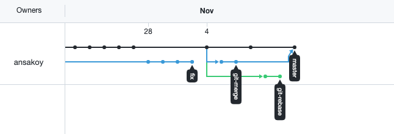
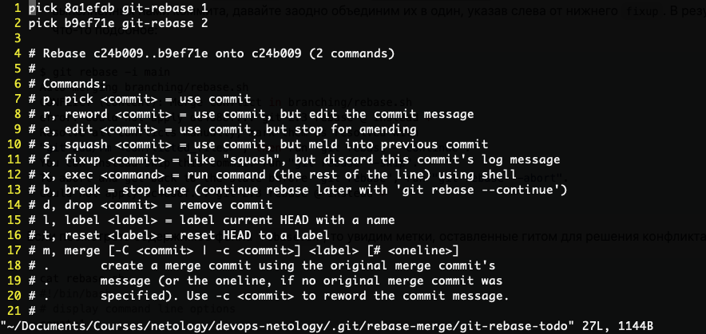
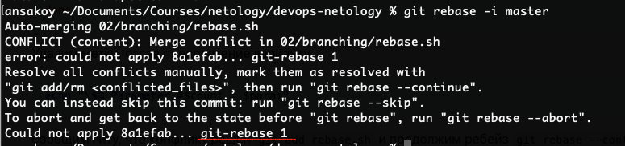
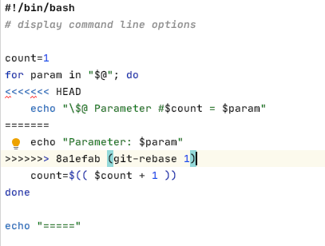
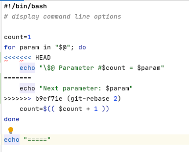
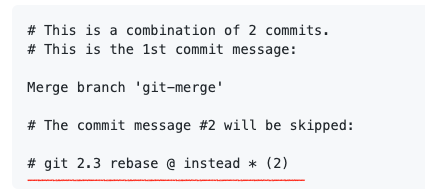
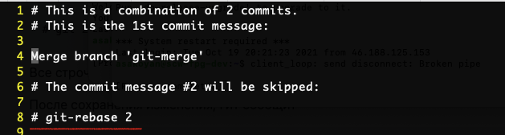
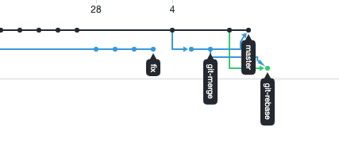
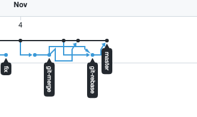

Неожиданности начинаются в финальной части, после ребейза git-rebase на master. 
Во время самого ребейза всё как будто нормально:

Добавляем fixup, где сказано, сохраняем.

(скриншота с фиксапом нет, но фиксап у меня находился вместо pick на второй строке)

После этого мне выдается конфликт, но проблема там не с коммитом `@ instead *`, 
как указано в примере в задаче, а с коммитом `git-rebase 1`

Сам конфликт выглядит идентично тому, что в задании

Дальше имеется второй конфликт, для которого примера в задаче нет, 
но приведенная строка, которую надо выбрать, присутствует.

Выбираем вариант в сответствии с инструкцией, добавляем в индекс, 
делаем git rebase --continue, ребейз состоялся, но в мердж-коммите опять же 
другое содержание, чем в примере:

В примере:

В процессе выполнения задачи:

По итогам пуша в удаленный репозиторий ветки git-rebase получается такая картина:

После этого переключаемся на мастер, мерджим в него git-rebase, 
пушим в удаленный репозиторий и получаем такого монстра:

