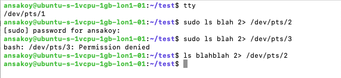
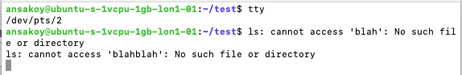
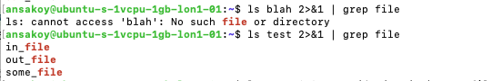
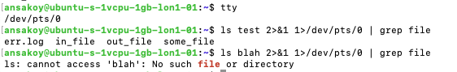

# Домашнее задание к занятию "3.2. Работа в терминале, лекция 2"

### 1. Какого типа команда cd? Попробуйте объяснить, почему она именно такого типа; опишите ход своих мыслей, если считаете что она могла бы быть другого типа.
Проверим тип команды `cd`
```
$ type -a cd
cd is a shell builtin
```
Сравним с типом какой-нибудь другой распространенной команды, например `ls`
```
$ type -a ls
ls is aliased to `ls --color=auto'
ls is /bin/ls
```
Мы видим, что команда `cd` - это встроенная команда shell, так называемый builtin (или internal command - внутренняя команда), 
тогда как команда `ls` - это внешняя по отношению к шеллу команда, которая запускает программу, расположенную по адресу `/bin/ls`.  
Принципиальная разница в том, что запуск внешней команды запускает новый процесс. Этот будет дочерним по отношению 
к процессу шелла. Внутренняя команда шелла не запускает процессов, а работает на уровне процесса самого шелла. 
Задача команды `cd` в том, чтобы менять значение переменной `$PWD`, в которой содержится путь к текущей директории. 
Это переменная среды. Если бы `cd` не была встроенной командой, а запускала новый дочерний процесс, то она бы 
не могла изменить значение переменной в среде, где работает родительский процесс. Однако будучи билтином она может 
это сделать, так как находится на верхнем уровне дерева процессов.  
Можно также отметить, что у встроенных команд нет своих man pages, то есть просмотреть ее возможности с помощью 
`man cd` не получится (вернется сообщение, что такого мануала нет). Чтобы просмотреть документацию по этой команде 
и иным аналогичным, нужно открыть мануал того шелла, к которому она относится.

### 2. Какая альтернатива без pipe команде grep <some_string> <some_file> | wc -l? man grep поможет в ответе на этот вопрос. Ознакомьтесь с [документом](http://www.smallo.ruhr.de/award.html) о других подобных некорректных вариантах использования pipe.
Команда `grep <some_string> <some_file> | wc -l`, по всей видимости, имеет целью посчитать в файле `some_file` 
число строк, где есть выражение `some_string`. Это выражение можно упростить, используя возможности самого `grep`, то есть 
не передавая данные новому процессу `wc -l`:
```
grep -c <some_string> <some_file>
```
Пример:
```
$ printf "some string\nblah\nhey there\nhere's some string\nand another string" > some_file
$ cat some_file 
some string
blah
hey there
here's some string
$ grep "some string" some_file | wc -l
2
$ grep -c "some string" some_file
2
```
### 3. Какой процесс с PID 1 является родителем для всех процессов в вашей виртуальной машине Ubuntu 20.04?
**Ответ**: `systemd`

Способы это выяснить:

Через `pstree`
```
$ pstree -p 1
systemd(1)─┬─accounts-daemon(697)─┬─{accounts-daemon}(702)
           │                      └─{accounts-daemon}(766)
           ├─agetty(765)
           ├─agetty(781)
           ├─atd(719)
           ├─cron(704)
           ├─dbus-daemon(705)
...
```

Через `ps`
```
$ ps -p 1
    PID TTY          TIME CMD
      1 ?        00:00:02 systemd
```

В принципе через `top` тоже можно увидеть.

### 4. Как будет выглядеть команда, которая перенаправит вывод stderr ls на другую сессию терминала?
В локальном варианте, где возможно переключение между сессиями tty с помощью сочетания `[CTRL] + ALT + Fn`, 
команда будет выглядеть так:
```
ls <dir_name> 2> /dev/tty<id>
# Например:
ls blah 2> /dev/tty4
```
При этом сессия, в которую происходит редирект, должна быть открыта, иначе вернется `Permission denied`.
На удаленной машине, с которой взаимодействие происходит посредством псевдотерминала, аналогичная ситуация. 
Сессия, в которую происходит перенаправление, должна быть открыта. Используем команду редиректа:
```
ls <dir_name> 2> /dev/pts/<id>
# Например:
ls blah 2> /dev/pts/2
```



### 5. Получится ли одновременно передать команде файл на stdin и вывести ее stdout в другой файл? Приведите работающий пример.
```
$ printf "this is some text" > in_file  # Создаем файл, который будем использовать в качестве инпута
$ wc -w < in_file > out_file  # Считаем, сколько в нем слов и передаем результат в другой файл
$ cat out_file  # Проверяем, что получилось
4
```
NB: разница результата с ситуацией, когда мы редиректим в новый файл команду `wc -w` без редиректа инпута:
```
$ wc -w in_file > out_file 
$ cat out_file
4 in_file
``` 
### 6. Получится ли вывести находясь в графическом режиме данные из PTY в какой-либо из эмуляторов TTY? Сможете ли вы наблюдать выводимые данные?
При условии, что в эмуляторе TTY, куда происходит вывод, открыта сессия, редирект работает, и результат 
можно наблюдать, перейдя в эту сессию из графического режима (например, `CTRL + ALT + F2`).
### 7. Выполните команду `bash 5>&1`. К чему она приведет? Что будет, если вы выполните `echo netology > /proc/$$/fd/5`? Почему так происходит?
Команда `bash 5>&1` приведет к созданию нового файлового дескриптора 5. Вывод этого дескриптора производится туда же, 
куда выводится результат с дескриптором 1, то есть stdout. В результате `echo netology > /proc/$$/fd/5` 
приведет к тому, что слово `netology` выведется в терминале:
```
$ bash 5>&1
$ echo netology > /proc/$$/fd/5
netology
```
Механизм:
* `echo` выводит слово "netology"
* результат этого вывода отправляется в созданный файл дескриптора /proc/$$/fd/5
* результат выводится туда же, куда выводится результат stdout, в данном случае по умолчанию в терминал
### 8. Получится ли в качестве входного потока для pipe использовать только stderr команды, не потеряв при этом отображение stdout на pty?
Исходная ситуация:
```console
$ ls blah | grep directory
ls: cannot access 'blah': No such file or directory  # grep не срабатывает, просто возвращается сообщение
$ ls test | grep out
**out**_file  # для сравнения - ожидаемый результат при передаче в пайп stdout, out подсвечивается
```

Попробуем передать stderr туда же, куда выводится stdout:
```
$ ls blah 2>&1 | grep file
ls: cannot access 'blah': No such **file** or directory  # Ожидаемый результат, out подсвечивается
$ ls test 2>&1 | grep file  # Но и сообщение в stdout теперь тоже передается через pipe и подвечивается
in_**file**
out_**file**
some_**file**
```

Нужно сделать так, чтобы сообщение stderr передавалось в пайп и работало как предполагается, 
а сообщение stdout работало как обычно. Попробуем добавить сначала передать stderr туда же, куда идет stdout, 
а потом вывести только значение stdout в текущую сессию
```
$ tty  # Определяем текущий псевдотерминал
/dev/pts/0
$ ls test 2>&1 1>/dev/pts/0 | grep file  # Проверяем поведение stdout - корректно выводится в терминал
err.log  in_file  out_file  some_file
$ ls blah 2>&1 1>/dev/pts/0 | grep file
ls: cannot access 'blah': No such **file** or directory  # проверяем поведение stderr - корректно передается в pipe
```

Механизм:
* Выполняется команда ls <название директории>
* Если возвращается stderr, то он передается в файл с дескриптором stdout и направляется в pipe
* Если возвращается stdout, то поток передается в текущий терминал

> На самом деле можно было использовать `grep -o` для вывода только тех значений, которые 
> подошли под паттерн
### 9. Что выведет команда `cat /proc/$$/environ`? Как еще можно получить аналогичный по содержанию вывод?
Команда выводит переменные среды текущего шелла и их значения. Аналогичный вывод можно получить, например, 
с помощью команды `printenv`.
### 10. Используя man, опишите что доступно по адресам /proc/<PID>/cmdline, /proc/<PID>/exe.
`man proc`
`/proc/[pid]/cmdline` - это файл, доступный только для чтения. В нем содержится полная команда, 
запустившая процесс. Например:
```
$ cat /proc/1/cmdline
/sbin/init
```
Если процесс зомби, то файл пуст.

`/proc/[pid]/exe` - это символическая ссылка, содержащая реальный путь запущенной команды. Если ввести 
этот адрес в терминале, он повторно вызовет соответствующую команду, открыв новый процесс.

### 11. Узнайте, какую наиболее старшую версию набора инструкций SSE поддерживает ваш процессор с помощью /proc/cpuinfo.
Используем `grep`
```
grep sse  /proc/cpuinfo
```
Выявленные совпадения:
```
sse
sse2
sse4_1
sse4_2
```
Немного смутила терминология. По-русски вроде бы "старший" == "более старый". Англоязычный аналог установить не могу 
- периодически в наиболее близких контекстах встречается "major", но складывается впечатление, что это слово 
скорее описывает позицию в паттерне версионирования (Major.Minor.Patch). При этом первое впечатление от вопроса - 
как будто требуется найти самую последнюю (новую, свежую) версию. По всей видимости, самая новая здесь SSE4.2, а самая старая - 
вероятно, SSE.
### 12. При открытии нового окна терминала и vagrant ssh создается новая сессия и выделяется pty. Это можно подтвердить командой tty, которая упоминалась в лекции 3.2. Однако:
```
vagrant@netology1:~$ ssh localhost 'tty'
not a tty
```
> Почитайте, почему так происходит, и как изменить поведение.

В `man ssh` есть описание флага -t, который позволяет принудительно назначить псевдотерминал.
### 13. Бывает, что есть необходимость переместить запущенный процесс из одной сессии в другую. Попробуйте сделать это, воспользовавшись reptyr. Например, так можно перенести в screen процесс, который вы запустили по ошибке в обычной SSH-сессии.
Устанавливаем reptyr (`sudo apt install reptyr`).  
Запускаем в ssh без скрина [скрипт](timer.py), который распечатывает раз в 5 секунд число, инкрементируя каждый раз на 
единицу:
```
$ python3 timer.py
0
1
```
Приостанавливаем процесс:
```
# ^Z
[1]+  Stopped                 python3 timer.py
```
Смотрим его PID:
```
$ jobs -l
[1]+ 32004 Stopped                 python3 timer.py
```
В другом окне, залогинившись из-под рута, в соответствии с инструкцией reptyr, смягчаем меры безопасности,
описанные в /etc/sysctl.d/10-ptrace.conf:
```
# echo 0 > /proc/sys/kernel/yama/ptrace_scope
```
Запускаем `screen -DRU`, вызываем в появившуюся вкладку процесс по PID
```
$ reptyr 32004
2
 3
  4
   5
    6
     7
      8
       9
        10
          11
            12
              13
```
Процесс возобновился в новой сессии с того места, на котором был приостановлен 
(правда, значения распечатываются теперь немного странно).  
Осталось понять, насколько критична замена значения /proc/sys/kernel/yama/ptrace_scope с 1 на 0 на нетестовом сервере.

### 14. sudo echo string > /root/new_file не даст выполнить перенаправление под обычным пользователем, так как перенаправлением занимается процесс shell'а, который запущен без sudo под вашим пользователем. Для решения данной проблемы можно использовать конструкцию echo string | sudo tee /root/new_file. Узнайте что делает команда tee и почему в отличие от sudo echo команда с sudo tee будет работать.
`tee` берет данные из stdin и выводит их в stdout. Это команда, запускающая процесс:
```
$ type -a tee
tee is /usr/bin/tee
```
`echo` - билтин баша.
```
$ type -a echo
echo is a shell builtin
```
Баш в данной сессии был запущен не из-под рута, а т.к. `echo` не создаст нового процесса, а просто попытается 
выполнить задачу внутри текущего процесса, и прав на запись в файл в этой директории у нее не будет. 
`tee`, в свою очередь, создаст новый процесс, уже от лица суперюзера, и у этого процесса уже есть необходимые права.  
В первом примере имеет место попытка записать вывод echo напрямую в /root/new_file, что не подразумевается 
текущими правами.  
Во втором примере `echo` передает строку через пайп в `tee`, запущенный от лица суперюзера, а `tee` уже передает 
значение в файл.