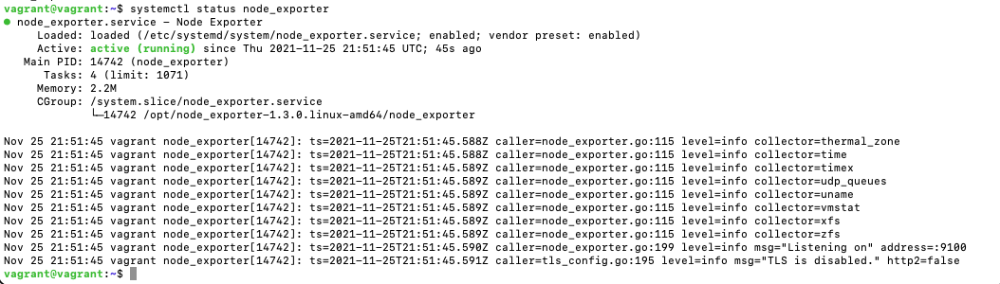
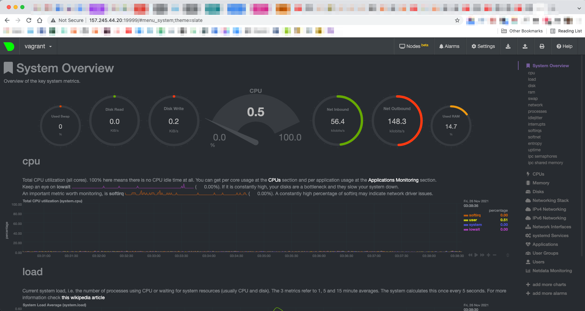
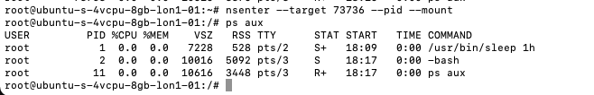
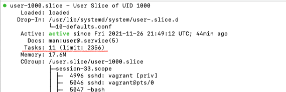
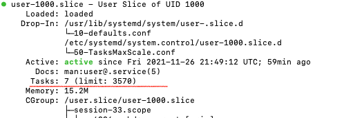

# Домашнее задание к занятию "3.4. Операционные системы, лекция 2"
[Источник](https://github.com/netology-code/sysadm-homeworks/tree/master/03-sysadmin-04-os)

### 1. На лекции мы познакомились с node_exporter. В демонстрации его исполняемый файл запускался в background. Этого достаточно для демо, но не для настоящей production-системы, где процессы должны находиться под внешним управлением. Используя знания из лекции по systemd, создайте самостоятельно простой unit-файл для node_exporter
Устанавливаем в соответствии с [указаниями](https://prometheus.io/docs/guides/node-exporter/), выбрав нужную 
версию на [соответствующей странице](https://prometheus.io/download/#node_exporter):
```
# Скачиваем
wget https://github.com/prometheus/node_exporter/releases/download/v1.3.0/node_exporter-1.3.0.linux-amd64.tar.gz

# Распаковываем
tar xvfz node_exporter-1.3.0.linux-amd64.tar.gz

# Переходим в директорию
cd node_exporter-1.3.0.linux-amd64

# Проверяем запуск
./node_exporter

curl localhost:9100/metrics
```

Пока node_exporter в домашней директории, что нехорошо. Переместим его в /opt в соответствии 
с [рекомендациями](https://nsrc.org/workshops/2021/sanog37/nmm/netmgmt/en/prometheus/ex-node-exporter.htm):
```
sudo mv node_exporter-1.3.0.linux-amd64 /opt
```

#### поместите его в автозагрузку, предусмотрите возможность добавления опций к запускаемому процессу через внешний файл (посмотрите, например, на `systemctl cat cron`)
Создадим [внешний файл](node_exporter) для добавления опций
```
sudo vim /etc/default/node_exporter
```
Создадим [юнит-файл](node_exporter.service) для systemd
```
sudo vim /etc/systemd/system/node_exporter.service
```
Содержание:
```
[Unit]
Description=Node Exporter

[Service]
EnvironmentFile=/etc/default/node_exporter
ExecStart=/opt/node_exporter-1.3.0.linux-amd64/node_exporter $OPTIONS

[Install]
WantedBy=multi-user.target
```
#### удостоверьтесь, что с помощью systemctl процесс корректно стартует, завершается, а после перезагрузки автоматически поднимается
```systemctl status node_exporter```
Получаем сообщение об ошибке:
```
Active: failed (Result: exit-code) since Thu 2021-11-25 21:45:53 UTC; 1min 16s ago
...
Nov 25 21:45:53 vagrant node_exporter[14658]: ts=2021-11-25T21:45:53.853Z caller=node_exporter.go:202 level=error err="listen tcp :9100: bind: address already in use
```
Подозреваем, что это продолжает работать запущенный ради проверки node_exporter. И точно:
```
vagrant@vagrant:~$ ps aux | grep node_exporter
vagrant    12771  0.0  1.5 717372 15460 pts/1    Sl+  Nov21   0:11 ./node_exporter
vagrant    14708  0.0  0.0   9032   724 pts/0    R+   21:49   0:00 grep --color=auto node_exporter
vagrant@vagrant:~$ kill 12771  # Убиваем старый процесс
```
Перезапускаем сервис, проверяем порт:
```
vagrant@vagrant:~$ sudo systemctl restart node_exporter
vagrant@vagrant:~$ sudo lsof -i:9100
COMMAND     PID USER   FD   TYPE DEVICE SIZE/OFF NODE NAME
node_expo 14742 root    3u  IPv6 135995      0t0  TCP *:9100 (LISTEN)
```
Действительно, запустился:


Перезагружаем систему `sudo reboot`. Проверяем `systemctl status node_exporter` - `Active: active (running)`.

Проверяем `stop` и `start`
```
vagrant@vagrant:~$ sudo systemctl stop node_exporter
vagrant@vagrant:~$ sudo systemctl status node_exporter
● node_exporter.service - Node Exporter
     Loaded: loaded (/etc/systemd/system/node_exporter.service; enabled; vendor preset: enabled)
     Active: inactive (dead) since Thu 2021-11-25 22:28:19 UTC; 8s ago
    Process: 599 ExecStart=/opt/node_exporter-1.3.0.linux-amd64/node_exporter $OPTIONS (code=killed, signal=TERM)
   Main PID: 599 (code=killed, signal=TERM)

[...]
Nov 25 22:28:19 vagrant systemd[1]: Stopping Node Exporter...
Nov 25 22:28:19 vagrant systemd[1]: node_exporter.service: Succeeded.
Nov 25 22:28:19 vagrant systemd[1]: Stopped Node Exporter.
vagrant@vagrant:~$ sudo systemctl start node_exporter
vagrant@vagrant:~$ sudo systemctl status node_exporter
● node_exporter.service - Node Exporter
     Loaded: loaded (/etc/systemd/system/node_exporter.service; enabled; vendor preset: enabled)
     Active: active (running) since Thu 2021-11-25 22:28:49 UTC; 2s ago
   Main PID: 1027 (node_exporter)
      Tasks: 4 (limit: 1071)
     Memory: 2.4M
     CGroup: /system.slice/node_exporter.service
             └─1027 /opt/node_exporter-1.3.0.linux-amd64/node_exporter

[...]
Nov 25 22:28:49 vagrant node_exporter[1027]: ts=2021-11-25T22:28:49.109Z caller=node_exporter.go:199 level=info msg="Listening on" address=:9100
Nov 25 22:28:49 vagrant node_exporter[1027]: ts=2021-11-25T22:28:49.110Z caller=tls_config.go:195 level=info msg="TLS is disabled." http2=false
```

### 2. Ознакомьтесь с опциями node_exporter и выводом `/metrics` по-умолчанию. Приведите несколько опций, которые вы бы выбрали для базового мониторинга хоста по CPU, памяти, диску и сети.
```
curl localhost:9100/metrics | grep node_cpu | less
curl localhost:9100/metrics | grep node_memory | less
curl localhost:9100/metrics | grep node_disk | less
curl localhost:9100/metrics | grep node_network | less
```
* node_cpu_seconds_total
* node_memory_Buffers_bytes
* node_memory_Cached_bytes
* node_memory_MemAvailable_bytes
* node_memory_MemFree_bytes
* node_memory_MemTotal_bytes
* node_disk_io_now
* node_disk_io_time_weighted_seconds_total
* node_disk_read_time_seconds_total
* node_disk_reads_completed_total
* node_network_receive_bytes_total
* node_network_receive_packets_total

Также может быть познавательно:
* node_load15 (средняя нагрузка за 15 минут)

### 3. Установите в свою виртуальную машину [Netdata](https://github.com/netdata/netdata). Воспользуйтесь [готовыми пакетами](https://packagecloud.io/netdata/netdata/install) для установки (`sudo apt install -y netdata`)
> в конфигурационном файле `/etc/netdata/netdata.conf` в секции \[web\] замените значение с localhost на `bind to = 0.0.0.0`

В полученном по итогам установки [файле](netdata.conf) `/etc/netdata/netdata.conf` секции \[web\] не обнаружено, 
есть секция \[global\], привязываем там.

Обновленный [Vagrantfile](Vagrantfile)

> После успешной перезагрузки в браузере на своем ПК (не в виртуальной машине) вы должны суметь зайти на `localhost:19999`. Ознакомьтесь с метриками, которые по умолчанию собираются Netdata и с комментариями, которые даны к этим метрикам

Т.к. дело происходит на удаленной машине, через браузер с локального компьютера подключаемся по 
адресу `<IP-адрес сервера>:19999`.



### 4. Можно ли по выводу `dmesg` понять, осознает ли ОС, что загружена не на настоящем оборудовании, а на системе виртуализации?
[Полезная ссылка](https://www.dmo.ca/blog/detecting-virtualization-on-linux/)  
По выводу можно понять, что ОС осознает.
```
# На виртуальной машине
$ dmesg | grep -i virtual
[    0.000000] DMI: innotek GmbH VirtualBox/VirtualBox, BIOS VirtualBox 12/01/2006
[    0.019209] CPU MTRRs all blank - virtualized system.
[    2.044184] Booting paravirtualized kernel on KVM
[    8.225130] systemd[1]: Detected virtualization oracle.

# На VPS
$ dmesg | grep -i virtual
[    0.134603] Booting paravirtualized kernel on KVM
[    1.526478] input: VirtualPS/2 VMware VMMouse as /devices/platform/i8042/serio1/input/input4
[    1.531309] input: VirtualPS/2 VMware VMMouse as /devices/platform/i8042/serio1/input/input3
[    3.779298] systemd[1]: Detected virtualization kvm.
```

Другой вариант:
```
$ sudo lshw -class system

# Виртуальная машина внутри ОС
vagrant                     
    description: Computer
    product: VirtualBox
    vendor: innotek GmbH
    version: 1.2
    serial: 0
    width: 64 bits
    capabilities: smbios-2.5 dmi-2.5 smp vsyscall32
    configuration: family=Virtual Machine uuid=C9C27642-E74C-934C-8BFC-1CF35FDE83E2

# Сам VPS
ubuntu-s-4vcpu-8gb-lon1-01  
    description: Computer
    product: Droplet
    vendor: DigitalOcean
    version: 20171212
    serial: 274700148
    width: 64 bits
    capabilities: smbios-2.4 dmi-2.4 smp vsyscall32
    configuration: boot=normal family=DigitalOcean_Droplet uuid=B033EA69-42AB-4C2A-A0D8-57438E0778EF
  *-pnp00:00
       product: PnP device PNP0b00
       physical id: 1
       capabilities: pnp
       configuration: driver=rtc_cmos
```
### 5. Как настроен sysctl fs.nr_open на системе по-умолчанию? Узнайте, что означает этот параметр. Какой другой существующий лимит не позволит достичь такого числа (ulimit --help)?
[Документация](https://www.kernel.org/doc/Documentation/sysctl/fs.txt)

Параметр `nr_open` означает максимальное число файловых дескрипторов, которые может открыть процесс. По умолчанию, 
это 1024*1024 (1048576). И действительно:
```
$ cat /proc/sys/fs/nr_open
1048576
```
Другой существующий лимит можно посмотреть командой `ulimit -n	# the maximum number of open file descriptors`:
```
$ ulimit -n
1024
```
### 6. Запустите любой долгоживущий процесс (не `ls`, который отработает мгновенно, а, например, `sleep 1h`) в отдельном неймспейсе процессов; покажите, что ваш процесс работает под PID 1 через `nsenter`. Для простоты работайте в данном задании под `root (sudo -i)`. Под обычным пользователем требуются дополнительные опции (`--map-root-user`) и т.д.
Запускаем процесс:
```
$ screen -DRU
$ unshare -f --pid --mount-proc /usr/bin/sleep 1h
```
В другом окне скрина видим, что процесс работает под PID 73736:
```
$ ps aux
...
root       73736  0.0  0.0   7228   528 pts/2    S+   18:09   0:00 /usr/bin/sleep 1h
...
```
Заходим в неймспейс и смотрим PID процесса



### 7. Найдите информацию о том, что такое `:(){ :|:& };:`. Запустите эту команду в своей виртуальной машине Vagrant с Ubuntu 20.04 (это важно, поведение в других ОС не проверялось). Некоторое время все будет "плохо", после чего (минуты) – ОС должна стабилизироваться. Вызов `dmesg` расскажет, какой механизм помог автоматической стабилизации. Как настроен этот механизм по-умолчанию, и как изменить число процессов, которое можно создать в сессии?
`:(){ :|:& };:` - это bash-функция, так называемая fork bomb, которая запускает процесс, рекурсивно вызывающий клоны самого себя. 
В мирной жизни используется для тестирования процессных ограничений, которые задаются в `/etc/security/limits.conf`. 
Функция `:` состоит в том, что она передает себя через пайп себе же. В более человекочитаемом виде 
ее можно представить так:
```
fork_bomb() { 
 fork_bomb | fork_bomb &
}; fork_bomb
```
[Запуск форк-бомбы - скринкаст](https://www.youtube.com/watch?v=4yLhbNMRoDo)

Вывод `dmesg` гласит:
```
cgroup: fork rejected by pids controller in /user.slice/user-1000.slice/session-33.scope
```
Systemd для каждого пользователя создает cgroup, к которой относятся все запускаемые им процессы. 
Этот механизм ограничивает использование системных ресурсов, в том числе максимальное число процессов и потоков (задач).  
Просмотр установленных ограничений:
```
$ systemctl status user-$UID.slice
```


По умолчанию пользователю выделяется 33% от максимального числа задач в системе:
```
$ cat /usr/lib/systemd/system/user-.slice.d/10-defaults.conf

[Unit]
Description=User Slice of UID %j
Documentation=man:user@.service(5)
After=systemd-user-sessions.service
StopWhenUnneeded=yes

[Slice]
TasksMax=33%
```

В данном случае максимальное число задач таково:
```
$ sysctl kernel.threads-max
kernel.threads-max = 7142
```

Один из способов изменить число задач для пользователя - создать кастомный файл специально для 
этого пользователя:
```
# Поставим себе 50% от максимального числа задач

sudo systemctl set-property user-$UID.slice TasksMax=50%
```
В результате создан файл `/etc/systemd/system.control/user-1000.slice.d/50-TasksMaxScale.conf`, содержащий 
кастомный лимит. Проверяем (`systemctl status user-$UID.slice`):  

