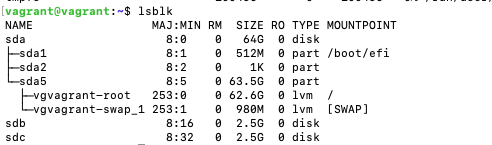
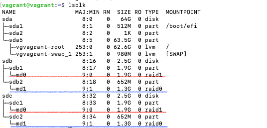
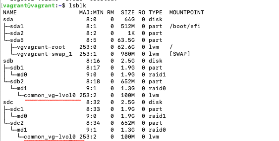
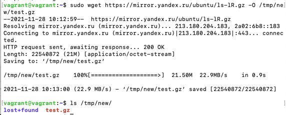
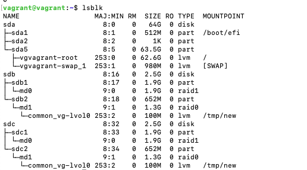
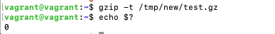
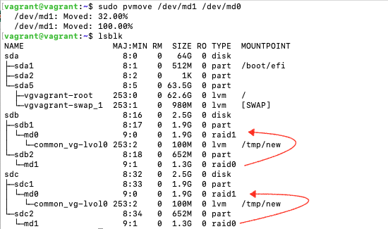
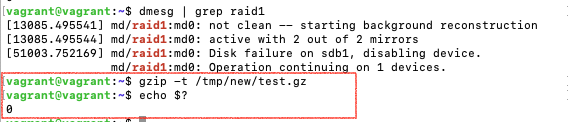
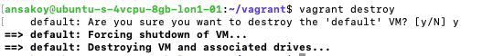

# Домашнее задание к занятию "3.5. Файловые системы"
[Источник](https://github.com/netology-code/sysadm-homeworks/tree/devsys10/03-sysadmin-05-fs)

### 1. Узнайте о [sparse](https://ru.wikipedia.org/wiki/%D0%A0%D0%B0%D0%B7%D1%80%D0%B5%D0%B6%D1%91%D0%BD%D0%BD%D1%8B%D0%B9_%D1%84%D0%B0%D0%B9%D0%BB) (разряженных) файлах.
Sparse-файлы - это разновидность файла, где пустые части (последовательности нулевых битов) не занимают дисковое 
пространство, а хранятся в метаданных. За счет этого физический размер файла может быть существенно меньше 
логического размера, что позволяет экономить дисковое пространство без затрат на распаковку и сжатие, 
которые имеют место в случае с архивными файлами. Проблема со sparse-файлами может быть в том, что поведение 
файловой системы по отношению к ним может быть непредсказуемым, а получаемые о них сведения - неверными. 
Еще одна проблема в том, что если ПО поддерживает работу с такими файлами, то она может взять в работу 
полный (физический) объем такого файла.  
Создание sparse-файла (Linux):
```
dd of=sparse-file bs=5M seek=1 count=0
```
Или
```
truncate -s 5M <filename>
```
Преобразование обычного файла в sparse:
```
fallocate -d <filename>
```
### 2. Могут ли файлы, являющиеся жесткой ссылкой на один объект, иметь разные права доступа и владельца? Почему?
Нет, потому что жесткие ссылки - это просто разные названия одного и того же файла (объекта), и имеют все свойства 
этого объекта. Если изменить права доступа, используя имя одной жесткой ссылки, это изменит права доступа к 
самому файлу, и другие жесткие ссылки на него тоже будут иметь соответствующие измененные права доступа.
### 3. Сделайте `vagrant destroy` на имеющийся инстанс Ubuntu. Замените содержимое Vagrantfile [следующим](Vagrantfile). Данная конфигурация создаст новую виртуальную машину с двумя дополнительными неразмеченными дисками по 2.5 Гб.
Результат:  



**NB**: 
```
$ ls -l /dev/sdb
brw-rw---- 1 root disk 8, 16 Nov 27 23:30 /dev/sdb
```
Префикс `b-` - block special file
### 4. Используя `fdisk`, разбейте первый диск на 2 раздела: 2 Гб, оставшееся пространство.
Смотрим, что есть:
```
sudo fdisk -l
Disk /dev/sda: 64 GiB, 68719476736 bytes, 134217728 sectors
Disk model: VBOX HARDDISK   
Units: sectors of 1 * 512 = 512 bytes
Sector size (logical/physical): 512 bytes / 512 bytes
I/O size (minimum/optimal): 512 bytes / 512 bytes
Disklabel type: dos
Disk identifier: 0x3f94c461

Device     Boot   Start       End   Sectors  Size Id Type
/dev/sda1  *       2048   1050623   1048576  512M  b W95 FAT32
/dev/sda2       1052670 134215679 133163010 63.5G  5 Extended
/dev/sda5       1052672 134215679 133163008 63.5G 8e Linux LVM


Disk /dev/sdb: 2.51 GiB, 2684354560 bytes, 5242880 sectors
Disk model: VBOX HARDDISK   
Units: sectors of 1 * 512 = 512 bytes
Sector size (logical/physical): 512 bytes / 512 bytes
I/O size (minimum/optimal): 512 bytes / 512 bytes


Disk /dev/sdc: 2.51 GiB, 2684354560 bytes, 5242880 sectors
Disk model: VBOX HARDDISK   
Units: sectors of 1 * 512 = 512 bytes
Sector size (logical/physical): 512 bytes / 512 bytes
I/O size (minimum/optimal): 512 bytes / 512 bytes


Disk /dev/mapper/vgvagrant-root: 62.55 GiB, 67150807040 bytes, 131153920 sectors
Units: sectors of 1 * 512 = 512 bytes
Sector size (logical/physical): 512 bytes / 512 bytes
I/O size (minimum/optimal): 512 bytes / 512 bytes


Disk /dev/mapper/vgvagrant-swap_1: 980 MiB, 1027604480 bytes, 2007040 sectors
Units: sectors of 1 * 512 = 512 bytes
Sector size (logical/physical): 512 bytes / 512 bytes
I/O size (minimum/optimal): 512 bytes / 512 bytes
```
Создаем разделы:
```
$ sudo fdisk /dev/sdb

Welcome to fdisk (util-linux 2.34).
Changes will remain in memory only, until you decide to write them.
Be careful before using the write command.

Device does not contain a recognized partition table.
Created a new DOS disklabel with disk identifier 0x90a66468.

Command (m for help): n
Partition type
   p   primary (0 primary, 0 extended, 4 free)
   e   extended (container for logical partitions)
Select (default p): p
Partition number (1-4, default 1): 1
First sector (2048-5242879, default 2048): 2048
Last sector, +/-sectors or +/-size{K,M,G,T,P} (2048-5242879, default 5242879): +2GB

Created a new partition 1 of type 'Linux' and of size 1.9 GiB.

Command (m for help): n
Partition type
   p   primary (1 primary, 0 extended, 3 free)
   e   extended (container for logical partitions)
Select (default p): p
Partition number (2-4, default 2): 2
First sector (3907584-5242879, default 3907584): 3907584
Last sector, +/-sectors or +/-size{K,M,G,T,P} (3907584-5242879, default 5242879): 5242879

Created a new partition 2 of type 'Linux' and of size 652 MiB.

Command (m for help): w
The partition table has been altered.
Calling ioctl() to re-read partition table.
Syncing disks.
```
Проверяем:
```
sudo fdisk -l
...
Disk /dev/sdb: 2.51 GiB, 2684354560 bytes, 5242880 sectors
Disk model: VBOX HARDDISK   
Units: sectors of 1 * 512 = 512 bytes
Sector size (logical/physical): 512 bytes / 512 bytes
I/O size (minimum/optimal): 512 bytes / 512 bytes
Disklabel type: dos
Disk identifier: 0x90a66468

Device     Boot   Start     End Sectors  Size Id Type
/dev/sdb1          2048 3907583 3905536  1.9G 83 Linux
/dev/sdb2       3907584 5242879 1335296  652M 83 Linux
...
```
### 5. Используя `sfdisk`, перенесите данную таблицу разделов на второй диск.
Создаем дамп таблицы с одного диска и перенаправляем его в `sfdisk` на втором диске:
```
$ sudo sfdisk --dump /dev/sdb | sudo sfdisk /dev/sdc
Checking that no-one is using this disk right now ... OK

Disk /dev/sdc: 2.51 GiB, 2684354560 bytes, 5242880 sectors
Disk model: VBOX HARDDISK   
Units: sectors of 1 * 512 = 512 bytes
Sector size (logical/physical): 512 bytes / 512 bytes
I/O size (minimum/optimal): 512 bytes / 512 bytes

>>> Script header accepted.
>>> Script header accepted.
>>> Script header accepted.
>>> Script header accepted.
>>> Created a new DOS disklabel with disk identifier 0x90a66468.
/dev/sdc1: Created a new partition 1 of type 'Linux' and of size 1.9 GiB.
/dev/sdc2: Created a new partition 2 of type 'Linux' and of size 652 MiB.
/dev/sdc3: Done.

New situation:
Disklabel type: dos
Disk identifier: 0x90a66468

Device     Boot   Start     End Sectors  Size Id Type
/dev/sdc1          2048 3907583 3905536  1.9G 83 Linux
/dev/sdc2       3907584 5242879 1335296  652M 83 Linux

The partition table has been altered.
Calling ioctl() to re-read partition table.
Syncing disks.
```
### 6. Соберите `mdadm` RAID1 на паре разделов 2 Гб.
```
$ sudo mdadm --create /dev/md0 --level=1 --raid-device=2 /dev/sdb1 /dev/sdc1
mdadm: Note: this array has metadata at the start and
    may not be suitable as a boot device.  If you plan to
    store '/boot' on this device please ensure that
    your boot-loader understands md/v1.x metadata, or use
    --metadata=0.90
Continue creating array? y
mdadm: Defaulting to version 1.2 metadata
mdadm: array /dev/md0 started.
```
### 7. Соберите `mdadm` RAID0 на второй паре маленьких разделов.
```
$ sudo mdadm --create /dev/md01 --level=0 --raid-device=2 /dev/sdb2 /dev/sdc2
mdadm: Defaulting to version 1.2 metadata
mdadm: array /dev/md1 started.
```
По итогам 6 и 7:  

### 8. Создайте 2 независимых PV на получившихся md-устройствах.
```
$ sudo pvcreate /dev/md0 /dev/md1
  Physical volume "/dev/md0" successfully created.
  Physical volume "/dev/md1" successfully created.
```
Результат:
```
$ sudo pvs
  PV         VG        Fmt  Attr PSize   PFree 
  /dev/md0             lvm2 ---    1.86g  1.86g
  /dev/md1             lvm2 ---   <1.27g <1.27g
  /dev/sda5  vgvagrant lvm2 a--  <63.50g     0 
```
### 9. Создайте общую volume-group на этих двух PV.
```
$ sudo vgcreate common_vg /dev/md0 /dev/md1
  Volume group "common_vg" successfully created
```
### 10. Создайте LV размером 100 Мб, указав его расположение на PV с RAID0.
```
$ sudo lvcreate -L 100M common_vg /dev/md1
  Logical volume "lvol0" created.
```

### 11. Создайте `mkfs.ext4` ФС на получившемся LV.
```
$ sudo mkfs.ext4 /dev/common_vg/lvol0
mke2fs 1.45.5 (07-Jan-2020)
Creating filesystem with 25600 4k blocks and 25600 inodes

Allocating group tables: done                            
Writing inode tables: done                            
Creating journal (1024 blocks): done
Writing superblocks and filesystem accounting information: done
```
### 12. Смонтируйте этот раздел в любую директорию, например, `/tmp/new`
```
$ mkdir /tmp/new
$ sudo mount /dev/common_vg/lvol0 /tmp/new
$ ls -ial /tmp/new
total 24
      2 drwxr-xr-x  3 root root  4096 Nov 28 10:03 .
3670017 drwxrwxrwt 10 root root  4096 Nov 28 10:05 ..
     11 drwx------  2 root root 16384 Nov 28 10:03 lost+found
```
### 13. Поместите туда тестовый файл, например `wget https://mirror.yandex.ru/ubuntu/ls-lR.gz -O /tmp/new/test.gz`

### 14. Прикрепите вывод `lsblk`
На бис:  

### 15. Протестируйте целостность файла:
```
root@vagrant:~# gzip -t /tmp/new/test.gz
root@vagrant:~# echo $?
0
```

### 16. Используя pvmove, переместите содержимое PV с RAID0 на RAID1.
```
sudo pvmove /dev/md1 /dev/md0
```
Теперь так:   

### 17. Сделайте --fail на устройство в вашем RAID1 md.
Исходная ситуация:
```
$ sudo mdadm --detail /dev/md0
/dev/md0:
           Version : 1.2
     Creation Time : Sat Nov 27 23:58:17 2021
        Raid Level : raid1
        Array Size : 1950720 (1905.00 MiB 1997.54 MB)
     Used Dev Size : 1950720 (1905.00 MiB 1997.54 MB)
      Raid Devices : 2
     Total Devices : 2
       Persistence : Superblock is persistent

       Update Time : Sun Nov 28 10:20:58 2021
             State : clean 
    Active Devices : 2
   Working Devices : 2
    Failed Devices : 0
     Spare Devices : 0

Consistency Policy : resync

              Name : vagrant:0  (local to host vagrant)
              UUID : acc9eb3c:3ac26ce6:9882154c:58e7f738
            Events : 17

    Number   Major   Minor   RaidDevice State
       0       8       17        0      active sync   /dev/sdb1
       1       8       33        1      active sync   /dev/sdc1
```
После фейла:
```
$ sudo mdadm /dev/md0 --fail /dev/sdb1
mdadm: set /dev/sdb1 faulty in /dev/md0
vagrant@vagrant:~$ sudo mdadm --detail /dev/md0
/dev/md0:
           Version : 1.2
     Creation Time : Sat Nov 27 23:58:17 2021
        Raid Level : raid1
        Array Size : 1950720 (1905.00 MiB 1997.54 MB)
     Used Dev Size : 1950720 (1905.00 MiB 1997.54 MB)
      Raid Devices : 2
     Total Devices : 2
       Persistence : Superblock is persistent

       Update Time : Sun Nov 28 10:30:15 2021
             State : clean, degraded 
    Active Devices : 1
   Working Devices : 1
    Failed Devices : 1
     Spare Devices : 0

Consistency Policy : resync

              Name : vagrant:0  (local to host vagrant)
              UUID : acc9eb3c:3ac26ce6:9882154c:58e7f738
            Events : 19

    Number   Major   Minor   RaidDevice State
       -       0        0        0      removed
       1       8       33        1      active sync   /dev/sdc1

       0       8       17        -      faulty   /dev/sdb1
```
### 18. Подтвердите выводом `dmesg`, что RAID1 работает в деградированном состоянии
```
$ dmesg | grep raid1
[13085.495541] md/raid1:md0: not clean -- starting background reconstruction
[13085.495544] md/raid1:md0: active with 2 out of 2 mirrors
[51003.752169] md/raid1:md0: Disk failure on sdb1, disabling device.
               md/raid1:md0: Operation continuing on 1 devices.
```
### 19. Протестируйте целостность файла, несмотря на "сбойный" диск он должен продолжать быть доступен:
```
root@vagrant:~# gzip -t /tmp/new/test.gz
root@vagrant:~# echo $?
0
```

### 20. Погасите тестовый хост, `vagrant destroy`.
