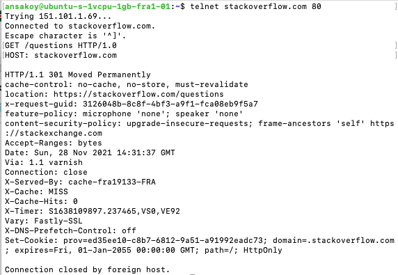
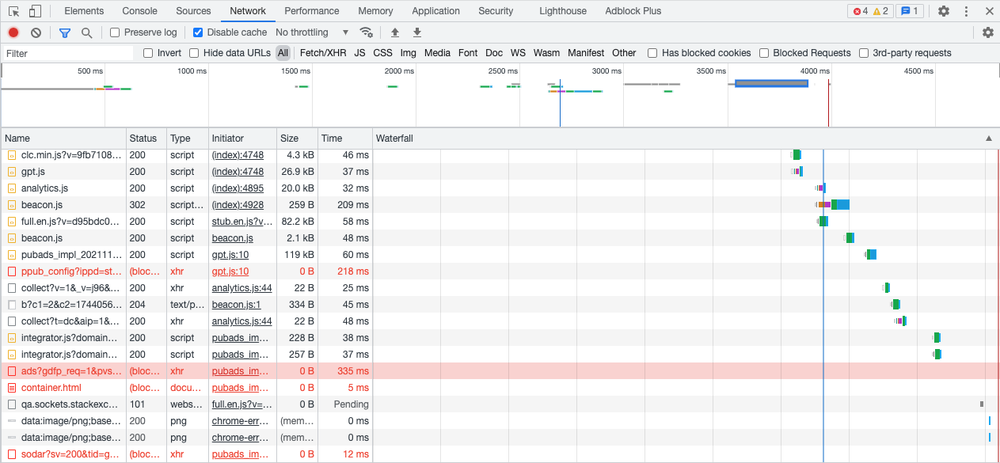
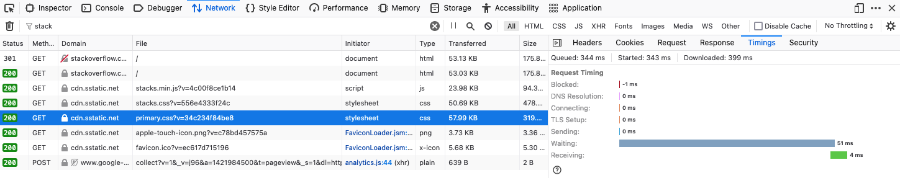
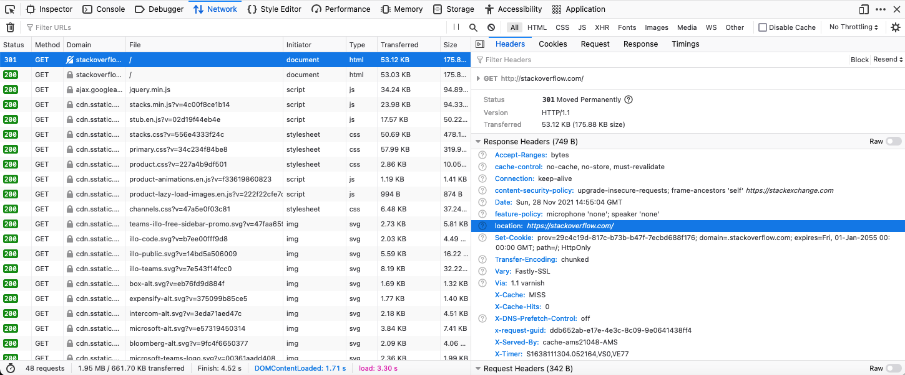
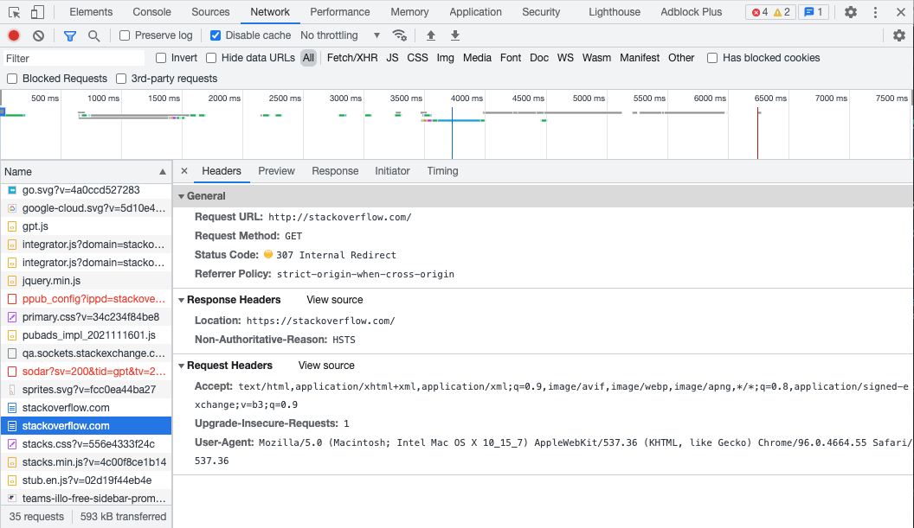
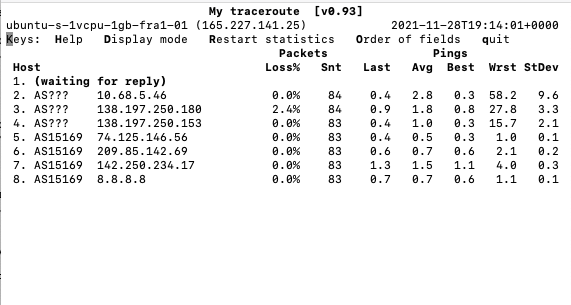

# Домашнее задание к занятию "3.6. Компьютерные сети, лекция 1"
[Источник](https://github.com/netology-code/sysadm-homeworks/tree/devsys10/03-sysadmin-06-net)
### 1. Работа c HTTP через телнет.
> * Подключитесь утилитой телнет к сайту stackoverflow.com telnet stackoverflow.com 80
```
$ telnet stackoverflow.com 80
Trying 151.101.1.69...
Connected to stackoverflow.com.
Escape character is '^]'.
```
> * отправьте HTTP запрос
>```
>GET /questions HTTP/1.0
>HOST: stackoverflow.com
>[press enter]
>[press enter]
>```
  


> * В ответе укажите полученный HTTP код, что он означает?

Пришел код 301, который значит, что страница была перемещена с адреса, по которому был отправлен запрос, 
на новый адрес, который вернулся в заголовках в поле `location` (https://stackoverflow.com/questions)

### 2. Повторите задание 1 в браузере, используя консоль разработчика F12.
> откройте вкладку Network
> отправьте запрос http://stackoverflow.com
> найдите первый ответ HTTP сервера, откройте вкладку Headers
> укажите в ответе полученный HTTP код.

Mozilla Firefox: пришел ответ 301, как и в случае с телнетом. В качестве `location` в заголовках 
указан адрес https://stackoverflow.com/

Google Chrome: пришел код 307 (страница была временно перемещена по адресу, который пришел в 
заголовках ответа - тоже `location` https://stackoverflow.com/)

> проверьте время загрузки страницы, какой запрос обрабатывался дольше всего?

В хроме дольше всего (335мс) грузился [этот файл](https://securepubads.g.doubleclick.net/gampad/ads?gdfp_req=1&pvsid=3574972749568129&correlator=3150565711743786&output=ldjh&impl=fif&eid=31061165&vrg=2021111601&ptt=17&sc=1&sfv=1-0-38&ecs=20211128&iu_parts=248424177%2Cstackoverflow.com%2Cmsb%2Chome-page&enc_prev_ius=%2F0%2F1%2F2%2F3&prev_iu_szs=300x250%7C300x600&fsfs=1&fsbs=1&cust_params=Registered%3Dtrue%26ProductVariant%3DLight%26TargetingConsent%3Dtrue&cookie=ID%3De4cf6e250e112551%3AT%3D1606657453%3AS%3DALNI_MaXt1uLKXneXkU2qk1GBATlWB8wkA&bc=31&abxe=1&lmt=1638112406&dt=1638112406152&dlt=1638112402344&idt=3668&frm=20&biw=677&bih=812&oid=2&adxs=-12245933&adys=-12245933&adks=471508633&ucis=1&ifi=1&u_his=4&u_h=1080&u_w=1920&u_ah=986&u_aw=1920&u_cd=30&u_sd=1&u_tz=180&flash=0&url=https%3A%2F%2Fstackoverflow.com%2F&vis=1&dmc=8&scr_x=0&scr_y=0&psz=0x0&msz=0x0&ga_vid=627841553.1606657453&ga_sid=1638112406&ga_hid=1390117217&ga_fc=true&fws=128&ohw=0&btvi=-1&uach=WyJtYWNPUyIsIjExLjUuMSIsIng4NiIsIiIsIjk2LjAuNDY2NC41NSIsW10sbnVsbCxudWxsLCI2NCJd&nvt=1).  



В мозилле всё быстрее. После редиректа на правильный адрес дольше всех (55мс) грузится 
[файл с настройками стиля](https://cdn.sstatic.net/Sites/stackoverflow/primary.css?v=34c234f84be8).  



> приложите скриншот консоли браузера в ответ.

Мозилла с ответом 301:  


Хром с ответом 307:  


### 3. Какой IP адрес у вас в интернете?
У текущего VPS `165.227.141.25`. Пруф:
```
$ hostname -I
165.227.141.25 10.19.0.7 10.114.0.3 
```
### 4. Какому провайдеру принадлежит ваш IP адрес? Какой автономной системе AS? Воспользуйтесь утилитой `whois`
```
$ sudo apt install whois
$ whois -h whois.arin.net 165.227.141.25
```
Ответ `whois`:
```
#
# ARIN WHOIS data and services are subject to the Terms of Use
# available at: https://www.arin.net/resources/registry/whois/tou/
#
# If you see inaccuracies in the results, please report at
# https://www.arin.net/resources/registry/whois/inaccuracy_reporting/
#
# Copyright 1997-2021, American Registry for Internet Numbers, Ltd.
#


NetRange:       165.227.0.0 - 165.227.255.255
CIDR:           165.227.0.0/16
NetName:        DIGITALOCEAN-165-227-0-0
NetHandle:      NET-165-227-0-0-1
Parent:         NET165 (NET-165-0-0-0-0)
NetType:        Direct Allocation
OriginAS:       AS14061
Organization:   DigitalOcean, LLC (DO-13)
RegDate:        2016-10-06
Updated:        2020-04-03
Comment:        Routing and Peering Policy can be found at https://www.as14061.net
Comment:        
Comment:        Please submit abuse reports at https://www.digitalocean.com/company/contact/#abuse
Ref:            https://rdap.arin.net/registry/ip/165.227.0.0


OrgName:        DigitalOcean, LLC
OrgId:          DO-13
Address:        101 Ave of the Americas
Address:        10th Floor
City:           New York
StateProv:      NY
PostalCode:     10013
Country:        US
RegDate:        2012-05-14
Updated:        2021-05-03
Comment:        http://www.digitalocean.com
Comment:        Simple Cloud Hosting
Ref:            https://rdap.arin.net/registry/entity/DO-13


OrgNOCHandle: NOC32014-ARIN
OrgNOCName:   Network Operations Center
OrgNOCPhone:  +1-347-875-6044 
OrgNOCEmail:  noc@digitalocean.com
OrgNOCRef:    https://rdap.arin.net/registry/entity/NOC32014-ARIN

OrgTechHandle: NOC32014-ARIN
OrgTechName:   Network Operations Center
OrgTechPhone:  +1-347-875-6044 
OrgTechEmail:  noc@digitalocean.com
OrgTechRef:    https://rdap.arin.net/registry/entity/NOC32014-ARIN

OrgAbuseHandle: ABUSE5232-ARIN
OrgAbuseName:   Abuse, DigitalOcean 
OrgAbusePhone:  +1-347-875-6044 
OrgAbuseEmail:  abuse@digitalocean.com
OrgAbuseRef:    https://rdap.arin.net/registry/entity/ABUSE5232-ARIN


#
# ARIN WHOIS data and services are subject to the Terms of Use
# available at: https://www.arin.net/resources/registry/whois/tou/
#
# If you see inaccuracies in the results, please report at
# https://www.arin.net/resources/registry/whois/inaccuracy_reporting/
#
# Copyright 1997-2021, American Registry for Internet Numbers, Ltd.
#
```
Итого:
* IP-адрес принадлежит провайдеру DigitalOcean, LLC (DO-13)
* Автономная система: AS14061

### 5. Через какие сети проходит пакет, отправленный с вашего компьютера на адрес 8.8.8.8? Через какие AS? Воспользуйтесь утилитой `traceroute`
```
$ sudo apt install traceroute
$ traceroute -An 8.8.8.8
traceroute to 8.8.8.8 (8.8.8.8), 30 hops max, 60 byte packets
 1  * * *
 2  10.68.5.36 [*]  1.021 ms  0.945 ms *
 3  138.197.250.166 [AS14061]  1.524 ms 138.197.250.162 [AS14061]  1.786 ms 138.197.250.160 [AS14061]  1.404 ms
 4  138.197.250.149 [AS14061]  1.525 ms 138.197.250.157 [AS14061]  0.963 ms 138.197.250.149 [AS14061]  1.488 ms
 5  74.125.146.56 [AS15169]  1.130 ms  1.116 ms 209.85.175.196 [AS15169]  3.181 ms
 6  * * *
 7  8.8.8.8 [AS15169]  0.607 ms  0.474 ms  0.542 ms
```
### 6. Повторите задание 5 в утилите `mtr`. На каком участке наибольшая задержка - delay?


Самая большая задержка имела место на первом этапе, по пути к IP `10.68.5.46`. Но там же указано и наибольшее 
стандартное отклонение (на скриншоте 9.6, в терминале через некоторое время показывает 7.5, но все равно 
это максимальный показатель из всех). Есть впечатление, что систематически наиболее медленный 
этап - между `209.85.142.69` и `142.250.234.17`. Там самое большое значение "лучшего" результата (1.1) и при этом 
небольшое стандартное отклонение (0.3 на скриншоте, в терминале через некоторое время значение доросло до 1.4).

### 7. Какие DNS сервера отвечают за доменное имя dns.google? Какие A записи? воспользуйтесь утилитой `dig`
```
$ sudo apt install dnsutils
```
```
$ dig NS dns.google  # Смотрим DNS-записи

; <<>> DiG 9.16.1-Ubuntu <<>> NS dns.google
;; global options: +cmd
;; Got answer:
;; ->>HEADER<<- opcode: QUERY, status: NOERROR, id: 11542
;; flags: qr rd ra; QUERY: 1, ANSWER: 4, AUTHORITY: 0, ADDITIONAL: 1

;; OPT PSEUDOSECTION:
; EDNS: version: 0, flags:; udp: 65494
;; QUESTION SECTION:
;dns.google.			IN	NS

;; ANSWER SECTION:
dns.google.		86400	IN	NS	ns2.zdns.google.
dns.google.		86400	IN	NS	ns1.zdns.google.
dns.google.		86400	IN	NS	ns3.zdns.google.
dns.google.		86400	IN	NS	ns4.zdns.google.

;; Query time: 20 msec
;; SERVER: 127.0.0.53#53(127.0.0.53)
;; WHEN: Sun Nov 28 21:00:16 UTC 2021
;; MSG SIZE  rcvd: 116
```
DNS-сервера:
* ns2.zdns.google.
* ns3.zdns.google.
* ns4.zdns.google.
* ns1.zdns.google.
```
$ dig A dns.google  # Смотрим A-записи

; <<>> DiG 9.16.1-Ubuntu <<>> A dns.google
;; global options: +cmd
;; Got answer:
;; ->>HEADER<<- opcode: QUERY, status: NOERROR, id: 26236
;; flags: qr rd ra; QUERY: 1, ANSWER: 2, AUTHORITY: 0, ADDITIONAL: 1

;; OPT PSEUDOSECTION:
; EDNS: version: 0, flags:; udp: 65494
;; QUESTION SECTION:
;dns.google.			IN	A

;; ANSWER SECTION:
dns.google.		738	IN	A	8.8.8.8
dns.google.		738	IN	A	8.8.4.4

;; Query time: 4 msec
;; SERVER: 127.0.0.53#53(127.0.0.53)
;; WHEN: Sun Nov 28 20:59:12 UTC 2021
;; MSG SIZE  rcvd: 71
```
A-записи:
* 8.8.8.8
* 8.8.4.4


### 8. Проверьте PTR записи для IP адресов из задания 7. Какое доменное имя привязано к IP? воспользуйтесь утилитой `dig`
```
$  dig -x 8.8.8.8

; <<>> DiG 9.16.1-Ubuntu <<>> -x 8.8.8.8
;; global options: +cmd
;; Got answer:
;; ->>HEADER<<- opcode: QUERY, status: NOERROR, id: 44241
;; flags: qr rd ra; QUERY: 1, ANSWER: 1, AUTHORITY: 0, ADDITIONAL: 1

;; OPT PSEUDOSECTION:
; EDNS: version: 0, flags:; udp: 65494
;; QUESTION SECTION:
;8.8.8.8.in-addr.arpa.		IN	PTR

;; ANSWER SECTION:
8.8.8.8.in-addr.arpa.	29975	IN	PTR	dns.google.

;; Query time: 0 msec
;; SERVER: 127.0.0.53#53(127.0.0.53)
;; WHEN: Sun Nov 28 21:12:15 UTC 2021
;; MSG SIZE  rcvd: 73

```
8.8.8.8 -> dns.google.
```
$ dig -x 8.8.4.4

; <<>> DiG 9.16.1-Ubuntu <<>> -x 8.8.4.4
;; global options: +cmd
;; Got answer:
;; ->>HEADER<<- opcode: QUERY, status: NOERROR, id: 58883
;; flags: qr rd ra; QUERY: 1, ANSWER: 1, AUTHORITY: 0, ADDITIONAL: 1

;; OPT PSEUDOSECTION:
; EDNS: version: 0, flags:; udp: 65494
;; QUESTION SECTION:
;4.4.8.8.in-addr.arpa.		IN	PTR

;; ANSWER SECTION:
4.4.8.8.in-addr.arpa.	86400	IN	PTR	dns.google.

;; Query time: 120 msec
;; SERVER: 127.0.0.53#53(127.0.0.53)
;; WHEN: Sun Nov 28 21:15:46 UTC 2021
;; MSG SIZE  rcvd: 73

```
8.8.4.4 -> dns.google.