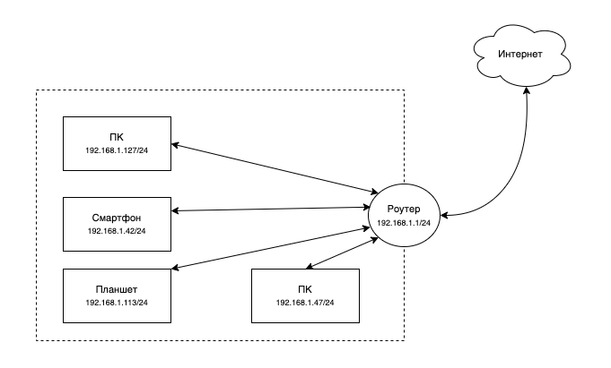

# Домашнее задание к занятию "3.8. Компьютерные сети, лекция 3"
[Источник](https://github.com/netology-code/sysadm-homeworks/tree/devsys10/03-sysadmin-08-net)
### 1. Подключитесь к публичному маршрутизатору в интернет. Найдите маршрут к вашему публичному IP
>```
>telnet route-views.routeviews.org
>Username: rviews
>show ip route x.x.x.x/32
>show bgp x.x.x.x/32```

```
route-views>show ip route 159.89.28.118
Routing entry for 159.89.16.0/20
  Known via "bgp 6447", distance 20, metric 0
  Tag 6939, type external
  Last update from 64.71.137.241 7w0d ago
  Routing Descriptor Blocks:
  * 64.71.137.241, from 64.71.137.241, 7w0d ago
      Route metric is 0, traffic share count is 1
      AS Hops 2
      Route tag 6939
      MPLS label: none
```
```
route-views>show bgp 159.89.28.118
BGP routing table entry for 159.89.16.0/20, version 1059051105
Paths: (24 available, best #23, table default)
  Not advertised to any peer
  Refresh Epoch 1
  4901 6079 1299 14061
    162.250.137.254 from 162.250.137.254 (162.250.137.254)
      Origin IGP, localpref 100, valid, external
      Community: 65000:10100 65000:10300 65000:10400
      path 7FE16C301568 RPKI State valid
      rx pathid: 0, tx pathid: 0
  Refresh Epoch 3
  3303 2914 14061
    217.192.89.50 from 217.192.89.50 (138.187.128.158)
      Origin IGP, localpref 100, valid, external
      Community: 2914:410 2914:1201 2914:2202 2914:3200 3303:1004 3303:1006 3303:3056
      path 7FE16C3AD028 RPKI State valid
      rx pathid: 0, tx pathid: 0
  Refresh Epoch 1
  7660 2516 1299 14061
    203.181.248.168 from 203.181.248.168 (203.181.248.168)
      Origin IGP, localpref 100, valid, external
      Community: 2516:1030 7660:9003
      path 7FE141B121C0 RPKI State valid
      rx pathid: 0, tx pathid: 0
  Refresh Epoch 1
  3267 14061
    194.85.40.15 from 194.85.40.15 (185.141.126.1)
      Origin IGP, metric 0, localpref 100, valid, external
      path 7FE0CE27F608 RPKI State valid
      rx pathid: 0, tx pathid: 0
  Refresh Epoch 1
  57866 6453 14061
    37.139.139.17 from 37.139.139.17 (37.139.139.17)
      Origin IGP, metric 0, localpref 100, valid, external
      Community: 6453:50 6453:2000 6453:2400 6453:2401
      path 7FE0B3F77548 RPKI State valid
      rx pathid: 0, tx pathid: 0
  Refresh Epoch 1
  7018 1299 14061
    12.0.1.63 from 12.0.1.63 (12.0.1.63)
```
### 2. Создайте dummy0 интерфейс в Ubuntu. Добавьте несколько статических маршрутов. Проверьте таблицу маршрутизации.
Интерфейсы, которые были вначале:
```
$ ip link
1: lo: <LOOPBACK,UP,LOWER_UP> mtu 65536 qdisc noqueue state UNKNOWN mode DEFAULT group default qlen 1000
    link/loopback 00:00:00:00:00:00 brd 00:00:00:00:00:00
2: eth0: <BROADCAST,MULTICAST,UP,LOWER_UP> mtu 1500 qdisc fq_codel state UP mode DEFAULT group default qlen 1000
    link/ether 7e:f5:88:b9:dd:be brd ff:ff:ff:ff:ff:ff
3: eth1: <BROADCAST,MULTICAST,UP,LOWER_UP> mtu 1500 qdisc fq_codel state UP mode DEFAULT group default qlen 1000
    link/ether 8e:73:07:92:90:7a brd ff:ff:ff:ff:ff:ff
4: eth1.10@eth1: <BROADCAST,MULTICAST,UP,LOWER_UP> mtu 1500 qdisc noqueue state UP mode DEFAULT group default qlen 1000
    link/ether 8e:73:07:92:90:7a brd ff:ff:ff:ff:ff:ff
```
Проверяем, загружен ли модуль dummy
```
$ sudo lsmod | grep dummy
dummy                  16384  0
```
Создаем новый интерфейс:
```
$ sudo ip link add dummy0 type dummy
$ ip link
1: lo: <LOOPBACK,UP,LOWER_UP> mtu 65536 qdisc noqueue state UNKNOWN mode DEFAULT group default qlen 1000
    link/loopback 00:00:00:00:00:00 brd 00:00:00:00:00:00
2: eth0: <BROADCAST,MULTICAST,UP,LOWER_UP> mtu 1500 qdisc fq_codel state UP mode DEFAULT group default qlen 1000
    link/ether 7e:f5:88:b9:dd:be brd ff:ff:ff:ff:ff:ff
3: eth1: <BROADCAST,MULTICAST,UP,LOWER_UP> mtu 1500 qdisc fq_codel state UP mode DEFAULT group default qlen 1000
    link/ether 8e:73:07:92:90:7a brd ff:ff:ff:ff:ff:ff
4: eth1.10@eth1: <BROADCAST,MULTICAST,UP,LOWER_UP> mtu 1500 qdisc noqueue state UP mode DEFAULT group default qlen 1000
    link/ether 8e:73:07:92:90:7a brd ff:ff:ff:ff:ff:ff
5: dummy0: <BROADCAST,NOARP> mtu 1500 qdisc noop state DOWN mode DEFAULT group default qlen 1000
    link/ether 1a:cb:44:b4:67:9e brd ff:ff:ff:ff:ff:ff
```
Добавляем ему адрес и поднимаем его:
```
$ sudo ip addr add 10.1.0.0/24 dev dummy0
$ sudo ip link set dev dummy0 up
```
Смотрим, что получается:
```
$ ip addr show dev dummy0
5: dummy0: <BROADCAST,NOARP,UP,LOWER_UP> mtu 1500 qdisc noqueue state UNKNOWN group default qlen 1000
    link/ether 1a:cb:44:b4:67:9e brd ff:ff:ff:ff:ff:ff
    inet 10.1.0.0/24 scope global dummy0
       valid_lft forever preferred_lft forever
    inet6 fe80::18cb:44ff:feb4:679e/64 scope link 
       valid_lft forever preferred_lft forever
```
Добавляем статические маршруты:
```
$ sudo ip route add 8.0.0.0/24 via 10.1.0.0
$ sudo ip route add 8.8.0.0/16 via 10.1.0.0
```
Смотрим таблицу
```
$ ip route
default via 159.89.16.1 dev eth0 proto static 
8.0.0.0/24 via 10.1.0.0 dev dummy0 
8.8.0.0/16 via 10.1.0.0 dev dummy0 
10.0.0.0/24 dev eth1.10 proto kernel scope link src 10.0.0.1 
10.1.0.0/24 dev dummy0 proto kernel scope link src 10.1.0.0
```
### 3. Проверьте открытые TCP порты в Ubuntu, какие протоколы и приложения используют эти порты? Приведите несколько примеров.
```
$ ss -tan
State   Recv-Q  Send-Q    Local Address:Port       Peer Address:Port  
LISTEN  0       4096      127.0.0.53%lo:53              0.0.0.0:*               
LISTEN  0       128             0.0.0.0:22              0.0.0.0:*               
ESTAB   0       36        159.89.28.118:22       46.x.x.x:12615           
ESTAB   0       0         159.89.28.118:22       46.x.x.x:3748            
LISTEN  0       128                [::]:22                 [::]:*               
```
<sup>*</sup>46.x.x.x - реальный IP, поэтому с иксами  
22 - порт SSH (к нему в данный подключены со стороны клиента терминал и FileZilla)
53 - используется DNS

Смотрим, какие приложения используют:
```
$ sudo lsof -i :22
COMMAND   PID    USER   FD   TYPE DEVICE SIZE/OFF NODE NAME
sshd      810    root    3u  IPv4  23205      0t0  TCP *:ssh (LISTEN)
sshd      810    root    4u  IPv6  23216      0t0  TCP *:ssh (LISTEN)
...
```
-> sshd
```
$ sudo lsof -i :53
COMMAND   PID            USER   FD   TYPE DEVICE SIZE/OFF NODE NAME
systemd-r 574 systemd-resolve   12u  IPv4  19545      0t0  UDP localhost:domain 
systemd-r 574 systemd-resolve   13u  IPv4  19546      0t0  TCP localhost:domain (LISTEN)
```
-> systemd-resolve

(впрочем, можно было вывести прямо в `ss`, добавив флаг `-p` и из-под sudo)
### 4. Проверьте используемые UDP сокеты в Ubuntu, какие протоколы и приложения используют эти порты?
```
sudo ss -uapn
State         Recv-Q        Send-Q               Local Address:Port               Peer Address:Port       Process        
UNCONN        0             0                    127.0.0.53%lo:53                      0.0.0.0:*           users:(("systemd-resolve",pid=574,fd=12))                      
```
Похоже, что использует только вышеупомянутое systemd-resolve
### 5. Используя diagrams.net, создайте L3 диаграмму вашей домашней сети или любой другой сети, с которой вы работали.
