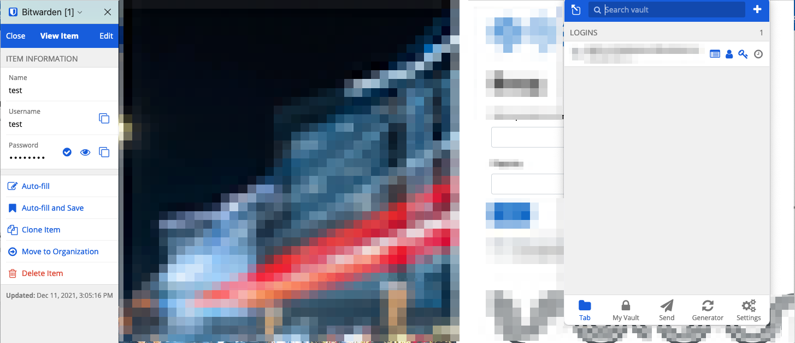

# Домашнее задание к занятию "3.9. Элементы безопасности информационных систем"
[Источник](https://github.com/netology-code/sysadm-homeworks/tree/devsys10/03-sysadmin-09-security)
### 1. Установите Bitwarden плагин для браузера. Зарегестрируйтесь и сохраните несколько паролей.

### 2. Установите Google authenticator на мобильный телефон. Настройте вход в Bitwarden акаунт через Google authenticator OTP.

### 3. Установите apache2, сгенерируйте самоподписанный сертификат, настройте тестовый сайт для работы по HTTPS.
```
# Устанавливаем apache2
$ sudo apt install apache2

# Проверяем профили ufw
$ sudo ufw app list
Available applications:
  Apache
  Apache Full
  Apache Secure
  OpenSSH

# Пока не настроили SSL, открываем полный вариант
# Apache - открыт порт 80
# Apache Full - и 80, и 443
# Apache Secure - только 443
$ sudo ufw allow 'Apache Full'
Rules updated
Rules updated (v6)

# И добавляем разрешение на доступ через ssh, а то в следующий раз не пустит
$ sudo ufw allow ssh

# Включаем файрволл:
$ sudo ufw enable

# Смотрим, что получилось:
$ sudo ufw status
Status: active

To                         Action      From
--                         ------      ----
Apache                     ALLOW       Anywhere                  
Apache (v6)                ALLOW       Anywhere (v6)

# Смотрим, как себя чувствует Apache
$ sudo systemctl status apache2
● apache2.service - The Apache HTTP Server
     Loaded: loaded (/lib/systemd/system/apache2.service; enabled; vendor prese>
     Active: active (running) since Sat 2021-12-11 16:09:40 UTC; 7min ago
       Docs: https://httpd.apache.org/docs/2.4/
   Main PID: 2829 (apache2)
      Tasks: 55 (limit: 1136)
     Memory: 5.1M
     CGroup: /system.slice/apache2.service
             ├─2829 /usr/sbin/apache2 -k start
             ├─2831 /usr/sbin/apache2 -k start
             └─2832 /usr/sbin/apache2 -k start

Dec 11 16:09:40 devnet systemd[1]: Starting The Apache HTTP Server...
Dec 11 16:09:40 devnet apachectl[2818]: AH00558: apache2: Could not reliably de>
Dec 11 16:09:40 devnet systemd[1]: Started The Apache HTTP Server.
...
```


*Т.к. в первом заходе в ufw не был открыт ssh, при следующем подключении доступа уже не было. 
Пришлось убить машину 159.89.29.118 и создать новую (IP 134.122.67.12), повторить там вышеуказанные 
шаги и продолжить с нижеследующего*

Создаем сертификат и одновременно ключ
```
$ sudo openssl req -x509 -nodes -days 365 -newkey rsa:2048 -keyout /etc/ssl/private/apache-selfsigned.key -out /etc/ssl/certs/apache-selfsigned.crt
Generating a RSA private key
...............................................................+++++
.....................+++++
writing new private key to '/etc/ssl/private/apache-selfsigned.key'
-----
You are about to be asked to enter information that will be incorporated
into your certificate request.
What you are about to enter is what is called a Distinguished Name or a DN.
There are quite a few fields but you can leave some blank
For some fields there will be a default value,
If you enter '.', the field will be left blank.
-----
Country Name (2 letter code) [AU]:RU
State or Province Name (full name) [Some-State]:Msk
Locality Name (eg, city) []:Msk
Organization Name (eg, company) [Internet Widgits Pty Ltd]:
Organizational Unit Name (eg, section) []:
Common Name (e.g. server FQDN or YOUR name) []:134.122.67.12
Email Address []:some_email@example.com 

# Ключи и сертификаты располгаются в /etc/ssl
```
Создаем конфиг SSL для апаче
```
$ sudo vim /etc/apache2/conf-available/ssl-params.conf

SSLCipherSuite EECDH+AESGCM:EDH+AESGCM:AES256+EECDH:AES256+EDH
SSLProtocol All -SSLv2 -SSLv3
SSLHonorCipherOrder On
Header always set Strict-Transport-Security "max-age=63072000; includeSubdomains"
Header always set X-Frame-Options DENY
Header always set X-Content-Type-Options nosniff
# Requires Apache >= 2.4
SSLCompression off
SSLSessionTickets Off
SSLUseStapling on
SSLStaplingCache "shmcb:logs/stapling-cache(150000)"
```
Переходим к модификациям дефолтов апаче
```
# Бэкапим дефолт для истории
$ sudo cp /etc/apache2/sites-available/default-ssl.conf /etc/apache2/sites-available/default-ssl.conf.bak
$ sudo vim /etc/apache2/sites-available/default-ssl.conf /etc/apache2/sites-available/default-ssl.conf

<IfModule mod_ssl.c>
        <VirtualHost _default_:443>
                ServerAdmin some_email@example.com
                ServerName 134.122.67.12

                DocumentRoot /var/www/html

                ErrorLog ${APACHE_LOG_DIR}/error.log
                CustomLog ${APACHE_LOG_DIR}/access.log combined

                SSLEngine on

                SSLCertificateFile      /etc/ssl/certs/apache-selfsigned.crt
                SSLCertificateKeyFile /etc/ssl/private/apache-selfsigned.key

                <FilesMatch "\.(cgi|shtml|phtml|php)$">
                                SSLOptions +StdEnvVars
                </FilesMatch>
                <Directory /usr/lib/cgi-bin>
                                SSLOptions +StdEnvVars
                </Directory>
                
                BrowserMatch "MSIE [2-6]" \
                                nokeepalive ssl-unclean-shutdown \
                                downgrade-1.0 force-response-1.0

        </VirtualHost>
</IfModule>
```
Делаем перенаправление в VirtualHost
```
# В файл /etc/apache2/sites-available/000-default.conf добавляем директиву:
Redirect "/" "https://134.122.67.12/"
```
Включаем SSL
```
# SSL
$ sudo a2enmod ssl
Considering dependency setenvif for ssl:
Module setenvif already enabled
Considering dependency mime for ssl:
Module mime already enabled
Considering dependency socache_shmcb for ssl:
Enabling module socache_shmcb.
Enabling module ssl.

# Заголовки
$ sudo a2enmod headers
Enabling module headers.

# По умолчанию
$ sudo a2ensite default-ssl
Enabling site default-ssl.

# Подключаем файл с параметрами
$ sudo a2enconf ssl-params
Enabling conf ssl-params.

# Проверяем корректность синтаксиса
$ sudo apache2ctl configtest
AH00558: apache2: Could not reliably determine the server's fully qualified domain name, using 127.0.1.1. Set the 'ServerName' directive globally to suppress this message
Syntax OK

# Перезапускаем апаче
$ sudo systemctl restart apache2
```
Для разнообразия заменяем содержимое дефолтного файла /var/www/html/index.html [новым содержимым](index.html)  
Пробуем выйти через браузер. Браузер сопротивляется:  
  

Но работает:  


### 4. Проверьте на TLS уязвимости произвольный сайт в интернете.
```
$ git clone --depth 1 https://github.com/drwetter/testssl.sh.git
$ cd testssl.sh/
$ ./testssl.sh -U --sneaky https://davidsakoyan.com/

###########################################################
    testssl.sh       3.1dev from https://testssl.sh/dev/
    (6da72bc 2021-12-10 20:16:28 -- )

      This program is free software. Distribution and
             modification under GPLv2 permitted.
      USAGE w/o ANY WARRANTY. USE IT AT YOUR OWN RISK!

       Please file bugs @ https://testssl.sh/bugs/

###########################################################

 Using "OpenSSL 1.0.2-chacha (1.0.2k-dev)" [~183 ciphers]
 on devnet:./bin/openssl.Linux.x86_64
 (built: "Jan 18 17:12:17 2019", platform: "linux-x86_64")


 Start 2021-12-11 13:53:40        -->> 167.71.48.87:443 (davidsakoyan.com) <<--

 rDNS (167.71.48.87):    --
 Service detected:       HTTP


 Testing vulnerabilities 

 Heartbleed (CVE-2014-0160)                not vulnerable (OK), no heartbeat extension
 CCS (CVE-2014-0224)                       not vulnerable (OK)
 Ticketbleed (CVE-2016-9244), experiment.  not vulnerable (OK), no session ticket extension
 ROBOT                                     Server does not support any cipher suites that use RSA key transport
 Secure Renegotiation (RFC 5746)           supported (OK)
 Secure Client-Initiated Renegotiation     not vulnerable (OK)
 CRIME, TLS (CVE-2012-4929)                not vulnerable (OK)
 BREACH (CVE-2013-3587)                    no gzip/deflate/compress/br HTTP compression (OK)  - only supplied "/" tested
 POODLE, SSL (CVE-2014-3566)               not vulnerable (OK)
 TLS_FALLBACK_SCSV (RFC 7507)              No fallback possible (OK), no protocol below TLS 1.2 offered
 SWEET32 (CVE-2016-2183, CVE-2016-6329)    not vulnerable (OK)
 FREAK (CVE-2015-0204)                     not vulnerable (OK)
 DROWN (CVE-2016-0800, CVE-2016-0703)      not vulnerable on this host and port (OK)
                                           make sure you don't use this certificate elsewhere with SSLv2 enabled services
                                           https://censys.io/ipv4?q=2AF94E1EF12FF679D43CAB08EAE870E8ADC97526B13B0D8515D0C5418ED5052B could help you to find out
 LOGJAM (CVE-2015-4000), experimental      common prime with 2048 bits detected: RFC7919/ffdhe2048 (2048 bits),
                                           but no DH EXPORT ciphers
 BEAST (CVE-2011-3389)                     not vulnerable (OK), no SSL3 or TLS1
 LUCKY13 (CVE-2013-0169), experimental     potentially VULNERABLE, uses cipher block chaining (CBC) ciphers with TLS. Check patches
 Winshock (CVE-2014-6321), experimental    not vulnerable (OK)
 RC4 (CVE-2013-2566, CVE-2015-2808)        no RC4 ciphers detected (OK)


 Done 2021-12-11 13:53:57 [  21s] -->> 167.71.48.87:443 (davidsakoyan.com) <<--
```
Обнаружилась одна потенциальная уязвимость, надо будет пофиксить
### 5. Установите на Ubuntu ssh сервер, сгенерируйте новый приватный ключ. Скопируйте свой публичный ключ на другой сервер. Подключитесь к серверу по SSH-ключу.
Генерируем ключ RSA
```
$ ssh-keygen -t rsa -b 2048
Generating public/private rsa key pair.
Enter file in which to save the key (/home/ansakoy/.ssh/id_rsa): 
Enter passphrase (empty for no passphrase): 
Enter same passphrase again: 
Your identification has been saved in /home/ansakoy/.ssh/id_rsa
Your public key has been saved in /home/ansakoy/.ssh/id_rsa.pub
The key fingerprint is:
SHA256:ZJ2gJVfKCJ4rIDgR0tId2dwVZN1Pe9OiaLIy0TbTRiY ansakoy@devnet
The key's randomart image is:
+---[RSA 2048]----+
|++ .o=..++*o .   |
|+.o.oooB.= .. . .|
|=.  o o = o    oo|
|.o   . oE o   .o+|
|  . .  .S= . . .o|
|   .  . * = .    |
|       o B       |
|      o .        |
|       o         |
+----[SHA256]-----+
```
Можно посмотреть на публичный ключ:
```
$ cat ~/.ssh/id_rsa.pub
ssh-rsa AAAAB3NzaC1yc2EAAAADAQABAAABAQDpR8Vby85PdxgCMZPQTT9z6IMbIEGdYuXpSaVOwL2+x+6dJuX8cvMLD3mE+uFprMFrsPkSdeyiXXk1F0CClpP6mOdHuTgCa3EPudWNE84LNTisfupJK+0qkFRZFjtMBSre6B6uQ57wySE11+QSsMxQy2IuC0IObgo4V5mz6GS+TMTOPRWM0wL1/bPl6CIPmUzxub/sJ3LMvFr2AceH5hHWaPS3DUQXcpVsdFbLl/SpWiXO01Yi7x++Nsr+AaoyDFhzHhaoOh+xWn7a/zjITMe749FsqxNi1w15d9/vhbzVdpXMEuJhAxbJT/M6Yl1EtVjVKqn/9u+wllqajMjI69x7 ansakoy@devnet
```

Выходим на другой сервер (с локального компьютера, потому что его SSH-ключ сервер уже знает). 
Добавляем новый ключ, сгенерированный на удаленной машине, в ~/.ssh/authorized_keys на этом 
сервере.  


Теперь подключаемся с исходной удаленной машины к той, на которую положили ключ:
```
$ ssh asakoyan@163.*.*.170
Welcome to Ubuntu 20.04.1 LTS (GNU/Linux 5.4.0-1041-kvm x86_64)

 * Documentation:  https://help.ubuntu.com
 * Management:     https://landscape.canonical.com
 * Support:        https://ubuntu.com/advantage

  System information as of Sat Dec 11 19:10:12 UTC 2021

  System load:  1.38               Processes:             138
  Usage of /:   4.6% of 135.22GB   Users logged in:       1
  Memory usage: 76%                IPv4 address for ens2: 10.194.79.193
  Swap usage:   0%                 IPv6 address for ens2: 2001:bc8:610:6400::1

  => /mnt/storage is using 94.6% of 457.35GB

 * Super-optimized for small spaces - read how we shrank the memory
   footprint of MicroK8s to make it the smallest full K8s around.

   https://ubuntu.com/blog/microk8s-memory-optimisation

123 updates can be installed immediately.
1 of these updates is a security update.
To see these additional updates run: apt list --upgradable


*** System restart required ***
Last login: Sat Dec 11 18:56:06 2021 from 134.122.67.12
$ exit
logout
Connection to 163.*.*.170 closed.
```
### 6. Переименуйте файлы ключей из задания 5. Настройте файл конфигурации SSH клиента, так чтобы вход на удаленный сервер осуществлялся по имени сервера.
```
# Переименовываем ключ
$ mv ~/.ssh/id_rsa.pub ~/.ssh/remote163_170.pub
$ mv ~/.ssh/id_rsa ~/.ssh/remote163_170

# Создаем конфиг для ssh
$ touch ~/.ssh/config && chmod 600 ~/.ssh/config
ansakoy@devnet:~$ vim ~/.ssh/config 

Host server163_170
HostName 163.*.*.170
IdentityFile ~/.ssh/remote163_170
User asakoyan
PubKeyAuthentication yes

# Подключаемся к серверу:
$ ssh server163_170
Welcome to Ubuntu 20.04.1 LTS (GNU/Linux 5.4.0-1041-kvm x86_64)
...
Last login: Sat Dec 11 19:10:12 2021 from 134.122.67.12
$ exit
logout
Connection to 163.*.*.170 closed.
```
### 7. Соберите дамп трафика утилитой tcpdump в формате pcap, 100 пакетов. Откройте файл pcap в Wireshark.
```
$ sudo tcpdump -c 100 -w tcpdump.pcap
```

