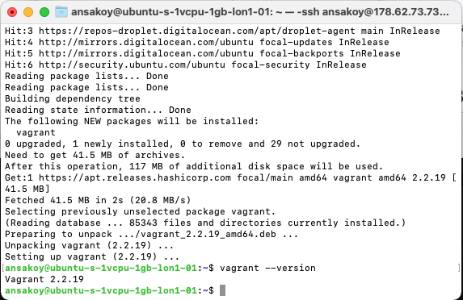
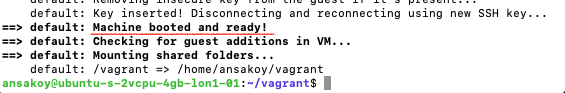
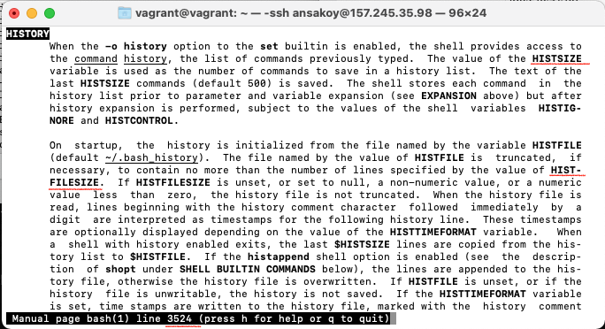

# Домашнее задание к занятию "3.1. Работа в терминале, лекция 1"
[Источник](https://github.com/netology-code/sysadm-homeworks/blob/master/03-sysadmin-01-terminal/README.md)

*Дисклеймер: по причине загруженности рабочего компьютера было принято решение развернуть используемо
 в задании ПО на VPS с установленной на нем Ubuntu 20.04*

### 1. Установите средство виртуализации Oracle VirtualBox
```
sudo apt update && sudo apt install virtualbox
```

### 2. Установите средство автоматизации Hashicorp Vagrant
[Сборник мануалов вагранта](https://learn.hashicorp.com/)

Версии вагранта: https://www.vagrantup.com/downloads

**NB**  
Немаловажный момент - знать, как удалять (например, старую версию). 
У вагранта для этого есть [инструкции](https://www.vagrantup.com/docs/installation/uninstallation):
```
sudo rm -rf /opt/vagrant
rm -f /usr/bin/vagrant
```
Помимо этого, также важно:
```
rm -rf ~/.vagrant.d
sudo apt purge --auto-remove vagrant
```
#### Устновка
По [инструкциям самого вагранта](https://www.vagrantup.com/downloads):
```
curl -fsSL https://apt.releases.hashicorp.com/gpg | sudo apt-key add -
sudo apt-add-repository "deb [arch=amd64] https://apt.releases.hashicorp.com $(lsb_release -cs) main"
sudo apt install vagrant
```
И в итоге вагрант установился в новейшей версии
```
$ vagrant --version
Vagrant 2.2.19
```

### 3. В вашем основном окружении подготовьте удобный для дальнейшей работы терминал.

Люблю дефолты


### 4. С помощью базового файла конфигурации запустите Ubuntu 20.04 в VirtualBox посредством Vagrant
```
mkdir vagrant
cd vagrant
```

```
$ vagrant init
A `Vagrantfile` has been placed in this directory. You are now
ready to `vagrant up` your first virtual environment! Please read
the comments in the Vagrantfile as well as documentation on
`vagrantup.com` for more information on using Vagrant.
```
```
$ vim Vagrantfile 

Vagrant.configure("2") do |config|
  ...
  config.vm.box = "bento/ubuntu-20.04"
  ...
```
Запускаем установку нужного бокса в виртуальную машину
```
vagrant up
```
После некоторых размышлений:


**NB**:  
```
# Выключить с сохранением состояния
vagrant suspend

# Выключить штатным образом
vagrant halt
```

### 5. Ознакомьтесь с графическим интерфейсом VirtualBox, посмотрите как выглядит виртуальная машина, которую создал для вас Vagrant, какие аппаратные ресурсы ей выделены. Какие ресурсы выделены по-умолчанию?
На удаленной машине ознакомиться с графическим интерфейсом затруднительно, поэтому посмотрим с помощью командной 
строки.
```
vboxmanage list vms
```
Т.к. виртуальная машина у нас одна, в списке только одна запись:
```
"vagrant_default_1636715900290_88563" {2552fe36-46c4-4d8a-be9b-821b73a8208b}
```
Смотрим ее конфигурацию:
```
vboxmanage showvminfo "vagrant_default_1636715900290_88563"
```
[Полный результат](showvminfo.txt)  
В частности видим, что памяти у нее 1 ГБ, 2 процессора, использование хозяйского процессора не имеет лимита (100%)
```
Memory size:                 1024MB
CPU exec cap:                100%
Number of CPUs:              2
```
Можно также ознакомиться с глобальными настройками VMBox (`vboxmanage list systemproperties` -> [подробности](systemproperties.txt)

### 6. Ознакомьтесь с возможностями конфигурации VirtualBox через Vagrantfile: [документация](https://www.vagrantup.com/docs/providers/virtualbox/configuration). Как добавить оперативной памяти или ресурсов процессора виртуальной машине?
Документация предлагает прописывать в VagrantFile
```
config.vm.provider "virtualbox" do |v|
  v.memory = 1024  # оперативная память
  v.cpus = 2  # ресурсы процессора
end
``` 
### 7. Команда vagrant ssh из директории, в которой содержится Vagrantfile, позволит вам оказаться внутри виртуальной машины без каких-либо дополнительных настроек. Попрактикуйтесь в выполнении обсуждаемых команд в терминале Ubuntu.
(Выход из машины - закономерным образом - `exit`)
```
$ vagrant ssh
Welcome to Ubuntu 20.04.2 LTS (GNU/Linux 5.4.0-80-generic x86_64)

 * Documentation:  https://help.ubuntu.com
 * Management:     https://landscape.canonical.com
 * Support:        https://ubuntu.com/advantage

  System information as of Fri 12 Nov 2021 07:20:07 PM UTC

  System load:  0.0               Processes:             110
  Usage of /:   2.4% of 61.31GB   Users logged in:       0
  Memory usage: 15%               IPv4 address for eth0: 10.0.2.15
  Swap usage:   0%


This system is built by the Bento project by Chef Software
More information can be found at https://github.com/chef/bento
Last login: Fri Nov 12 13:04:13 2021 from 10.0.2.2
```
### 8. Ознакомиться с разделами man bash, почитать о настройках самого bash:

- какой переменной можно задать длину журнала history, и на какой строчке manual это описывается?

В данном случае начало описания приходится на строчку 3524:

Но это не очень надежный показатель, т.к. нумерация строк производится в зависимости от ширины окна терминала.
Переменная `HISTSIZE` задает число команд, которые сохраняются в списке history во время сессии. 
Написано, что умолчанию хранится 500 команд. При этом почему-то в при распечатывании переменной на 
совершенно новой машине указывается значение 1000 команд:
```
vagrant@vagrant:~$ echo $HISTSIZE
1000
```
В ходе сессии команды из списка копируются в файл history 
(путь в переменной `HISTFILE`, по умолчанию `~/.bash_history`) в количестве, определяемом переменной 
`HISTFILESIZE`.
```
HISTORY
                                                              <...> The value of the HISTSIZE
       variable is used as the number of commands to save in a history list.  The text of the
       last HISTSIZE commands (default 500) is saved.
       <...>
       On  startup,  the  history is initialized from the file named by the variable HISTFILE
       (default ~/.bash_history).  The file named by the value of HISTFILE is  truncated,  if
       necessary, to contain no more than the number of lines specified by the value of HIST‐
       FILESIZE.
                                                                                 <...>   When
       a  shell with history enabled exits, the last $HISTSIZE lines are copied from the his‐
       tory list to $HISTFILE.
                                                                     <...>  After  saving  the
       history, the history file is truncated to contain no more than HISTFILESIZE lines.
```
- что делает директива ignoreboth в bash?

`ignoreboth` - одна из возможностей определить правила сохранение команд в списке history. Это одно из 
значений, которое может входить в список, содержащийся в переменной `HISTCONTROL`. Например, если 
в списке указано `ignorespace`, то в истории не сохраняются строки, начинающиеся с пробела. 
Если указано `ignoredups`, то в истории не сохраняются команды, повторяющиеся несколько раз 
подряд. `ignoreboth` - это сокращение, объединяющее в себе две предыдущие директивы.  
Собственно, это единственная директива, которая находится в текущем списке на новой машине:
```
vagrant@vagrant:~$ echo $HISTCONTROL
ignoreboth
```
### 9. В каких сценариях использования применимы скобки {} и на какой строчке man bash это описано?
Впервые `{}` упоминается в кратком описании зарезервированных слов (в моем случае - строка 209):
```
RESERVED WORDS
       Reserved  words  are  words  that  have a special meaning to the shell.  The following
       words are recognized as reserved when unquoted and either the first word of  a  simple
       command (see SHELL GRAMMAR below) or the third word of a case or for command:

       ! case  coproc  do done elif else esac fi for function if in select then until while {
       } time [[ ]]
```
Использование {} описывается в разделе Brace Expansion (начало у меня - на строке 1308). Назначение в том, чтобы 
ускорить процесс ввода путем использования условных развертываемых символов. Например, можно создать три файла с разными названиями, 
указав их расширение только один раз:
```
vagrant@vagrant:~$ mkdir test
vagrant@vagrant:~$ cd test
vagrant@vagrant:~/test$ touch {one,two,three}.txt
vagrant@vagrant:~/test$ ls
one.txt  three.txt  two.txt
``` 
И в принципе любое повторющееся сочетание можно указать единожды:
```
vagrant@vagrant:~/test$ touch prefix_{1,2,3}_postfix
vagrant@vagrant:~/test$ ls
one.txt  prefix_1_postfix  prefix_2_postfix  prefix_3_postfix  three.txt  two.txt
```
А также можно задавать диапазоны значений, указав только первое и последнее значение:
```
vagrant@vagrant:~/test$ echo {z..a}
z y x w v u t s r q p o n m l k j i h g f e d c b a
```

### 10. Основываясь на предыдущем вопросе, как создать однократным вызовом touch 100000 файлов? А получилось ли создать 300000? Если нет, то почему?
```
vagrant@vagrant:~/test$ ls  # убеждаемся, что в папке отсутствуют (зримые) файлы
vagrant@vagrant:~/test$ touch doc{1..100000}  # создаем разом 100000 файлов
vagrant@vagrant:~/test$ ls | wc -w  # смотрим, сколько файлов теперь в папке
100000
```
Создать 300000 файлов невозможно - слишком большой список аргументов:
```
vagrant@vagrant:~/test$ touch doc{1..300000}
-bash: /usr/bin/touch: Argument list too long
```
### 11. В man bash поищите по `/\[\[`. Что делает конструкция `[[ -d /tmp ]]`
Конструкция оценивает утверждение "/tmp - это директория" на предмет истинности или ложности. 
Пример в действии:
```
vagrant@vagrant:~/test$ touch just_file
vagrant@vagrant:~/test$ if [[ -d /tmp ]]; then  echo "it's a directory"; else echo "it's not a directory"; fi
it's a directory
vagrant@vagrant:~/test$ if [[ -d just_file ]]; then  echo "it's a directory"; else echo "it's not a directory"; fi
it's not a directory
```
### 12. Основываясь на знаниях о просмотре текущих (например, PATH) и установке новых переменных; командах, которые мы рассматривали, добейтесь в выводе type -a bash в виртуальной машине наличия первым пунктом в списке:
>```
>bash is /tmp/new_path_directory/bash
>bash is /usr/local/bin/bash
>bash is /bin/bash
>```
>(прочие строки могут отличаться содержимым и порядком) В качестве ответа приведите команды, которые позволили вам добиться указанного вывода или соответствующие скриншоты.
```
vagrant@vagrant:~$ mkdir /tmp/new_path_directory/
vagrant@vagrant:~$ cp /usr/bin/bash /tmp/new_path_directory/
vagrant@vagrant:~$ export PATH="/tmp/new_path_directory:$PATH"
vagrant@vagrant:~$ type -a bash
bash is /tmp/new_path_directory/bash
bash is /usr/bin/bash
bash is /bin/bash
```
### 13. Чем отличается планирование команд с помощью batch и at?
`at` позволяет задать время выполения команды или скрипта. Задача выполняется один раз в установленное время. 
Список задач, поставленных пользователем, можно посмотреть с помощью команды `atq`.
Пример использования:
```
vagrant@vagrant:~$ touch at_file | at 17:18  # Создать файл at_file в 17:18
warning: commands will be executed using /bin/sh
job 2 at Sat Nov 13 17:18:00 2021
vagrant@vagrant:~$ atq  # Посмотреть очередь назначенных работ
2	Sat Nov 13 17:18:00 2021 a vagrant  
vagrant@vagrant:~$ ls
at_file  test  vb_vagr_default_config.txt
```
`atrm` позволяет удалить задачу из пользовательского списка (идентификатор - номер задачи). Например:
```
vagrant@vagrant:~$ touch at_file1 | at 17:22
warning: commands will be executed using /bin/sh
job 3 at Sat Nov 13 17:22:00 2021
vagrant@vagrant:~$ atq
3	Sat Nov 13 17:22:00 2021 a vagrant
vagrant@vagrant:~$ atrm 3
vagrant@vagrant:~$ atq
vagrant@vagrant:~$ 
```
Интерактивный режим `at`:
```
vagrant@vagrant:~$ at now + 2 min  # at <время, когда должно произойти событие>
warning: commands will be executed using /bin/sh
at> echo "interactive mode"  # Ввод задач
at> echo "blah"
at> <EOT>  # ^D - выход из интерактивного режима at
job 4 at Sat Nov 13 17:31:00 2021
```
`batch` позволяет назначить выполнение задачи на тот момент, когда загруженность минимальна. 
По умолчанию в качестве порога используется значение `load average` < 1.5   
Синтаксически используется так же, как `at`:
* интерактивный режим
```
vagrant@vagrant:~$ batch
warning: commands will be executed using /bin/sh
at> touch batch_file1
at> touch batch_file2
at> <EOT>
job 5 at Sat Nov 13 17:32:00 2021
vagrant@vagrant:~$ ls
at_file  at_file1  batch_file1  batch_file2  test  vb_vagr_default_config.txt
```
* через пайп (`задача | batch`)

### 14. Завершите работу виртуальной машины чтобы не расходовать ресурсы компьютера и/или батарею ноутбука.
```
vagrant halt
```