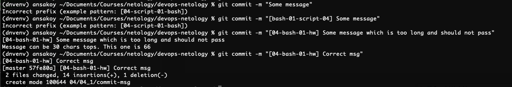

# Домашнее задание к занятию "4.1. Командная оболочка Bash: Практические навыки"
[Источник](https://github.com/netology-code/sysadm-homeworks/tree/devsys10/04-script-01-bash)
### 1. Обязательная задача 1
> Есть скрипт:
> ```
> a=1
> b=2
> c=a+b
> d=$a+$b
> e=$(($a+$b))
> ```
> Какие значения переменным c,d,e будут присвоены? Почему?

| Переменная  | Значение | Обоснование |
| ------------- | ------------- | ------------- |
| `a`  | "a+b"  | потому что этой переменной передали строку `a+b` |
| `b`  | "1+2"  | потому что ей передали строку `{переменная $a со строковым значением 1}+{переменная $b со строковым значением 2}` |
| `c`  | 3  | потому что синтаксическая конструкция $(()) предназначена для оценивания числовых выражений |

### 2. Обязательная задача 2
> На нашем локальном сервере упал сервис и мы написали скрипт, который постоянно проверяет его доступность, записывая дату проверок до тех пор, пока сервис не станет доступным. В скрипте допущена ошибка, из-за которой выполнение не может завершиться, при этом место на Жёстком Диске постоянно уменьшается. Что необходимо сделать, чтобы его исправить:
> ```
> while ((1==1)
> do
> curl https://localhost:4757
> if (($? != 0))
> then
> date >> curl.log
> fi
> done
> ```

В скрипте отсутствует условие выхода из цикла. Нужно его добавить:
```
while ((1==1)) ; do
  curl  https://localhost:4757
  if (($? != 0)) ; then
    date >> curl.log
  else
    break
  fi
done
```
Также в примере нарушен синтаксис, т.к. отсутствует одна скобка в условии while-цикла (`while ((1==1)`).

В принципе можно обойтись вообще без if-условий, т.к. для работы скрипта достаточно условия `while` ([пример](monitor.sh))

### 3. Обязательная задача 3
> Необходимо написать скрипт, который проверяет доступность трёх IP: 192.168.0.1, 173.194.222.113, 87.250.250.242 по 80 порту и записывает результат в файл log. Проверять доступность необходимо пять раз для каждого узла.
[Скрипт](ip_check.sh)  
```
for ip in 192.168.0.1 173.194.222.113 87.250.250.242; do
  for i in {1..5}; do
    nc -z $ip 80
    result=$?
    echo "$(date): $ip - $result" >> ip_check.log
  done;
done
```
[Лог](ip_check.log)
### 4. Обязательная задача 4
> Необходимо дописать скрипт из предыдущего задания так, чтобы он выполнялся до тех пор, пока один из узлов не окажется недоступным. Если любой из узлов недоступен - IP этого узла пишется в файл error, скрипт прерывается
[Скрипт](ip_check_err.sh)
```
while (( 1==1 )); do
  for ip in 192.168.0.1 173.194.222.113 87.250.250.242; do
    for i in {1..5}; do
      nc -z $ip 80
      result=$?
      echo "$(date): $ip - $result" >> ip_check_err.log
      if (($result != 0)) ; then
        echo $ip >> error
        exit 0
      fi
    done;
  done
done
```
### Дополнительное задание (со звездочкой*) - необязательно к выполнению
> Мы хотим, чтобы у нас были красивые сообщения для коммитов в репозиторий. Для этого нужно написать локальный хук для git, который будет проверять, что сообщение в коммите содержит код текущего задания в квадратных скобках и количество символов в сообщении не превышает 30. Пример сообщения: \[04-script-01-bash\] сломал хук.
[Скрипт](commit-msg)
```
#!/bin/sh

length=$(awk '{print length}' $1)

egrep '\[[0-9]{2}-.+?-[0-9]{2}-.+?\].*' $1
result=$?
if (( $result != 0 )); then
	echo "Incorrect prefix (example pattern: [04-script-01-bash])"
	exit 1
elif (( $length > 30 )); then
	echo "Message can be 30 chars tops. This one is $length"
	exit 1
fi
```
В действии:  

