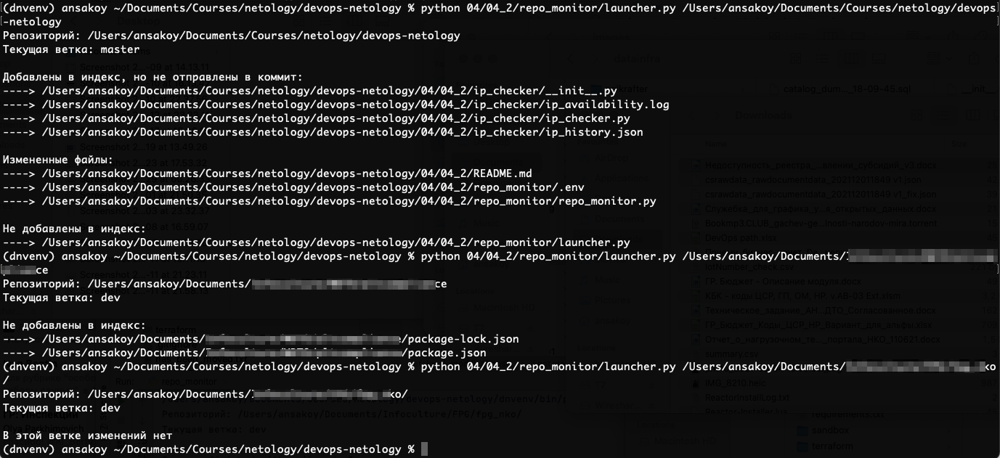

# Домашнее задание к занятию "4.2. Использование Python для решения типовых DevOps задач"
[Источник](https://github.com/netology-code/sysadm-homeworks/tree/devsys10/04-script-02-py)
### 1. Обязательная задача 1
> Есть скрипт:
> ```
> #!/usr/bin/env python3
> a = 1
> b = '2'
> c = a + b
> ```
| Вопрос  | Ответ |
| ------------- | ------------- |
| Какое значение будет присвоено переменной `c`?  | Никакого, будет TypeError  |
| Как получить для переменной `c` значение 12?  | Например, так: `c = str(a) + b`  |
| Как получить для переменной `c` значение 3?  | `c = a + int(b)`  |  

### 2. Обязательная задача 2
> Мы устроились на работу в компанию, где раньше уже был DevOps Engineer. Он написал скрипт, позволяющий узнать, какие файлы модифицированы в репозитории, относительно локальных изменений. Этим скриптом недовольно начальство, потому что в его выводе есть не все изменённые файлы, а также непонятен полный путь к директории, где они находятся. Как можно доработать скрипт ниже, чтобы он исполнял требования вашего руководителя?
> ```
> #!/usr/bin/env python3
> 
> import os
> 
> bash_command = ["cd ~/netology/sysadm-homeworks", "git status"]
> result_os = os.popen(' && '.join(bash_command)).read()
> is_change = False
> for result in result_os.split('\n'):
>     if result.find('modified') != -1:
>         prepare_result = result.replace('\tmodified:   ', '')
>         print(prepare_result)
>         break
> ```

[Например, так для начала](repo_monitor)  
В норме все такие скрипты должны быть оформлены в виде отдельных проектов. В данном случае 
не вижу смысла специально создавать репозитории, но имеется в виду, что в рабочем режиме задачи 
2-3 и 4 - это либо два разных репозитория, либо один отдельный (в зависимости от 
конкретного применения).

Основной рабочий код:
```python
"""
Скрипт позволяет узнать, какие файлы модифицированы в репозитории относительно локальных изменений
Указывать полные пути к файлам относительно репозитория
"""
import os

import environ
from git import Repo

BASE_DIR = os.path.dirname(os.path.dirname(os.path.dirname(os.path.dirname(os.path.abspath(__file__)))))

# FIXME: Вспомогательный путь добавлен, потому что модуль находится внутри большого проекта.
#  В норме он должен быть вынесен в отдельный проект, чтобы BASE_DIR была лично его.
PROJ_DIR = os.path.join(BASE_DIR, '04', '04_2', 'repo_monitor')

env = environ.Env(
    GIT_REPO=(str, BASE_DIR),
)

environ.Env.read_env(os.path.join(PROJ_DIR, ".env"))

GIT_REPO_PATH = env("GIT_REPO")


def list_files(report: str, seq: list, repo_path=None):
    """
    Добавить в отчет перечень файлов
    """
    if repo_path:
        git_path = repo_path
    else:
        git_path = GIT_REPO_PATH
    for mfile in seq:
        report += f"\n----> {os.path.join(git_path, mfile)}"
    return report


def get_local_modifications(repo_path=None):
    """
    Собрать отчет о локальных изменениях в репозитории
    """
    git_repo = Repo(GIT_REPO_PATH)
    git_path = GIT_REPO_PATH
    if repo_path:
        git_path = repo_path
        git_repo = Repo(repo_path)
    staged_files = [
        os.path.join(git_path, fname)
        for fname in git_repo.git.diff(name_only=True, staged=True).split('\n') if len(fname)
    ]
    modified_files = [
        os.path.join(git_path, fname)
        for fname in git_repo.git.diff(name_only=True).split('\n') if len(fname)
    ]
    untracked_files = [os.path.join(git_path, fname) for fname in git_repo.untracked_files]
    report = f"Репозиторий: {git_path}\nТекущая ветка: {git_repo.active_branch}"
    if staged_files:
        report += f"\n\nДобавлены в индекс, но не отправлены в коммит:"
        report = list_files(report, staged_files)
    if modified_files:
        report += f"\n\nИзмененные файлы:"
        report = list_files(report, modified_files)
    if untracked_files:
        report += f"\n\nНе добавлены в индекс:"
        report = list_files(report, untracked_files)
    if not staged_files and not modified_files and not untracked_files:
        report += f"\n\nВ этой ветке изменений нет"
    print(report)


if __name__ == '__main__':
    get_local_modifications()
```

Пример вывода по состоянию текущей локальной ветки:
```
Репозиторий: /Users/ansakoy/Documents/Courses/netology/devops-netology
Текущая ветка: master

Добавлены в индекс, но не отправлены в коммит:
----> /Users/ansakoy/Documents/Courses/netology/devops-netology/04/04_2/README.md
----> /Users/ansakoy/Documents/Courses/netology/devops-netology/04/04_2/repo_monitor/.env
----> /Users/ansakoy/Documents/Courses/netology/devops-netology/04/04_2/repo_monitor/__init__.py
----> /Users/ansakoy/Documents/Courses/netology/devops-netology/04/04_2/repo_monitor/repo_monitor.py
----> /Users/ansakoy/Documents/Courses/netology/devops-netology/requirements.txt

Измененные файлы:
----> /Users/ansakoy/Documents/Courses/netology/devops-netology/04/04_2/repo_monitor/repo_monitor.py
```
### 3. Обязательная задача 3
> Доработать скрипт выше так, чтобы он мог проверять не только локальный репозиторий в текущей директории, а также умел воспринимать путь к репозиторию, который мы передаём как входной параметр. Мы точно знаем, что начальство коварное и будет проверять работу этого скрипта в директориях, которые не являются локальными репозиториями.

Начальство скорее адекватно, чем коварно.  
Добавлен [лончер](repo_monitor/launcher.py) для CLI (наряду с возможностью задавать репозиторий через .env):
```python
from repo_monitor import get_local_modifications


def launch_from_cli(*args):
    if not args[0][1]:
        print("Не указан путь к нужному репозиторию")
        return
    repo_address = args[0][1]
    get_local_modifications(repo_path=repo_address)


if __name__ == '__main__':
    from sys import argv
    launch_from_cli(argv)
```
Пример вывода:


### 4. Обязательная задача 4
> Наша команда разрабатывает несколько веб-сервисов, доступных по http. Мы точно знаем, что на их стенде нет никакой балансировки, кластеризации, за DNS прячется конкретный IP сервера, где установлен сервис. Проблема в том, что отдел, занимающийся нашей инфраструктурой очень часто меняет нам сервера, поэтому IP меняются примерно раз в неделю, при этом сервисы сохраняют за собой DNS имена. Это бы совсем никого не беспокоило, если бы несколько раз сервера не уезжали в такой сегмент сети нашей компании, который недоступен для разработчиков. Мы хотим написать скрипт, который опрашивает веб-сервисы, получает их IP, выводит информацию в стандартный вывод в виде: <URL сервиса> - <его IP>. Также, должна быть реализована возможность проверки текущего IP сервиса c его IP из предыдущей проверки. Если проверка будет провалена - оповестить об этом в стандартный вывод сообщением: \[ERROR\] <URL сервиса> IP mismatch: <старый IP> <Новый IP>. Будем считать, что наша разработка реализовала сервисы: drive.google.com, mail.google.com, google.com.

[Проект](ip_checker)  
Основная рабочая часть скрипта:
```python
"""
Получение IP веб-сервисов по доменному имени
Вывод информации в stdout в виде: <URL сервиса> - <его IP>
Проверка доступности текущего IP с записью результата в лог
Сравнение текущего IP сервиса c его IP из предыдущей проверки
В случае изменения вывод в stdout сообщения в формате: [ERROR] <URL сервиса> IP mismatch: <старый IP> <Новый IP>
"""
import datetime
import json
import os
import socket
import subprocess

BASE_DIR = os.path.dirname(os.path.abspath(__file__))

IP_HISTORY_FILE = os.path.join(BASE_DIR, 'ip_history.json')
LOG_FILE = os.path.join(BASE_DIR, 'ip_availability.log')


def load_json(source: str):
    with open(source, 'r', encoding="utf-8") as handler:
        return json.load(handler)


def dump_json(input: (dict, list), json_file: str):
    with open(json_file, 'w', encoding='utf-8') as handler:
        json.dump(input, handler, ensure_ascii=False, indent=2)


def process_history(name: str, current_ip: str, output: str, addresses: dict):
    ips = addresses.get(name, list())
    old_new = None
    if ips and ips[-1] != current_ip:
        addresses[name].append(current_ip)
        old_new = ips[-1], current_ip
    elif not ips:
        addresses[name] = [current_ip]
    dump_json(addresses, output)
    return old_new


def check_connection(ip_address: str):
    with open(os.devnull, 'w') as dev_null:
        try:
            subprocess.check_call(
                ['ping', '-c', '3', ip_address],
                stdout=dev_null,
                stderr=dev_null,
            )
            result = 'up'
        except subprocess.CalledProcessError:
            result = 'down'
        with open(LOG_FILE, 'a', encoding='utf-8') as handler:
            handler.write(f"{datetime.datetime.utcnow()} - {ip_address} - {result}\n")


def process_name(name: str):
    try:
        ip_address = socket.gethostbyname(name)
        print(f"{name} - {ip_address}")
    except socket.gaierror:
        print(f"Некорректное доменное имя: {name}")
        return
    check_connection(ip_address)

    try:
        urls = load_json(IP_HISTORY_FILE)
    except FileNotFoundError:
        urls = dict()
    old_new = process_history(
        name=name,
        current_ip=ip_address,
        output=IP_HISTORY_FILE,
        addresses=urls,
    )
    if old_new:
        print(f"[ERROR] {name} IP mismatch: {old_new[0]} {old_new[1]}")
    print("\n")


def launch(*args):
    for arg in args[0][1:]:
        process_name(arg)


if __name__ == '__main__':
    from sys import argv
    
    launch(argv)
```
Пример файла `ip_history.json`:
```json
{
  "mail.google.com": [
    "64.233.162.83"
  ],
  "drive.google.com": [
    "64.233.165.194",
    "173.194.73.194"
  ],
  "google.com": [
    "74.125.205.139",
    "64.233.165.139",
    "209.85.233.138"
  ]
}
```
[Сам файл](ip_checker/ip_history.json)

Пример логов `ip_availability.log`
```
2021-12-13 11:28:57.349542 - 64.233.162.83 - up
2021-12-13 11:30:21.638725 - 64.233.165.194 - up
2021-12-13 11:30:23.666590 - 64.233.162.83 - up
2021-12-13 11:30:25.702728 - 74.125.205.139 - up
2021-12-13 11:34:38.475462 - 64.233.165.194 - up
2021-12-13 11:34:40.509709 - 64.233.162.83 - up
2021-12-13 11:34:42.542702 - 64.233.165.139 - up
2021-12-13 11:38:29.670871 - 173.194.73.194 - up
2021-12-13 11:38:31.698301 - 64.233.162.83 - up
2021-12-13 11:38:33.730872 - 209.85.233.138 - up
```
[Сам файл](ip_checker/ip_availability.log) (хотя в норме он должен быть в гитигноре)

> Вывод скрипта при запуске при тестировании:
```
python 04/04_2/ip_checker/ip_checker.py drive.google.com mail.google.com google.com blah
drive.google.com - 173.194.73.194
[ERROR] drive.google.com IP mismatch: 64.233.165.194 173.194.73.194


mail.google.com - 64.233.162.83


google.com - 209.85.233.138
[ERROR] google.com IP mismatch: 64.233.165.139 209.85.233.138
```