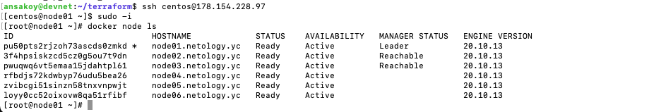
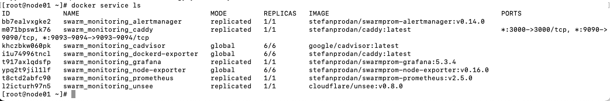
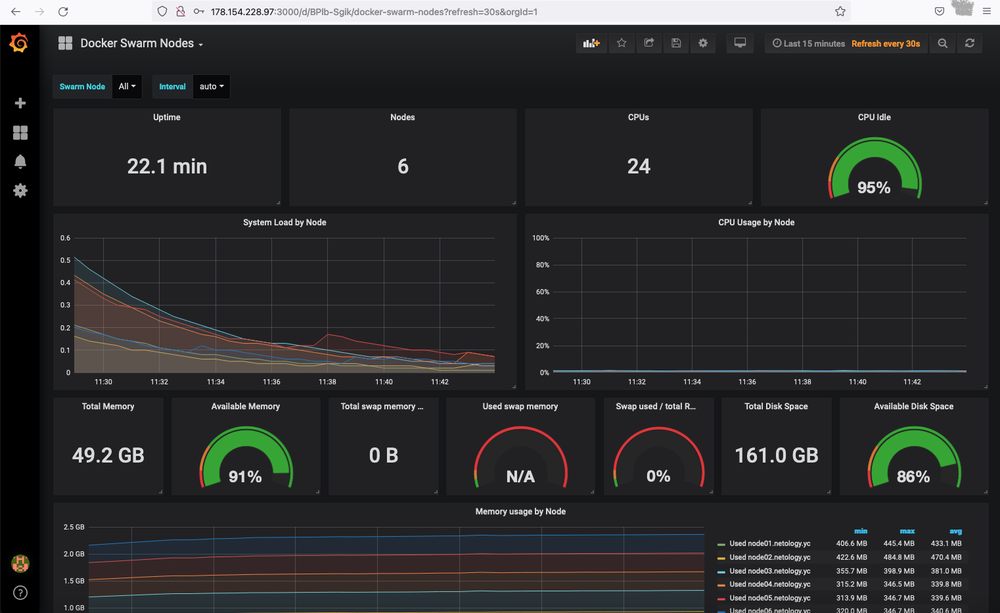
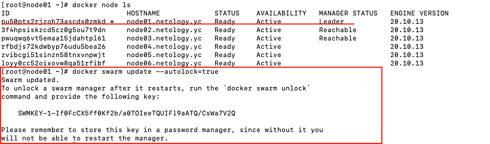

# Домашнее задание к занятию "5.5. Оркестрация кластером Docker контейнеров на примере Docker Swarm"

[Источник](https://github.com/netology-code/virt-homeworks/tree/virt-11/05-virt-05-docker-swarm)

## Задача 1

Дайте письменые ответы на следующие вопросы:

> - В чём отличие режимов работы сервисов в Docker Swarm кластере: replication и global?

Сервис, запущенный в режиме replication, работает в виде указанного числа содержательно 
идентичных реплик.  
В глобальном режиме сервис запускается на каждой ноде кластера.

> - Какой алгоритм выбора лидера используется в Docker Swarm кластере?

Raft. В кластере серверов один лидер (Л) и остальные - его последователи (П). 
Л отправляет П сигналы раз в установленный промежуток, показывая, что он существует. 
Если П не получает ожидаемый сигнал, он переходит в статус кандидата (К)  
и начинает отсчет времени. Также он рассылает другим серверам запросы проголосовать 
за свою кандидатуру. Если он получает запрос от другого К, у которого отсчет 
начался раньше, он проигрывает и становится П нового Л. Если он в ответ 
на свой запрос получает большинство голосов, он становится новым Л. Если не 
происходит ни того, ни другого (например, потому что голоса разделились поровну, 
то начинается новый раунд выборов). Чтобы снизить риск последнего сценария, 
в алгоритме используется рандомизация временного промежутка, в течение которого каждый 
К ожидает сигнала от Л. После избрания новый Л навязывает свою историю логов 
своим П во избежание противоречий, связанных с неполной репликацией старого лога.

> - Что такое Overlay Network?

Оверлейная сеть - это виртуальная сеть, объединяющая сервисы, входящие в 
кластер docker-swarm'а. Благодаря этому объединению все сервисы оказываются 
в одной подсети, использующей единый протокол шифрования, что позволяет им 
безопасно обмениваться данными.

## Задача 2

> Создать ваш первый Docker Swarm кластер в Яндекс.Облаке
>
>Для получения зачета, вам необходимо предоставить скриншот из терминала (консоли), 
>с выводом команды:
>```
>docker node ls
>```

### NB в [src/packer/centos-7-base.json](src/packer/centos-7-base.json) 
фальшивый токен облака. В реальной жизни нужно заменить на настоящий



## Задача 3

>Создать ваш первый, готовый к боевой эксплуатации кластер мониторинга, 
>состоящий из стека микросервисов.
>
>Для получения зачета, вам необходимо предоставить скриншот из терминала (консоли), 
>с выводом команды:
>```
>docker service ls
>```





## Задача 4 (*)

>Выполнить на лидере Docker Swarm кластера команду (указанную ниже) и дать 
>письменное описание её функционала, что она делает и зачем она нужна:
>```
># см.документацию: https://docs.docker.com/engine/swarm/swarm_manager_locking/
>docker swarm update --autolock=true
>```



По умолчанию логи машин-менеджеров в кластере сворма шифруются. Также есть возможность 
добавить еще один слой защиты, передав владельцу кластера контроль над использованием 
ключей шифрования. Если включить эту функцию (в данном случае она была добавлена 
к уже запущенному сворму), то для перезапуска потребуется ручная разблокировка 
менеджеров с использованием добавленного ключа.