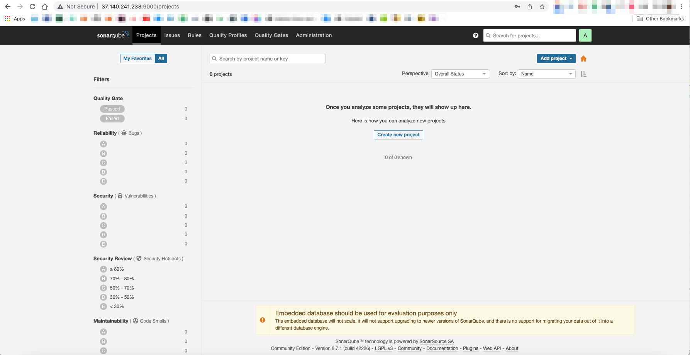
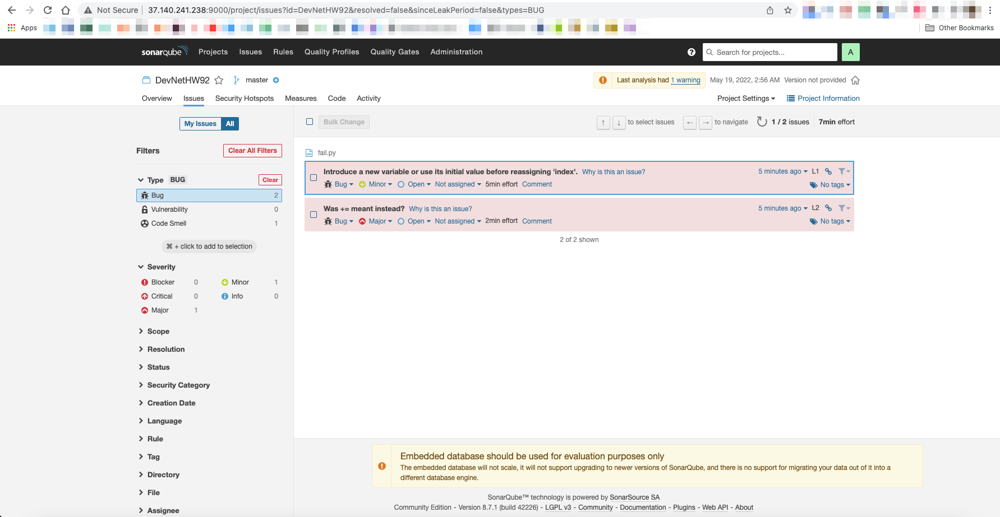
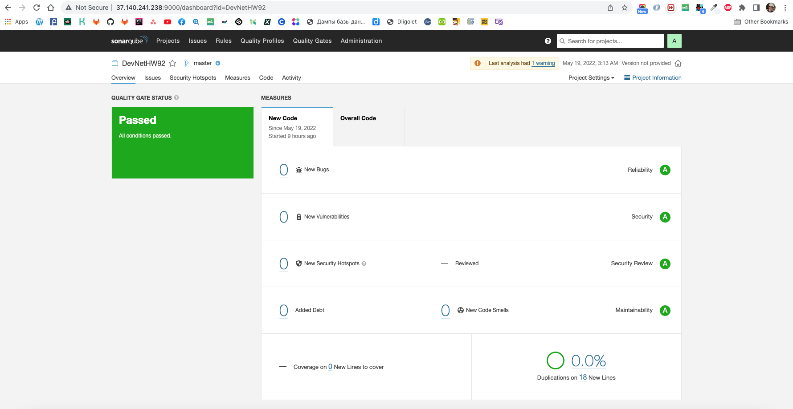
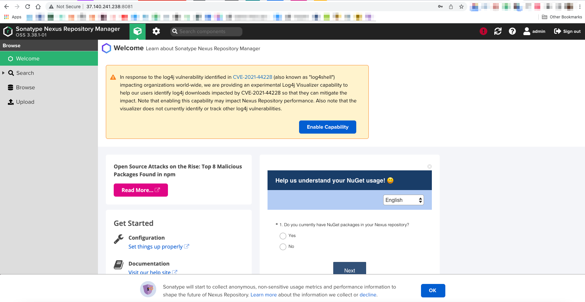
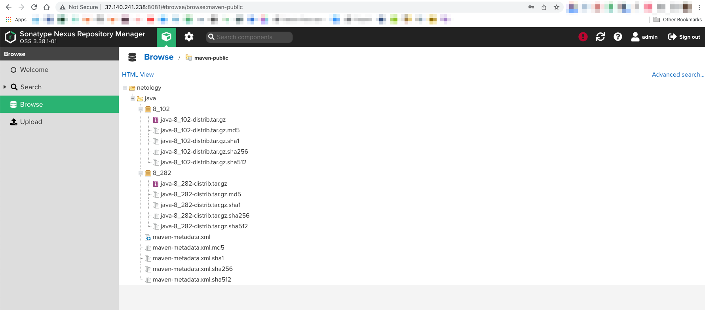

# Домашнее задание к занятию "09.02 CI\CD"
[Источник](https://github.com/netology-code/mnt-homeworks/blob/master/09-ci-02-cicd/README.md)

**ДИСКЛЕЙМЕР:**  
В этом файле минимум документации процесса и в основном требуемые свидетельства его прохождения. 
Подробно, по шагам и с решением проблем - [здесь](REALREADME.md)

## Знакомоство с SonarQube

> ### Подготовка к выполнению

> 1. Выполняем `docker pull sonarqube:8.7-community`
> 2. Выполняем `docker run -d --name sonarqube -e SONAR_ES_BOOTSTRAP_CHECKS_DISABLE=true -p 9000:9000 sonarqube:8.7-community`
> 3. Ждём запуск, смотрим логи через `docker logs -f sonarqube`
> 4. Проверяем готовность сервиса через [браузер](http://localhost:9000)
> 5. Заходим под admin\admin, меняем пароль на свой
> 
> В целом, в [этой статье](https://docs.sonarqube.org/latest/setup/install-server/) описаны все варианты установки, включая и docker, но так как нам он нужен разово, то достаточно того набора действий, который я указал выше.



> ### Основная часть

> 1. Создаём новый проект, название произвольное
> 2. Скачиваем пакет sonar-scanner, который нам предлагает скачать сам sonarqube
> 3. Делаем так, чтобы binary был доступен через вызов в shell (или меняем переменную PATH или любой другой удобный вам способ)
> 4. Проверяем `sonar-scanner --version`
> 5. Запускаем анализатор против кода из директории [example](./example) с дополнительным ключом `-Dsonar.coverage.exclusions=fail.py`
> 6. Смотрим результат в интерфейсе
> 7. Исправляем ошибки, которые он выявил(включая warnings)
> 8. Запускаем анализатор повторно - проверяем, что QG пройдены успешно
> 9. Делаем скриншот успешного прохождения анализа, прикладываем к решению ДЗ

**Sonar-scanner**:

Качаем:
```
wget https://binaries.sonarsource.com/Distribution/sonar-scanner-cli/sonar-scanner-cli-4.7.0.2747-linux.zip
```
Распаковываем:
```
unzip sonar-scanner-cli-4.7.0.2747-linux.zip
```

Доступность вызова:

```
export PATH=$PATH:/home/ansakoy/09_2/sonar-scanner-4.7.0.2747-linux/bin
```

Версия:

```
ansakoy@devnet:~/09_2/sonar-scanner-4.7.0.2747-linux/bin$ sonar-scanner --version
INFO: Scanner configuration file: /home/ansakoy/09_2/sonar-scanner-4.7.0.2747-linux/conf/sonar-scanner.properties
INFO: Project root configuration file: NONE
INFO: SonarScanner 4.7.0.2747
INFO: Java 11.0.14.1 Eclipse Adoptium (64-bit)
INFO: Linux 5.4.0-28-generic amd64
```

Анализируем [плохой файл](example/fail.py):
```
sonar-scanner \
  -Dsonar.projectKey=DevNetHW92 \
  -Dsonar.sources=. \
  -Dsonar.host.url=http://37.140.241.238:9000 \
  -Dsonar.login=12db299beba265400627d2793bf4b7ecf0f9330b \
  -Dsonar.coverage.exclusions=fail.py
```

Результат в интерфейсе:




Исправляем на [хороший файл](example/succeed.py)

```python
def increment(index):
    index += 1
    return index


def get_square(numb):
    return numb * numb


def print_numb(numb):
    print("Number is {}".format(numb))


idx = 0
while idx < 10:
    idx = increment(idx)
    print_numb(get_square(idx))
```

```
sonar-scanner
   -Dsonar.projectKey=DevNetHW92
   -Dsonar.sources=.
   -Dsonar.host.url=http://37.140.241.238:9000
   -Dsonar.login=12db299beba265400627d2793bf4b7ecf0f9330b
   -Dsonar.coverage.exclusions=succeed.py
```

Результат:



## Знакомство с Nexus

> ### Подготовка к выполнению
> 
> 1. Выполняем `docker pull sonatype/nexus3`
> 2. Выполняем `docker run -d -p 8081:8081 --name nexus sonatype/nexus3`
> 3. Ждём запуск, смотрим логи через `docker logs -f nexus`
> 4. Проверяем готовность сервиса через [бразуер](http://localhost:8081)
> 5. Узнаём пароль от admin через `docker exec -it nexus /bin/bash`
> 6. Подключаемся под админом, меняем пароль, сохраняем анонимный доступ

Успешно залогинились:



> ### Основная часть
> 
> 1. В репозиторий `maven-public` загружаем артефакт с GAV параметрами:
>    1. groupId: netology
>    2. artifactId: java
>    3. version: 8_282
>    4. classifier: distrib
>    5. type: tar.gz
> 2. В него же загружаем такой же артефакт, но с version: 8_102
> 3. Проверяем, что все файлы загрузились успешно
> 4. В ответе присылаем файл `maven-metadata.xml` для этого артефекта

Загрузили артефакты:



[maven-metadata.xml](nexus/maven-metadata.xml) по итогам:

```xml
<?xml version="1.0" encoding="UTF-8"?>
<metadata modelVersion="1.1.0">
  <groupId>netology</groupId>
  <artifactId>java</artifactId>
  <versioning>
    <latest>8_282</latest>
    <release>8_282</release>
    <versions>
      <version>8_102</version>
      <version>8_282</version>
    </versions>
    <lastUpdated>20220519105712</lastUpdated>
  </versioning>
</metadata>
```

### Знакомство с Maven

> ### Подготовка к выполнению
> 
> 1. Скачиваем дистрибутив с [maven](https://maven.apache.org/download.cgi)
> 2. Разархивируем, делаем так, чтобы binary был доступен через вызов в shell (или меняем переменную PATH или любой другой удобный вам способ)
> 3. Проверяем `mvn --version`
> 4. Забираем директорию [mvn](./mvn) с pom
> 
> ### Основная часть
> 
> 1. Меняем в `pom.xml` блок с зависимостями под наш артефакт из первого пункта задания для Nexus (java с версией 8_282)
> 2. Запускаем команду `mvn package` в директории с `pom.xml`, ожидаем успешного окончания
> 3. Проверяем директорию `~/.m2/repository/`, находим наш артефакт
> 4. В ответе присылаем исправленный файл `pom.xml`

Артефакт:
```
ansakoy@devnet:~/.m2/repository/netology/java/8_282$ ls -lha
total 20K
drwxr-xr-x 2 ansakoy sudo 4.0K May 19 12:58 .
drwxr-xr-x 3 ansakoy sudo 4.0K May 19 12:58 ..
-rw-r--r-- 1 ansakoy sudo    0 May 19 12:58 java-8_282-distrib.tar.gz
-rw-r--r-- 1 ansakoy sudo   40 May 19 12:58 java-8_282-distrib.tar.gz.sha1
-rw-r--r-- 1 ansakoy sudo  382 May 19 12:58 java-8_282.pom.lastUpdated
-rw-r--r-- 1 ansakoy sudo  175 May 19 12:58 _remote.repositories
```

Исправленный [pom.xml](mvn/pom.xml):

```xml
<project xmlns="http://maven.apache.org/POM/4.0.0" xmlns:xsi="http://www.w3.org/2001/XMLSchema-instance"
  xsi:schemaLocation="http://maven.apache.org/POM/4.0.0 http://maven.apache.org/xsd/maven-4.0.0.xsd">
  <modelVersion>4.0.0</modelVersion>
 
  <groupId>com.netology.app</groupId>
  <artifactId>simple-app</artifactId>
  <version>1.0-SNAPSHOT</version>
   <repositories>
    <repository>
      <id>my-repo</id>
      <name>maven-public</name>
      <url>http://localhost:8081/repository/maven-public/</url>
    </repository>
  </repositories>
  <dependencies>
     <dependency>
      <groupId>netology</groupId>
      <artifactId>java</artifactId>
      <version>8_282</version>
      <classifier>distrib</classifier>
      <type>tar.gz</type>
    </dependency>
  </dependencies>
</project>
```