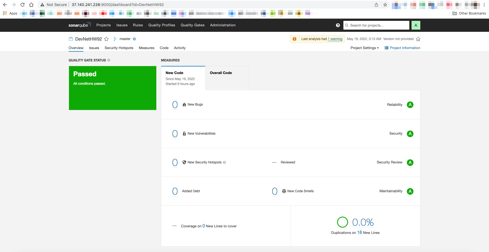
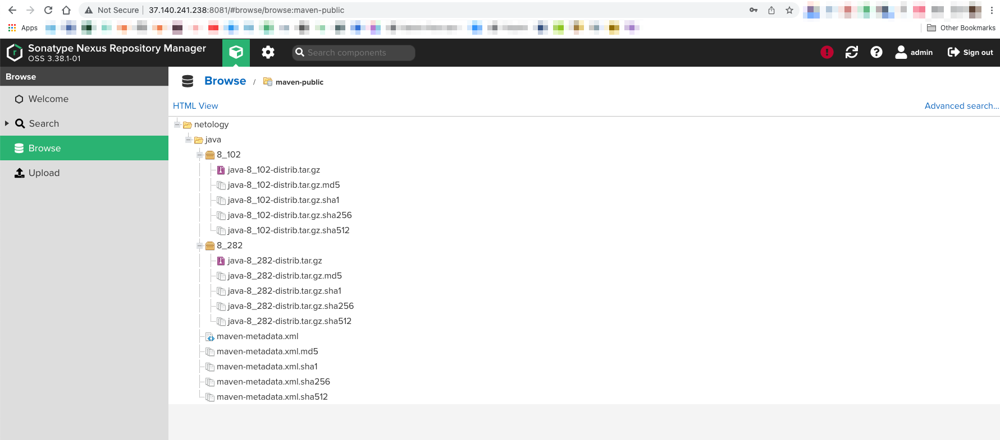

# Домашнее задание к занятию "09.02 CI\CD"
[Источник](https://github.com/netology-code/mnt-homeworks/blob/master/09-ci-02-cicd/README.md)

## Знакомоство с SonarQube

> ### Подготовка к выполнению

> 1. Выполняем `docker pull sonarqube:8.7-community`
    
```
ansakoy@devnet:~/09_2$ sudo docker pull sonarqube:8.7-community
8.7-community: Pulling from library/sonarqube
22599d3e9e25: Pull complete 
00bb4d95f2aa: Pull complete 
3ef8cf8a60c8: Pull complete 
928990dd1bda: Pull complete 
07cca701c22e: Pull complete 
Digest: sha256:70496f44067bea15514f0a275ee898a7e4a3fedaaa6766e7874d24a39be336dc
Status: Downloaded newer image for sonarqube:8.7-community
docker.io/library/sonarqube:8.7-community
```
    
> 2. Выполняем `docker run -d --name sonarqube -e SONAR_ES_BOOTSTRAP_CHECKS_DISABLE=true -p 9000:9000 sonarqube:8.7-community`

```
ansakoy@devnet:~/09_2$ sudo docker run -d --name sonarqube -e SONAR_ES_BOOTSTRAP
_CHECKS_DISABLE=true -p 9000:9000 sonarqube:8.7-community
495d26e0414407d4940489759c8287e6281dc78577411f2a5da476bc18e031fa
```

> 3. Ждём запуск, смотрим логи через `docker logs -f sonarqube`

```
ansakoy@devnet:~/09_2$ sudo docker logs -f sonarqube
2022.05.18 22:42:31 INFO  app[][o.s.a.AppFileSystem] Cleaning or creating temp d
irectory /opt/sonarqube/temp
2022.05.18 22:42:31 INFO  app[][o.s.a.es.EsSettings] Elasticsearch listening on 
[HTTP: 127.0.0.1:9001, TCP: 127.0.0.1:34857]
2022.05.18 22:42:31 INFO  app[][o.s.a.ProcessLauncherImpl] Launch process[[key='
es', ipcIndex=1, logFilenamePrefix=es]] from [/opt/sonarqube/elasticsearch]: /op
t/sonarqube/elasticsearch/bin/elasticsearch
2022.05.18 22:42:31 INFO  app[][o.s.a.SchedulerImpl] Waiting for Elasticsearch t
o be up and running
warning: no-jdk distributions that do not bundle a JDK are deprecated and will be removed in a future release
OpenJDK 64-Bit Server VM warning: Option UseConcMarkSweepGC was deprecated in version 9.0 and will likely be removed in a future release.
2022.05.18 22:42:46 INFO  es[][o.e.n.Node] version[7.10.2], pid[30], build[oss/tar/747e1cc71def077253878a59143c1f785afa92b9/2021-01-13T00:42:12.435326Z], OS[Linux/5.4.0-28-generic/amd64], JVM[AdoptOpenJDK/OpenJDK 64-Bit Server VM/11.0.10/11.0.10+9]
2022.05.18 22:42:46 INFO  es[][o.e.n.Node] JVM home [/opt/java/openjdk]
...
```

> 4. Проверяем готовность сервиса через [браузер](http://localhost:9000)

Работает, только вместо localhost у нас адрес сервера, на котором мы выполняем задания, дабы не грузить 
и без того перегруженный комп.


> 5. Заходим под admin\admin, меняем пароль на свой


```
# СОВЕРШЕННО СЕКРЕТНО!!!!
myadmin
************
```
 
> В целом, в [этой статье](https://docs.sonarqube.org/latest/setup/install-server/) описаны все варианты установки, включая и docker, но так как нам он нужен разово, то достаточно того набора действий, который я указал выше.
> 
> ### Основная часть

> 1. Создаём новый проект, название произвольное

DevNetHW92
```
testtoken: ************************************************
```

> 2. Скачиваем пакет sonar-scanner, который нам предлагает скачать сам sonarqube

Предложения сонаркуба:


Ближе к делу:
* Качать отсюда: http://37.140.241.238:9000/documentation/analysis/scan/sonarscanner/ 
(упс, да же мой урл, нет там никакого сонарсканера). Вторая попытка: отсюда: https://binaries.sonarsource.com/Distribution/sonar-scanner-cli/sonar-scanner-cli-4.7.0.2747-linux.zip

* Запускать это:
```
sonar-scanner \
  -Dsonar.projectKey=DevNetHW92 \
  -Dsonar.sources=. \
  -Dsonar.host.url=http://37.140.241.238:9000 \
  -Dsonar.login=12db299beba265400627d2793bf4b7ecf0f9330b
```

Качаем:
```
wget https://binaries.sonarsource.com/Distribution/sonar-scanner-cli/sonar-scanner-cli-4.7.0.2747-linux.zip
```
Распаковываем:
```
unzip sonar-scanner-cli-4.7.0.2747-linux.zip
```

> 3. Делаем так, чтобы binary был доступен через вызов в shell (или меняем переменную PATH или любой другой удобный вам способ)

```
export PATH=$PATH:/home/ansakoy/09_2/sonar-scanner-4.7.0.2747-linux/bin
```

> 4. Проверяем `sonar-scanner --version`

```
ansakoy@devnet:~/09_2/sonar-scanner-4.7.0.2747-linux/bin$ sonar-scanner --version
INFO: Scanner configuration file: /home/ansakoy/09_2/sonar-scanner-4.7.0.2747-linux/conf/sonar-scanner.properties
INFO: Project root configuration file: NONE
INFO: SonarScanner 4.7.0.2747
INFO: Java 11.0.14.1 Eclipse Adoptium (64-bit)
INFO: Linux 5.4.0-28-generic amd64
```

> 5. Запускаем анализатор против кода из директории [example](./example) с дополнительным ключом `-Dsonar.coverage.exclusions=fail.py`

```
sonar-scanner \
  -Dsonar.projectKey=DevNetHW92 \
  -Dsonar.sources=. \
  -Dsonar.host.url=http://37.140.241.238:9000 \
  -Dsonar.login=12db299beba265400627d2793bf4b7ecf0f9330b \
  -Dsonar.coverage.exclusions=fail.py
```

```
ansakoy@devnet:~/09_2$ cd example/
ansakoy@devnet:~/09_2/example$ sonar-scanner \
>   -Dsonar.projectKey=DevNetHW92 \
>   -Dsonar.sources=. \
>   -Dsonar.host.url=http://37.140.241.238:9000 \
>   -Dsonar.login=12db299beba265400627d2793bf4b7ecf0f9330b \
>   -Dsonar.coverage.exclusions=fail.py
INFO: Scanner configuration file: /home/ansakoy/09_2/sonar-scanner-4.7.0.2747-linux/conf/sonar-scanner.properties
INFO: Project root configuration file: NONE
INFO: SonarScanner 4.7.0.2747  
INFO: Java 11.0.14.1 Eclipse Adoptium (64-bit)
INFO: Linux 5.4.0-28-generic amd64
INFO: User cache: /home/ansakoy/.sonar/cache
INFO: Scanner configuration file: /home/ansakoy/09_2/sonar-scanner-4.7.0.2747-linux/conf/sonar-scanner.properties
INFO: Project root configuration file: NONE
INFO: Analyzing on SonarQube server 8.7.1
INFO: Default locale: "en_US", source code encoding: "UTF-8" (analysis is platform dependent)
INFO: Load global settings
INFO: Load global settings (done) | time=375ms
INFO: Server id: BF41A1F2-AYDZVzkZ1zYPwEdpnBcD
INFO: User cache: /home/ansakoy/.sonar/cache
INFO: Load/download plugins
INFO: Load plugins index
INFO: Load plugins index (done) | time=179ms
INFO: Load/download plugins (done) | time=5181ms
INFO: Process project properties
INFO: Process project properties (done) | time=32ms
INFO: Execute project builders 
INFO: Execute project builders (done) | time=4ms
INFO: Project key: DevNetHW92  
INFO: Base dir: /home/ansakoy/09_2/example
INFO: Working dir: /home/ansakoy/09_2/example/.scannerwork
INFO: Load project settings for component key: 'DevNetHW92'
INFO: Load project settings for component key: 'DevNetHW92' (done) | time=200ms
INFO: Load quality profiles
INFO: Load quality profiles (done) | time=355ms
INFO: Load active rules
INFO: Load active rules (done) | time=7960ms
WARN: SCM provider autodetection failed. Please use "sonar.scm.provider" to define SCM of your project, or disable the SCM Sensor in the project settings.
INFO: Indexing files...
INFO: Project configuration:
INFO:   Excluded sources for coverage: fail.py
INFO: 1 file indexed
INFO: Quality profile for py: Sonar way
INFO: ------------- Run sensors on module DevNetHW92
INFO: Load metrics repository  
INFO: Load metrics repository (done) | time=160ms
INFO: Sensor Python Sensor [python]
INFO: Starting global symbols computation
INFO: 1 source files to be analyzed
INFO: Load project repositories
INFO: Load project repositories (done) | time=107ms
INFO: 0/1 files analyzed, current file: fail.py
INFO: 0/1 files analyzed, current file: fail.py
INFO: Starting rules execution 
INFO: 1 source files to be analyzed
INFO: 1/1 source files have been analyzed
INFO: 1/1 source files have been analyzed
INFO: Sensor Python Sensor [python] (done) | time=23360ms
INFO: Sensor Cobertura Sensor for Python coverage [python]
INFO: Sensor Cobertura Sensor for Python coverage [python] (done) | time=31ms
INFO: Sensor PythonXUnitSensor [python]
INFO: Sensor PythonXUnitSensor [python] (done) | time=3ms
INFO: Sensor CSS Rules [cssfamily]
INFO: No CSS, PHP, HTML or VueJS files are found in the project. CSS analysis is skipped.
INFO: Sensor CSS Rules [cssfamily] (done) | time=15ms
INFO: Sensor JaCoCo XML Report Importer [jacoco]
INFO: 'sonar.coverage.jacoco.xmlReportPaths' is not defined. Using default locations: target/site/jacoco/jacoco.xml,target/site/jacoco-it/jacoco.xml,build/reports/jacoco/test/jacocoTestReport.xml
INFO: No report imported, no coverage information will be imported by JaCoCo XML Report Importer
INFO: Sensor JaCoCo XML Report Importer [jacoco] (done) | time=26ms
INFO: Sensor C# Properties [csharp]
INFO: Sensor C# Properties [csharp] (done) | time=7ms
INFO: Sensor JavaXmlSensor [java]
INFO: Sensor JavaXmlSensor [java] (done) | time=5ms
INFO: Sensor HTML [web]
INFO: Sensor HTML [web] (done) | time=17ms
INFO: Sensor VB.NET Properties [vbnet]
INFO: Sensor VB.NET Properties [vbnet] (done) | time=11ms
INFO: ------------- Run sensors on project
INFO: Sensor Zero Coverage Sensor
INFO: Sensor Zero Coverage Sensor (done) | time=3ms
INFO: SCM Publisher No SCM system was detected. You can use the 'sonar.scm.provider' property to explicitly specify it.
INFO: CPD Executor Calculating CPD for 1 file
INFO: CPD Executor CPD calculation finished (done) | time=27ms
INFO: Analysis report generated in 274ms, dir size=92 KB
INFO: Analysis report compressed in 104ms, zip size=12 KB
INFO: Analysis report uploaded in 367ms
INFO: ANALYSIS SUCCESSFUL, you can browse http://37.140.241.238:9000/dashboard?id=DevNetHW92
INFO: Note that you will be able to access the updated dashboard once the server has processed the submitted analysis report
INFO: More about the report processing at http://37.140.241.238:9000/api/ce/task?id=AYDZmghH1zYPwEdpnGbP
INFO: Analysis total time: 38.361 s
INFO: ------------------------------------------------------------------------
INFO: EXECUTION SUCCESS
INFO: ------------------------------------------------------------------------
INFO: Total time: 48.631s
INFO: Final Memory: 10M/294M   
INFO: ------------------------------------------------------------------------
```

> 6. Смотрим результат в интерфейсе


> 7. Исправляем ошибки, которые он выявил(включая warnings)

[Исправленный файл](example/succeed.py)

```python
def increment(index):
    index += 1
    return index


def get_square(numb):
    return numb * numb


def print_numb(numb):
    print("Number is {}".format(numb))


idx = 0
while idx < 10:
    idx = increment(idx)
    print_numb(get_square(idx))
```

> 8. Запускаем анализатор повторно - проверяем, что QG пройдены успешно

```
sonar-scanner
   -Dsonar.projectKey=DevNetHW92
   -Dsonar.sources=.
   -Dsonar.host.url=http://37.140.241.238:9000
   -Dsonar.login=12db299beba265400627d2793bf4b7ecf0f9330b
   -Dsonar.coverage.exclusions=succeed.py
```

> 9. Делаем скриншот успешного прохождения анализа, прикладываем к решению ДЗ



## Знакомство с Nexus

> ### Подготовка к выполнению
> 
> 1. Выполняем `docker pull sonatype/nexus3`

```
ansakoy@devnet:~/09_2$ sudo docker pull sonatype/nexus3
[sudo] password for ansakoy: 
Using default tag: latest
latest: Pulling from sonatype/nexus3
3de00bb8554b: Pull complete 
c530010fb61c: Pull complete 
7702e8da5f17: Pull complete 
17eb9ed9829d: Pull complete 
43371288717f: Pull complete 
Digest: sha256:66fe12b1eb3e97bae72eb3c2c4e436499d41ff144cdfd1dcd0718df738304732
Status: Downloaded newer image for sonatype/nexus3:latest
docker.io/sonatype/nexus3:latest
```

> 2. Выполняем `docker run -d -p 8081:8081 --name nexus sonatype/nexus3`

```
ansakoy@devnet:~/09_2$ sudo docker run -d -p 8081:8081 --name nexus sonatype/nexus3
efbe0eec1f4846a82b8ce27e26d7d6810fbf9ef68e44e459812b9b6313d35e6c
```

> 3. Ждём запуск, смотрим логи через `docker logs -f nexus`

```
ansakoy@devnet:~/09_2$ sudo docker logs -f nexus
2022-05-19 09:03:07,327+0000 INFO  [FelixStartLevel] *SYSTEM org.sonatype.nexus.pax.logging.NexusLogActivator - start
2022-05-19 09:03:07,611+0000 WARN  [CM Event Dispatcher (Fire ConfigurationEvent: pid=org.apache.karaf.log)] *SYSTEM org.apache.felix.fileinstall - File is not writeable: file:/opt/sonatype/nexus/etc/karaf/org.apache.karaf.log.cfg
2022-05-19 09:03:07,630+0000 WARN  [CM Event Dispatcher (Fire ConfigurationEvent: pid=jmx.acl)] *SYSTEM org.apache.felix.fileinstall - File is not writeable: file:/opt/sonatype/nexus/etc/karaf/jmx.acl.cfg
2022-05-19 09:03:07,638+0000 WARN  [CM Event Dispatcher (Fire ConfigurationEvent: pid=org.apache.karaf.features)] *SYSTEM org.apache.felix.fileinstall - File is not writeable: file:/opt/sonatype/nexus/etc/karaf/org.apache.karaf.features.cfg
2022-05-19 09:03:07,657+0000 WARN  [CM Event Dispatcher (Fire ConfigurationEvent: pid=org.ops4j.pax.url.mvn)] *SYSTEM org.apache.felix.fileinstall - File is not writeable: file:/opt/sonatype/nexus/etc/karaf/org.ops4j.pax.url.mvn.cfg
...
```

> 4. Проверяем готовность сервиса через [бразуер](http://localhost:8081)

В нашем случае: http://37.140.241.238:8081/


> 5. Узнаём пароль от admin через `docker exec -it nexus /bin/bash`

```
Default user is admin and the uniquely generated password can be found in the admin.password file inside the volume.
```
([источник](https://hub.docker.com/r/sonatype/nexus3))

```
ansakoy@devnet:~/09_2$ sudo docker exec -it nexus /bin/bash
bash-4.4$ ls
bin   dev  help.1  lib    licenses    media  nexus-data  proc  run   srv  tmp                uid_template.sh  var
boot  etc  home    lib64  lost+found  mnt    opt         root  sbin  sys  uid_entrypoint.sh  usr
bash-4.4$ ls nexus-data/
admin.password  cache  elasticsearch  generated-bundles  javaprefs  keystores  log     port                 tmp
blobs           db     etc            instances          karaf.pid  lock       orient  restore-from-backup
bash-4.4$ cat nexus-data/admin.password 
d21d43c0-c2d7-417b-9211-21a9237dee66
```

> 6. Подключаемся под админом, меняем пароль, сохраняем анонимный доступ

```
# СОВЕРШЕННО СЕКРЕТНО!!!
admin
****************************
``` 


> ### Основная часть
> 
> 1. В репозиторий `maven-public` загружаем артефакт с GAV параметрами:
>    1. groupId: netology
>    2. artifactId: java
>    3. version: 8_282
>    4. classifier: distrib
>    5. type: tar.gz
> 2. В него же загружаем такой же артефакт, но с version: 8_102
> 3. Проверяем, что все файлы загрузились успешно
> 4. В ответе присылаем файл `maven-metadata.xml` для этого артефекта


```
java_8_282.tar.gz
java_8_102.tar.gz
```




[maven-metadata.xml](nexus/maven-metadata.xml)

```xml
<?xml version="1.0" encoding="UTF-8"?>
<metadata modelVersion="1.1.0">
  <groupId>netology</groupId>
  <artifactId>java</artifactId>
  <versioning>
    <latest>8_282</latest>
    <release>8_282</release>
    <versions>
      <version>8_102</version>
      <version>8_282</version>
    </versions>
    <lastUpdated>20220519105712</lastUpdated>
  </versioning>
</metadata>
```

### Знакомство с Maven

> ### Подготовка к выполнению
> 
> 1. Скачиваем дистрибутив с [maven](https://maven.apache.org/download.cgi)

Скачиваем этот: https://dlcdn.apache.org/maven/maven-3/3.8.5/binaries/apache-maven-3.8.5-bin.tar.gz

```
wget https://dlcdn.apache.org/maven/maven-3/3.8.5/binaries/apache-maven-3.8.5-bin.tar.gz
```
```
ansakoy@devnet:~/09_2$ wget https://dlcdn.apache.org/maven/maven-3/3.8.5/binaries/apache-maven-3.8.5-bin.tar.gz
--2022-05-19 12:07:16--  https://dlcdn.apache.org/maven/maven-3/3.8.5/binaries/apache-maven-3.8.5-bin.tar.gz
Resolving dlcdn.apache.org (dlcdn.apache.org)... 151.101.2.132, 2a04:4e42::644
Connecting to dlcdn.apache.org (dlcdn.apache.org)|151.101.2.132|:443... connected.
HTTP request sent, awaiting response... 200 OK
Length: 8673123 (8.3M) [application/x-gzip]
Saving to: ‘apache-maven-3.8.5-bin.tar.gz’

apache-maven-3.8.5-bin.tar.gz          100%[===========================================================================>]   8.27M  5.55MB/s    in 1.5s    

2022-05-19 12:07:18 (5.55 MB/s) - ‘apache-maven-3.8.5-bin.tar.gz’ saved [8673123/8673123]
```
> 2. Разархивируем, делаем так, чтобы binary был доступен через вызов в shell (или меняем переменную PATH или любой другой удобный вам способ)

```
ansakoy@devnet:~/09_2$ ls
apache-maven-3.8.5-bin.tar.gz  example  sonar-scanner-4.7.0.2747-linux
ansakoy@devnet:~/09_2$ tar -zxf apache-maven-3.8.5-bin.tar.gz
ansakoy@devnet:~/09_2$ ls
apache-maven-3.8.5  apache-maven-3.8.5-bin.tar.gz  example  sonar-scanner-4.7.0.2747-linux
ansakoy@devnet:~/09_2$ ls apache-maven-3.8.5
bin  boot  conf  lib  LICENSE  NOTICE  README.txt
ansakoy@devnet:~/09_2$ ls apache-maven-3.8.5/bin/
m2.conf  mvn  mvn.cmd  mvnDebug  mvnDebug.cmd  mvnyjp
ansakoy@devnet:~/09_2$ sudo ln -s /home/ansakoy/09_2/apache-maven-3.8.5/bin/mvn /usr/bin/mvn
```
> 3. Проверяем `mvn --version`

```
ansakoy@devnet:~/09_2$ mvn --version
The JAVA_HOME environment variable is not defined correctly,
this environment variable is needed to run this program.
```
упс

Ну допустим так:
```
export JAVA_HOME=/home/ansakoy/09_2/sonar-scanner-4.7.0.2747-linux/jre/bin
```
тот же эффект. Попробуем установить джаву по-настоящему:

```
sudo apt update
sudo apt install -y openjdk-8-jdk
```
```
ansakoy@devnet:~/09_2/sonar-scanner-4.7.0.2747-linux/jre/bin$ java -version
openjdk version "1.8.0_312"
OpenJDK Runtime Environment (build 1.8.0_312-8u312-b07-0ubuntu1~20.04-b07)
OpenJDK 64-Bit Server VM (build 25.312-b07, mixed mode)
```
Ну ок, теперь работает:
```
ansakoy@devnet:~/09_2/sonar-scanner-4.7.0.2747-linux/jre/bin$ export JAVA_HOME=/usr/lib/jvm/java-8-openjdk-amd64/jre/
ansakoy@devnet:~/09_2/sonar-scanner-4.7.0.2747-linux/jre/bin$ echo $JAVA_HOME
/usr/lib/jvm/java-8-openjdk-amd64/jre/
ansakoy@devnet:~/09_2/sonar-scanner-4.7.0.2747-linux/jre/bin$ mvn -version
Apache Maven 3.8.5 (3599d3414f046de2324203b78ddcf9b5e4388aa0)
Maven home: /home/ansakoy/09_2/apache-maven-3.8.5
Java version: 1.8.0_312, vendor: Private Build, runtime: /usr/lib/jvm/java-8-openjdk-amd64/jre
Default locale: en_US, platform encoding: UTF-8
OS name: "linux", version: "5.4.0-28-generic", arch: "amd64", family: "unix"
```

> 4. Забираем директорию [mvn](./mvn) с pom
> 
> ### Основная часть
> 
> 1. Меняем в `pom.xml` блок с зависимостями под наш артефакт из первого пункта задания для Nexus (java с версией 8_282)

```xml
<project xmlns="http://maven.apache.org/POM/4.0.0" xmlns:xsi="http://www.w3.org/2001/XMLSchema-instance"
  xsi:schemaLocation="http://maven.apache.org/POM/4.0.0 http://maven.apache.org/xsd/maven-4.0.0.xsd">
  <modelVersion>4.0.0</modelVersion>
 
  <groupId>com.netology.app</groupId>
  <artifactId>simple-app</artifactId>
  <version>1.0-SNAPSHOT</version>
   <repositories>
    <repository>
      <id>my-repo</id>
      <name>maven-public</name>
      <url>http://localhost:8081/repository/maven-public/</url>
    </repository>
  </repositories>
  <dependencies>
     <dependency>
      <groupId>netology</groupId>
      <artifactId>java</artifactId>
      <version>8_282</version>
      <classifier>distrib</classifier>
      <type>tar.gz</type>
    </dependency>
  </dependencies>
</project>
```

> 2. Запускаем команду `mvn package` в директории с `pom.xml`, ожидаем успешного окончания

```
ansakoy@devnet:~/09_2/mvn$ mvn package
...
[INFO] ------------------------------------------------------------------------
[INFO] BUILD SUCCESS
[INFO] ------------------------------------------------------------------------
[INFO] Total time:  24.259 s
[INFO] Finished at: 2022-05-19T12:58:57+01:00
[INFO] ------------------------------------------------------------------------
```
> 3. Проверяем директорию `~/.m2/repository/`, находим наш артефакт

```ansakoy@devnet:~/09_2/mvn$ ls -lha ~/.m2/repository/
total 48K
drwxr-xr-x 12 ansakoy sudo 4.0K May 19 12:58 .
drwxr-xr-x  3 ansakoy sudo 4.0K May 19 12:58 ..
drwxr-xr-x  3 ansakoy sudo 4.0K May 19 12:58 backport-util-concurrent
drwxr-xr-x  3 ansakoy sudo 4.0K May 19 12:58 classworlds
drwxr-xr-x  3 ansakoy sudo 4.0K May 19 12:58 com
drwxr-xr-x  3 ansakoy sudo 4.0K May 19 12:58 commons-cli
drwxr-xr-x  3 ansakoy sudo 4.0K May 19 12:58 commons-lang
drwxr-xr-x  3 ansakoy sudo 4.0K May 19 12:58 commons-logging
drwxr-xr-x  3 ansakoy sudo 4.0K May 19 12:58 junit
drwxr-xr-x  3 ansakoy sudo 4.0K May 19 12:58 log4j
drwxr-xr-x  3 ansakoy sudo 4.0K May 19 12:58 netology
drwxr-xr-x  6 ansakoy sudo 4.0K May 19 12:58 org```
```
Артефакт:
```
ansakoy@devnet:~/.m2/repository/netology/java/8_282$ ls -lha
total 20K
drwxr-xr-x 2 ansakoy sudo 4.0K May 19 12:58 .
drwxr-xr-x 3 ansakoy sudo 4.0K May 19 12:58 ..
-rw-r--r-- 1 ansakoy sudo    0 May 19 12:58 java-8_282-distrib.tar.gz
-rw-r--r-- 1 ansakoy sudo   40 May 19 12:58 java-8_282-distrib.tar.gz.sha1
-rw-r--r-- 1 ansakoy sudo  382 May 19 12:58 java-8_282.pom.lastUpdated
-rw-r--r-- 1 ansakoy sudo  175 May 19 12:58 _remote.repositories
```

> 4. В ответе присылаем исправленный файл `pom.xml`

Дубль два: [pom.xml](mvn/pom.xml)

```xml
<project xmlns="http://maven.apache.org/POM/4.0.0" xmlns:xsi="http://www.w3.org/2001/XMLSchema-instance"
  xsi:schemaLocation="http://maven.apache.org/POM/4.0.0 http://maven.apache.org/xsd/maven-4.0.0.xsd">
  <modelVersion>4.0.0</modelVersion>
 
  <groupId>com.netology.app</groupId>
  <artifactId>simple-app</artifactId>
  <version>1.0-SNAPSHOT</version>
   <repositories>
    <repository>
      <id>my-repo</id>
      <name>maven-public</name>
      <url>http://localhost:8081/repository/maven-public/</url>
    </repository>
  </repositories>
  <dependencies>
     <dependency>
      <groupId>netology</groupId>
      <artifactId>java</artifactId>
      <version>8_282</version>
      <classifier>distrib</classifier>
      <type>tar.gz</type>
    </dependency>
  </dependencies>
</project>
```

