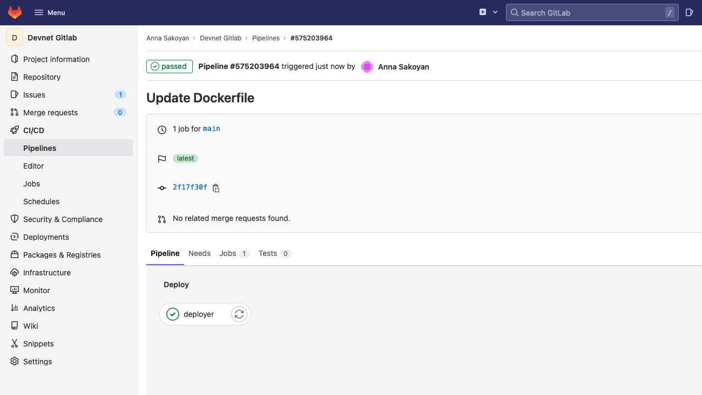
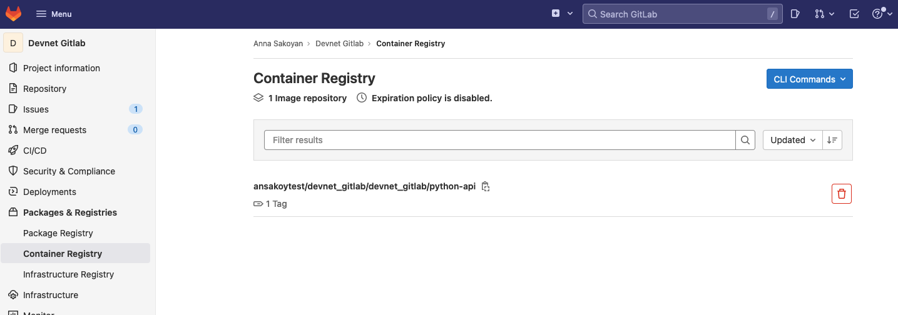
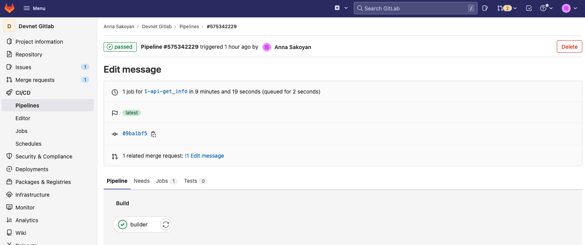

# Домашнее задание к занятию "09.06 Gitlab"

[Источник](https://github.com/netology-code/mnt-homeworks/blob/MNT-7/09-ci-06-gitlab/README.md)  
(Выбрана эта ветка по итогам обсуждений в чате)

# Домашнее задание к занятию "09.06 Gitlab"

## Подготовка к выполнению

> 1. Необходимо [зарегистрироваться](https://about.gitlab.com/free-trial/)

Аккаунт: https://gitlab.com/ansakoytest/

> 2. Создайте свой новый проект

https://gitlab.com/ansakoytest/devnet_gitlab

> 3. Создайте новый репозиторий в gitlab, наполните его [файлами](./repository)

~~От названия файла `python-api.py` с дефисом, как в папке по ссылке, подергивается глаз. Такую штуку 
никогда и никуда нельзя будет ни импортировать, ни запустить как модуль.~~

(возможно, в пункте 2 имелась в виду группа, и внутри нее надо было создать проект, что 
в терминах гитлаба и есть репозиторий, но буду делать как написано, то есть 
считать, что новый репозиторий был создан на прошлом шаге)

> 4. Проект должен быть публичным, остальные настройки по желанию

## Основная часть

### DevOps

> В репозитории содержится код проекта на python. Проект - RESTful API сервис. Ваша задача автоматизировать сборку образа с выполнением python-скрипта:
> 1. Образ собирается на основе [centos:7](https://hub.docker.com/_/centos?tab=tags&page=1&ordering=last_updated)
> 2. Python версии не ниже 3.7
> 3. Установлены зависимости: `flask` `flask-jsonpify` `flask-restful`
> 4. Создана директория `/python_api`
> 5. Скрипт из репозитория размещён в /python_api
> 6. Точка вызова: запуск скрипта
> 7. Если сборка происходит на ветке `master`: Образ должен пушится в docker registry вашего gitlab `python-api:latest`, иначе этот шаг нужно пропустить

[Dockerfile](https://gitlab.com/ansakoytest/devnet_gitlab/-/blob/main/Dockerfile)
```
FROM centos:7

COPY api.py /opt/python_api/api.py
COPY requirements.txt /opt/python_api/requirements.txt

RUN yum update -y \
    && yum -y install gcc openssl-devel bzip2-devel libffi-devel zlib-devel xz-devel \
    && yum -y install wget make \
    && wget https://www.python.org/ftp/python/3.9.6/Python-3.9.6.tgz \
    && tar xzf Python-3.9.6.tgz \
    && cd Python-3.9.6 \
    && ./configure --enable-optimizations \
    && make altinstall \
    && cd .. && rm Python-3.9.6.tgz \
    && yum install python3-pip -y \
    && yum clean all \
    && python3.9 -m pip install --upgrade pip \
    && python3.9 -m pip install -r /opt/python_api/requirements.txt

ENTRYPOINT  ["python3.9", "/opt/python_api/api.py"]
```
[.gitlab-ci.yml](https://gitlab.com/ansakoytest/devnet_gitlab/-/blob/main/.gitlab-ci.yml)
```yaml
stages:
    - build
    - deploy
image: docker:20.10.17
services:
  - name: docker:20.10.17-dind
builder:
  stage: build
  script:
    - docker build -t $CI_REGISTRY/$CI_PROJECT_PATH/$CI_PROJECT_NAME/image:latest .
  except:
    - main
deployer:
  stage: deploy
  script:
    - docker login -u $CI_REGISTRY_USER -p $CI_REGISTRY_PASSWORD $CI_REGISTRY
    - docker build -t $CI_REGISTRY/$CI_PROJECT_PATH/$CI_PROJECT_NAME/python-api:latest .
    - docker push $CI_REGISTRY/$CI_PROJECT_PATH/$CI_PROJECT_NAME/python-api:latest
  only:
    - main
```

Результат в GUI



И образ в реестре появился



### Product Owner

> Вашему проекту нужна бизнесовая доработка: необходимо поменять JSON ответа на вызов метода GET `/rest/api/get_info`, необходимо создать Issue в котором указать:
> 1. Какой метод необходимо исправить
> 2. Текст с `{ "message": "Already started" }` на `{ "message": "Running"}`
> 3. Issue поставить label: feature

[Issue](https://gitlab.com/ansakoytest/devnet_gitlab/-/issues/1)

### Developer

> Вам пришел новый Issue на доработку, вам необходимо:
> 1. Создать отдельную ветку, связанную с этим issue
> 2. Внести изменения по тексту из задания
> 3. Подготовить Merge Requst, влить необходимые изменения в `master`, проверить, что сборка прошла успешно

[Реквест](https://gitlab.com/ansakoytest/devnet_gitlab/-/merge_requests/1)  
[Сработало](https://gitlab.com/ansakoytest/devnet_gitlab/-/pipelines/575342229)  



### Tester

> Разработчики выполнили новый Issue, необходимо проверить валидность изменений:
> 1. Поднять докер-контейнер с образом `python-api:latest` и проверить возврат метода на корректность
> 2. Закрыть Issue с комментарием об успешности прохождения, указав желаемый результат и фактически достигнутый

Ну как бы так сказать. Если проверять надо образ `python-api:latest`, это значит, что 
изменения ветки уже вмерджены в мастер до теста. Не очень остроумно. Всё-таки лучше 
сначала тестировать, а потом мерджить, не наоборот. Ну уж ладно, смерджим до теста.

```
ansakoy@devnet:~/08_2$ sudo docker pull registry.gitlab.com/ansakoytest/devnet_gitlab/devnet_gitlab/python-api
Using default tag: latest
latest: Pulling from ansakoytest/devnet_gitlab/devnet_gitlab/python-api
Digest: sha256:edaa36f215fb8fd2b14e02583bb6ae8e27c1b44d446e5eccfcdc465f9647da8b
Status: Image is up to date for registry.gitlab.com/ansakoytest/devnet_gitlab/devnet_gitlab/python-api:latest
registry.gitlab.com/ansakoytest/devnet_gitlab/devnet_gitlab/python-api:latest
ansakoy@devnet:~/08_2$ sudo docker run --name pythonapi -d -p 5290:5290 registry.gitlab.com/ansakoytest/devnet_gitlab/devnet_gitlab/python-api
28a6ff91fb470f5d048a4466de78b9de5f4d9171318b80a8b20b9beb4a0b3ec8
ansakoy@devnet:~/08_2$ sudo docker ps
CONTAINER ID   IMAGE                                                                    COMMAND                  CREATED          STATUS         PORTS                                       NAMES
28a6ff91fb47   registry.gitlab.com/ansakoytest/devnet_gitlab/devnet_gitlab/python-api   "python3.9 /opt/pyth…"   10 seconds ago   Up 7 seconds   0.0.0.0:5290->5290/tcp, :::5290->5290/tcp   pythonapi
b1506d0a7b24   centos:7                                                                 "sleep infinity"         2 days ago       Up 2 days                                                  clickhouse-01
ansakoy@devnet:~/08_2$ curl 127.0.0.1:5290/get_info
{"version": 3, "method": "GET", "message": "Running"}
```

## Итог

> После успешного прохождения всех ролей - отправьте ссылку на ваш проект в гитлаб, как решение домашнего задания

https://gitlab.com/ansakoytest/devnet_gitlab/

## Необязательная часть

> Автомазируйте работу тестировщика, пусть у вас будет отдельный конвейер, который автоматически поднимает контейнер и выполняет проверку, например, при помощи curl. На основе вывода - будет приниматься решение об успешности прохождения тестирования

Т.к. задание необязательное, буду импровизировать. Во-первых, очень не нравится идея 
что-либо проверять курлом при деплое проекта, способного иметь самостоятельную систему 
тестирования. Разраб сделал - разраб затестил. Странно на каждую фичу заставлять 
еще отдельно девопса что-то хардкодить в деплое. Поэтому добавляется 
новый файл `test.py`, который проверяет, всё ли хорошо. Запускается в поднятом контейнере, 
который в случае нормального прохождения останавливается и убивается, а процесс идет дальше.

Единственный момент. Хочется, чтобы тесты запускались как при обновлении мастера, 
так и при обновлении ветки в разработке. Как это красиво сделать, пока не понимаю. Хотелось 
бы, чтобы билдер билдил, тестер тестил, а деплоер деплоил. Сейчас деплоер и билдит, и деплоит 
при условии, что пушится мастер. А билдер срабатывает только при условии, что коммит отправлен 
в побочную ветку (и билдит по своим правилам). Из-за этого либо тестирование у нас происходит 
только для одного из билдов, потому что от конкретного билда зависит, какой образ мы запускаем. 
Либо, нам надо отдельно сделать тесты для мастера и немастера. Сейчас имплементирован 
второй вариант. Сильно оставляет желать лучшего, конечно. Но пока так

```yaml
stages:
    - build
    - test
    - deploy
image: docker:20.10.17
services:
  - name: docker:20.10.17-dind
builder:
  stage: build
  script:
    - docker build -t $CI_REGISTRY/$CI_PROJECT_PATH/$CI_PROJECT_NAME/image:latest .
  except:
    - main
tester:
  stage: test
  script:
    - docker run -d --name flaskapi $CI_REGISTRY/$CI_PROJECT_PATH/$CI_PROJECT_NAME/image
    - docker exec flaskapi python3.9 /opt/python_api/test.py
    - docker stop flaskapi
    - docker rm flaskapi
    - docker image rm $CI_REGISTRY/$CI_PROJECT_PATH/$CI_PROJECT_NAME/image
deployer:
  stage: deploy
  script:
    - docker login -u $CI_REGISTRY_USER -p $CI_REGISTRY_PASSWORD $CI_REGISTRY
    - docker build -t $CI_REGISTRY/$CI_PROJECT_PATH/$CI_PROJECT_NAME/python-api:latest .
    - docker push $CI_REGISTRY/$CI_PROJECT_PATH/$CI_PROJECT_NAME/python-api:latest
  only:
    - main
```
Тест успешно [фейлит пайплайн](https://gitlab.com/ansakoytest/devnet_gitlab/-/pipelines/575434668) в случае 
несоответствия ожиданиям (в случае соответствия пайплайн срабатывает).

