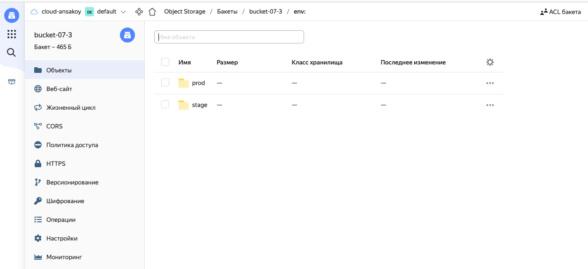
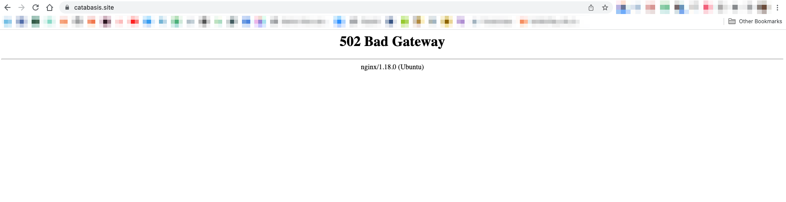
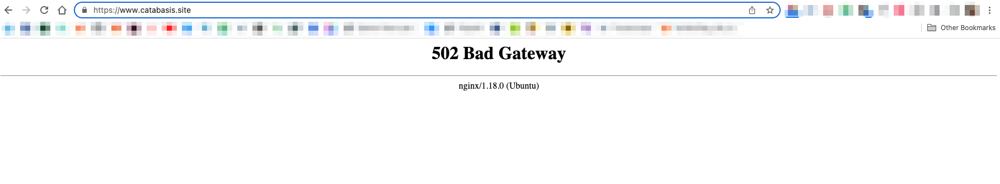

# Дипломный практикум в YandexCloud

[Официальный источник](https://netology.ru/profile/program/fdvpspdc-2/lessons/135374/lesson_items/696439)  
[Источник маркдауна](https://github.com/olegbukatchuk/devops-diplom-yandexcloud/blob/main/README.md)

## Основные ссылки:
- [Репозиторий дипломного проекта](https://github.com/ansakoy/devnet-diploma)
- [Заметки по ходу выполнения проекта](REALREADME.md)

## Цели:

> 1. Зарегистрировать доменное имя (любое на ваш выбор в любой доменной зоне).
> 2. Подготовить инфраструктуру с помощью Terraform на базе облачного провайдера YandexCloud.
> 3. Настроить внешний Reverse Proxy на основе Nginx и LetsEncrypt.
> 4. Настроить кластер MySQL.
> 5. Установить WordPress.
> 6. Развернуть Gitlab CE и Gitlab Runner.
> 7. Настроить CI/CD для автоматического развёртывания приложения.
> 8. Настроить мониторинг инфраструктуры с помощью стека: Prometheus, Alert Manager и Grafana.

---
## Этапы выполнения:

### Регистрация доменного имени

> Подойдет любое доменное имя на ваш выбор в любой доменной зоне.
> 
> ПРИМЕЧАНИЕ: Далее в качестве примера используется домен `you.domain` замените его вашим доменом.
> 
> Рекомендуемые регистраторы:
>   - [nic.ru](https://nic.ru)
>   - [reg.ru](https://reg.ru)
> 
> Цель:
> 
> 1. Получить возможность выписывать [TLS сертификаты](https://letsencrypt.org) для веб-сервера.
> 
> Ожидаемые результаты:
> 
> 1. У вас есть доступ к личному кабинету на сайте регистратора.
> 2. Вы зарезистрировали домен и можете им управлять (редактировать dns записи в рамках этого домена).

Есть учетная запись на reg.ru и домен catabasis.site, который, скорее всего, сгинет к январю 2023 
года, потому что продлевать его большого смысла нет.

### Создание инфраструктуры

> Для начала необходимо подготовить инфраструктуру в YC при помощи [Terraform](https://www.terraform.io/).
> 
> Особенности выполнения:
> 
> - Бюджет купона ограничен, что следует иметь в виду при проектировании инфраструктуры и использовании ресурсов;
> - Следует использовать последнюю стабильную версию [Terraform](https://www.terraform.io/).
> 
> Предварительная подготовка:
> 
> 1. Создайте сервисный аккаунт, который будет в дальнейшем использоваться Terraform для работы с инфраструктурой с необходимыми и достаточными правами. Не стоит использовать права суперпользователя
> 2. Подготовьте [backend](https://www.terraform.io/docs/language/settings/backends/index.html) для Terraform:
>    а. Рекомендуемый вариант: [Terraform Cloud](https://app.terraform.io/)  
>    б. Альтернативный вариант: S3 bucket в созданном YC аккаунте.
> 3. Настройте [workspaces](https://www.terraform.io/docs/language/state/workspaces.html)
>    а. Рекомендуемый вариант: создайте два workspace: *stage* и *prod*. В случае выбора этого варианта все последующие шаги должны учитывать факт существования нескольких workspace.  
>    б. Альтернативный вариант: используйте один workspace, назвав его *stage*. Пожалуйста, не используйте workspace, создаваемый Terraform-ом по-умолчанию (*default*).
> 4. Создайте VPC с подсетями в разных зонах доступности.
> 5. Убедитесь, что теперь вы можете выполнить команды `terraform destroy` и `terraform apply` без дополнительных ручных действий.
> 6. В случае использования [Terraform Cloud](https://app.terraform.io/) в качестве [backend](https://www.terraform.io/docs/language/settings/backends/index.html) убедитесь, что применение изменений успешно проходит, используя web-интерфейс Terraform cloud.
> 
> Цель:
> 
> 1. Повсеместно применять IaaC подход при организации (эксплуатации) инфраструктуры.
> 2. Иметь возможность быстро создавать (а также удалять) виртуальные машины и сети. С целью экономии денег на вашем аккаунте в YandexCloud.
> 
> Ожидаемые результаты:
> 
> 1. Terraform сконфигурирован и создание инфраструктуры посредством Terraform возможно без дополнительных ручных действий.
> 2. Полученная конфигурация инфраструктуры является предварительной, поэтому в ходе дальнейшего выполнения задания возможны изменения.

Т.к. очень не хочется каждый раз возиться с настройками сервисного аккаунта и генерацией 
необходимых для терраформа переменных вручную, написан [питоновский скрипт](https://github.com/ansakoy/devnet-diploma/blob/master/scripts/yc_setup.py), который 
принимает исходный набор минимальный набор сведений для развертывания данной инфраструктуры 
и затем сам через API ЯО всё генерирует. Остальное - через ТФ.

Бакет:



Созданные машины:


Подсети с привязанной таблицей маршрутизации:


Ресурсные записи:


---
### Установка Nginx и LetsEncrypt

> Необходимо разработать Ansible роль для установки Nginx и LetsEncrypt.
> 
> **Для получения LetsEncrypt сертификатов во время тестов своего кода пользуйтесь [тестовыми сертификатами](https://letsencrypt.org/docs/staging-environment/), так как количество запросов к боевым серверам LetsEncrypt [лимитировано](https://letsencrypt.org/docs/rate-limits/).**
> 
> Рекомендации:
>   - Имя сервера: `you.domain`
>   - Характеристики: 2vCPU, 2 RAM, External address (Public) и Internal address.
> 
> Цель:
> 
> 1. Создать reverse proxy с поддержкой TLS для обеспечения безопасного доступа к веб-сервисам по HTTPS.
> 
> Ожидаемые результаты:
> 
> 1. В вашей доменной зоне настроены все A-записи на внешний адрес этого сервера:
>     - `https://www.you.domain` (WordPress)
>     - `https://gitlab.you.domain` (Gitlab)
>     - `https://grafana.you.domain` (Grafana)
>     - `https://prometheus.you.domain` (Prometheus)
>     - `https://alertmanager.you.domain` (Alert Manager)
> 2. Настроены все upstream для выше указанных URL, куда они сейчас ведут на этом шаге не важно, позже вы их отредактируете и укажите верные значения.
> 2. В браузере можно открыть любой из этих URL и увидеть ответ сервера (502 Bad Gateway). На текущем этапе выполнение задания это нормально!

Примеры обращений по адресам с привязанным сертификатом:






И так далее

___
### Установка кластера MySQL

> Необходимо разработать Ansible роль для установки кластера MySQL.
> 
> Рекомендации:
>   - Имена серверов: `db01.you.domain` и `db02.you.domain`
>   - Характеристики: 4vCPU, 4 RAM, Internal address.
> 
> Цель:
> 
> 1. Получить отказоустойчивый кластер баз данных MySQL.
> 
> Ожидаемые результаты:
> 
> 1. MySQL работает в режиме репликации Master/Slave.
> 2. В кластере автоматически создаётся база данных c именем `wordpress`.
> 3. В кластере автоматически создаётся пользователь `wordpress` с полными правами на базу `wordpress` и паролем `wordpress`.
> 
> **Вы должны понимать, что в рамках обучения это допустимые значения, но в боевой среде использование подобных значений не приемлимо! Считается хорошей практикой использовать логины и пароли повышенного уровня сложности. В которых будут содержаться буквы верхнего и нижнего регистров, цифры, а также специальные символы!**

MySQL установлен, репликация настроена. Мастер:


Слейв работает в качестве реплики:


___
### Установка WordPress

> Необходимо разработать Ansible роль для установки WordPress.
> 
> Рекомендации:
>   - Имя сервера: `app.you.domain`
>   - Характеристики: 4vCPU, 4 RAM, Internal address.
> 
> Цель:
> 
> 1. Установить [WordPress](https://wordpress.org/download/). Это система управления содержимым сайта ([CMS](https://ru.wikipedia.org/wiki/Система_управления_содержимым)) с открытым исходным кодом.
> 
> 
> По данным W3techs, WordPress используют 64,7% всех веб-сайтов, которые сделаны на CMS. Это 41,1% всех существующих в мире сайтов. Эту платформу для своих блогов используют The New York Times и Forbes. Такую популярность WordPress получил за удобство интерфейса и большие возможности.
> 
> Ожидаемые результаты:
> 
> 1. Виртуальная машина на которой установлен WordPress и Nginx/Apache (на ваше усмотрение).
> 2. В вашей доменной зоне настроена A-запись на внешний адрес reverse proxy:
>    - `https://www.you.domain` (WordPress)
> 3. На сервере `you.domain` отредактирован upstream для выше указанного URL и он смотрит на виртуальную машину на которой установлен WordPress.
> 4. В браузере можно открыть URL `https://www.you.domain` и увидеть главную страницу WordPress.

Вордпресс установлен:


---
### Установка Gitlab CE и Gitlab Runner

> Необходимо настроить CI/CD систему для автоматического развертывания приложения при изменении кода.
> 
> Рекомендации:
>   - Имена серверов: `gitlab.you.domain` и `runner.you.domain`
>   - Характеристики: 4vCPU, 4 RAM, Internal address.
> 
> Цель:
> 1. Построить pipeline доставки кода в среду эксплуатации, то есть настроить автоматический деплой на сервер `app.you.domain` при коммите в репозиторий с WordPress.
> 
> Подробнее об [Gitlab CI](https://about.gitlab.com/stages-devops-lifecycle/continuous-integration/)
> 
> Ожидаемый результат:
> 
> 1. Интерфейс Gitlab доступен по https.
> 2. В вашей доменной зоне настроена A-запись на внешний адрес reverse proxy:
>     - `https://gitlab.you.domain` (Gitlab)
> 3. На сервере `you.domain` отредактирован upstream для выше указанного URL и он смотрит на виртуальную машину на которой установлен Gitlab.
> 3. При любом коммите в репозиторий с WordPress и создании тега (например, v1.0.0) происходит деплой на виртуальную машину.

Гитлаб доступен:


Логинится нормально:


Да, будем всё делать из-под рута и самым варварским образом, а когда у нас еще 
будет такая возможность.

Устанавливаем связь между папкой вордпресса на хосте вордпресса. Для этого:
- устанавливаем там git 
(в основной сценарий не включено; в принципе можно включить, но цель сценария 
рассматривается как создание инфраструктуры, в которой в дальнейшем можно работать - вот 
сейчас с гитлабом инсценировка такой работы). 
- в гитлабе создаем проект catabasis.site
- на хосте в /var/www/catabasis.site инициализируем git, создаем .gitignore, кладем 
туда приватный `wp-config.php`, добавляем гитлабовский проект в качестве remote.
- создаем из этого коммит и пушим в гитлаб.

Результат:


Регистрируем раннер, который будет работать через shell. И туда же кладем баш-скрипт `deploy.sh`, 
который будет обновлять вордпресс и перезапускать php, когда это нужно:
```bash
#!/bin/bash

echo "I'm at $(hostname -I)"
cd /var/www/catabasis.site
sudo git pull
sudo systemctl restart php7.4-fpm
```
Добавляем .gitlab-ci.yml:
```yaml
stages:
  - deploy

deployer:
  stage: deploy
  script:
    - echo "Running as user $(whoami)"
    - echo "My working dir is $(pwd)"
    - if [ "$CI_COMMIT_TAG" = "" ] ; then echo "Deploy only happens if tag is added";
      else 
        echo "Look, there's a tag!" && ssh ubuntu@www 'bash -s' < /home/gitlab-runner/deploy.sh;
      fi
    - echo "Hey I worked!!"
``` 
Деплой включается, только если добавлен тег. При обычных коммитах джоб отрабатывает 
без деплоя.

Работает:


А именно:

- просто коммит (без тега):


- с тегом:


___
### Установка Prometheus, Alert Manager, Node Exporter и Grafana

> Необходимо разработать Ansible роль для установки Prometheus, Alert Manager и Grafana.
> 
> Рекомендации:
>   - Имя сервера: `monitoring.you.domain`
>   - Характеристики: 4vCPU, 4 RAM, Internal address.
> 
> Цель:
> 
> 1. Получение метрик со всей инфраструктуры.
> 
> Ожидаемые результаты:
> 
> 1. Интерфейсы Prometheus, Alert Manager и Grafana доступены по https.
> 2. В вашей доменной зоне настроены A-записи на внешний адрес reverse proxy:
>   - `https://grafana.you.domain` (Grafana)
>   - `https://prometheus.you.domain` (Prometheus)
>   - `https://alertmanager.you.domain` (Alert Manager)
> 3. На сервере `you.domain` отредактированы upstreams для выше указанных URL и они смотрят на виртуальную машину на которой установлены Prometheus, Alert Manager и Grafana.
> 4. На всех серверах установлен Node Exporter и его метрики доступны Prometheus.
> 5. У Alert Manager есть необходимый [набор правил](https://awesome-prometheus-alerts.grep.to/rules.html) для создания алертов.
> 2. В Grafana есть дашборд отображающий метрики из Node Exporter по всем серверам.
> 3. В Grafana есть дашборд отображающий метрики из MySQL (*).
> 4. В Grafana есть дашборд отображающий метрики из WordPress (*).
> 
> *Примечание: дашборды со звёздочкой являются опциональными заданиями повышенной сложности их выполнение желательно, но не обязательно.*

---
## Что необходимо для сдачи задания?
> 
> 1. Репозиторий со всеми Terraform манифестами и готовность продемонстрировать создание всех ресурсов с нуля.
> 2. Репозиторий со всеми Ansible ролями и готовность продемонстрировать установку всех сервисов с нуля.
> 3. Скриншоты веб-интерфейсов всех сервисов работающих по HTTPS на вашем доменном имени.
>   - `https://www.you.domain` (WordPress)
>   - `https://gitlab.you.domain` (Gitlab)
>   - `https://grafana.you.domain` (Grafana)
>   - `https://prometheus.you.domain` (Prometheus)
>   - `https://alertmanager.you.domain` (Alert Manager)
> 4. Все репозитории рекомендуется хранить на одном из ресурсов ([github.com](https://github.com) или [gitlab.com](https://gitlab.com)).

