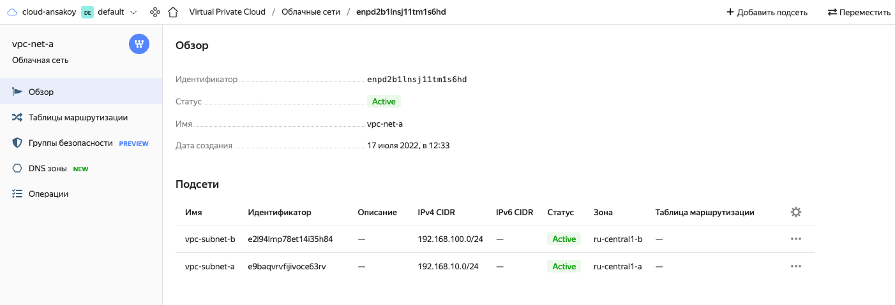
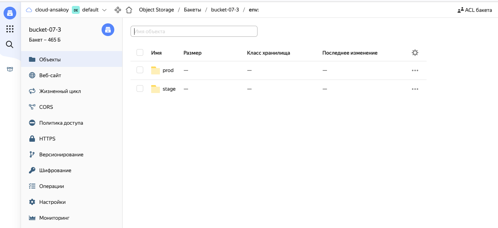
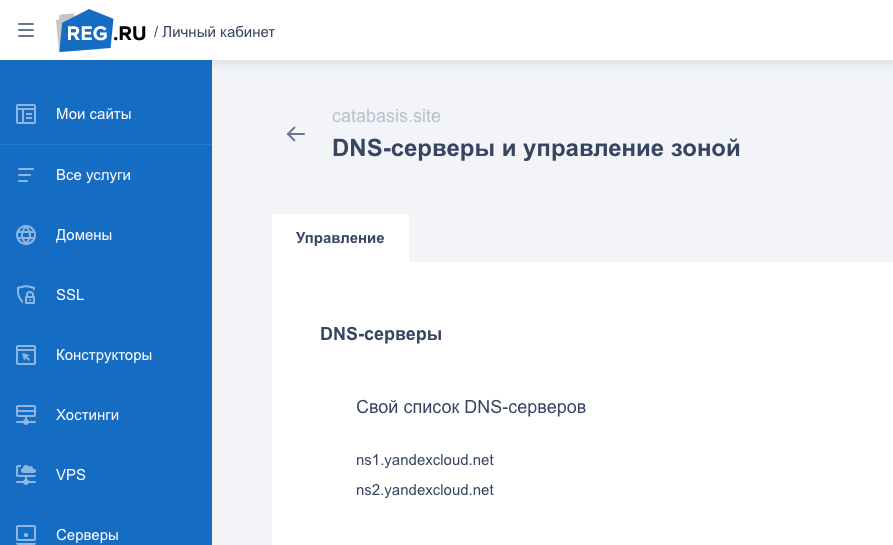
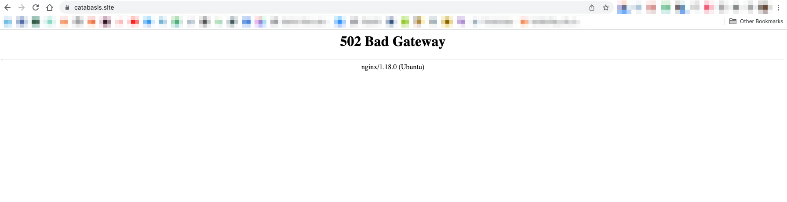
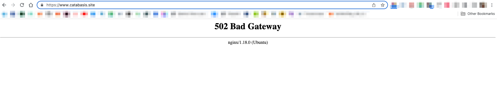
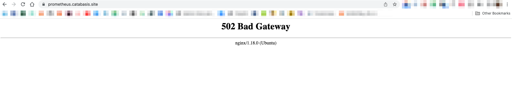
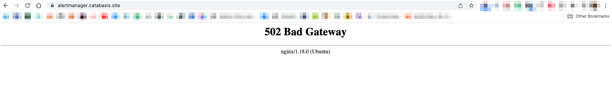

# Дипломный практикум в YandexCloud

[Официальный источник](https://netology.ru/profile/program/fdvpspdc-2/lessons/135374/lesson_items/696439)  
[Источник маркдауна](https://github.com/olegbukatchuk/devops-diplom-yandexcloud/blob/main/README.md)

  * [Цели:](#цели)
  * [Этапы выполнения:](#этапы-выполнения)
      * [Регистрация доменного имени](#регистрация-доменного-имени)
      * [Создание инфраструктуры](#создание-инфраструктуры)
          * [Установка Nginx и LetsEncrypt](#установка-nginx)
          * [Установка кластера MySQL](#установка-mysql)
          * [Установка WordPress](#установка-wordpress)
          * [Установка Gitlab CE, Gitlab Runner и настройка CI/CD](#установка-gitlab)
          * [Установка Prometheus, Alert Manager, Node Exporter и Grafana](#установка-prometheus)
  * [Что необходимо для сдачи задания?](#что-необходимо-для-сдачи-задания)
  * [Как правильно задавать вопросы дипломному руководителю?](#как-правильно-задавать-вопросы-дипломному-руководителю)

---
## Цели:

1. Зарегистрировать доменное имя (любое на ваш выбор в любой доменной зоне).
2. Подготовить инфраструктуру с помощью Terraform на базе облачного провайдера YandexCloud.
3. Настроить внешний Reverse Proxy на основе Nginx и LetsEncrypt.
4. Настроить кластер MySQL.
5. Установить WordPress.
6. Развернуть Gitlab CE и Gitlab Runner.
7. Настроить CI/CD для автоматического развёртывания приложения.
8. Настроить мониторинг инфраструктуры с помощью стека: Prometheus, Alert Manager и Grafana.

---
## Этапы выполнения:

### Регистрация доменного имени

Подойдет любое доменное имя на ваш выбор в любой доменной зоне.

ПРИМЕЧАНИЕ: Далее в качестве примера используется домен `you.domain` замените его вашим доменом.

Рекомендуемые регистраторы:
  - [nic.ru](https://nic.ru)
  - [reg.ru](https://reg.ru)

Цель:

1. Получить возможность выписывать [TLS сертификаты](https://letsencrypt.org) для веб-сервера.

Ожидаемые результаты:

1. У вас есть доступ к личному кабинету на сайте регистратора.
2. Вы зарезистрировали домен и можете им управлять (редактировать dns записи в рамках этого домена).

### Создание инфраструктуры

Для начала необходимо подготовить инфраструктуру в YC при помощи [Terraform](https://www.terraform.io/).

Особенности выполнения:

> - Бюджет купона ограничен, что следует иметь в виду при проектировании инфраструктуры и использовании ресурсов;
> - Следует использовать последнюю стабильную версию [Terraform](https://www.terraform.io/).

Почти. Использую последнюю стабильную с зеркала.

> 
> Предварительная подготовка:

Немного надоело настраивать YC из командной строки, использовать баш и потом парсить на нем 
ответы - странно, попробуем оборудовать всё через АПИ и Python.  
Смотрим, что мы имеем на этот счет: [доки](https://cloud.yandex.ru/docs/functions/lang/python/)

Довольно мутный, как обычно у яндекса, Cloud Functions. Не хочется углубляться без большой 
уверенности, что понадобится в ближайшее время (а потом еще и изменится всё). Так что 
ограничимся тем, что у них есть просто [устанавливаемый SDK](https://github.com/yandex-cloud/python-sdk).
```
pip install yandexcloud
```
А еще можно забить на SDK и использовать requests. Что мы и сделаем.

[Дока по АПИ](https://cloud.yandex.ru/docs/api-design-guide/)
[Аутентификация](https://cloud.yandex.ru/docs/iam/api-ref/authentication)

> 1. Создайте сервисный аккаунт, который будет в дальнейшем использоваться Terraform для работы с инфраструктурой с необходимыми и достаточными правами. Не стоит использовать права суперпользователя

Создан специальный сервисный аккаунт по имени `hey-sa` с ролью `editor`. Написан 
[питоний скрипт](https://github.com/ansakoy/devnet-diploma/blob/master/scripts/yc_setup.py), 
который обустраивает ЯО для дальнейший работы.

> 2. Подготовьте [backend](https://www.terraform.io/docs/language/settings/backends/index.html) для Terraform:
>    а. Рекомендуемый вариант: [Terraform Cloud](https://app.terraform.io/)  
>    б. Альтернативный вариант: S3 bucket в созданном YC аккаунте.

Следуем альтернативному варианту. Бакет в ЯО уже есть. Нужно только добавить его ключи в 
уже имеющийся `.env`. Так их проще хранить, не являя миру. Запускать `terraform init`, 
соответственно, проще через питон, там уже для этого всё готово.

> 3. Настройте [workspaces](https://www.terraform.io/docs/language/state/workspaces.html)
>    а. Рекомендуемый вариант: создайте два workspace: *stage* и *prod*. В случае выбора этого варианта все последующие шаги должны учитывать факт существования нескольких workspace.  

Почему бы и не создать
```
terraform workspace new stage
terraform workspace new prod
```
```
(venvdiploma) ansakoy@devnetbig:~/diploma/terraform$ terraform workspace list
  default
  prod
* stage
```

>    б. Альтернативный вариант: используйте один workspace, назвав его *stage*. Пожалуйста, не используйте workspace, создаваемый Terraform-ом по-умолчанию (*default*).
> 4. Создайте VPC с подсетями в разных зонах доступности.

[Суть истории про зоны доступности](https://cloud.yandex.ru/docs/overview/concepts/geo-scope) в доках ЯО.  
Также из доки мы устанавливаем, что фактически есть всего 2 зоны:
```
ru-central1-a
ru-central1-b
```
А [ru-central1-c](https://cloud.yandex.ru/docs/overview/concepts/ru-central1-c-deprecation) выводится 
из эксплуатации с апреля 2022 и лучше в ее сторону не смотреть.

В целом насчет [сетей и подсетей в ЯО](https://cloud.yandex.ru/docs/vpc/concepts/network)

<details>
<summary>В итоге получился вот такой план</summary>:

```
(venvdiploma) ansakoy@devnetbig:~/diploma/terraform$ terraform plan

Terraform used the selected providers to generate the following execution plan. Resource actions are indicated with the following
symbols:
  + create

Terraform will perform the following actions:

  # yandex_vpc_network.diploma-vpc-network will be created
  + resource "yandex_vpc_network" "diploma-vpc-network" {
      + created_at                = (known after apply)
      + default_security_group_id = (known after apply)
      + folder_id                 = (known after apply)
      + id                        = (known after apply)
      + labels                    = (known after apply)
      + name                      = "vpc-net-a"
      + subnet_ids                = (known after apply)
    }

  # yandex_vpc_subnet.subnet-a will be created
  + resource "yandex_vpc_subnet" "subnet-a" {
      + created_at     = (known after apply)
      + folder_id      = (known after apply)
      + id             = (known after apply)
      + labels         = (known after apply)
      + name           = "vpc-subnet-a"
      + network_id     = (known after apply)
      + v4_cidr_blocks = [
          + "192.168.10.0/24",
        ]
      + v6_cidr_blocks = (known after apply)
      + zone           = "ru-central1-a"
    }

  # yandex_vpc_subnet.subnet-b will be created
  + resource "yandex_vpc_subnet" "subnet-b" {
      + created_at     = (known after apply)
      + folder_id      = (known after apply)
      + id             = (known after apply)
      + labels         = (known after apply)
      + name           = "vpc-subnet-b"
      + network_id     = (known after apply)
      + v4_cidr_blocks = [
          + "192.168.100.0/24",
        ]
      + v6_cidr_blocks = (known after apply)
      + zone           = "ru-central1-b"
    }

Plan: 3 to add, 0 to change, 0 to destroy.
```
</details>

> 5. Убедитесь, что теперь вы можете выполнить команды `terraform destroy` и `terraform apply` без дополнительных ручных действий.

<details>
<summary>`terraform apply -auto-approve`</summary>

```
(venvdiploma) ansakoy@devnetbig:~/diploma/terraform$ terraform apply -auto-approve
 
Terraform used the selected providers to generate the following execution plan. Resource actions are indicated with the following symbols:
  + create

Terraform will perform the following actions:

  # yandex_vpc_network.diploma-vpc-network will be created
  + resource "yandex_vpc_network" "diploma-vpc-network" {
      + created_at                = (known after apply)
      + default_security_group_id = (known after apply)
      + folder_id                 = (known after apply)
      + id                        = (known after apply)
      + labels                    = (known after apply)
      + name                      = "vpc-net-a"
      + subnet_ids                = (known after apply)
    }

  # yandex_vpc_subnet.subnet-a will be created
  + resource "yandex_vpc_subnet" "subnet-a" {
      + created_at     = (known after apply)
      + folder_id      = (known after apply)
      + id             = (known after apply)
      + labels         = (known after apply)
      + name           = "vpc-subnet-a"
      + network_id     = (known after apply)
      + v4_cidr_blocks = [
          + "192.168.10.0/24",
        ]
      + v6_cidr_blocks = (known after apply)
      + zone           = "ru-central1-a"
    }

  # yandex_vpc_subnet.subnet-b will be created
  + resource "yandex_vpc_subnet" "subnet-b" {
      + created_at     = (known after apply)
      + folder_id      = (known after apply)
      + id             = (known after apply)
      + labels         = (known after apply)
      + name           = "vpc-subnet-b"
      + network_id     = (known after apply)
      + v4_cidr_blocks = [
          + "192.168.100.0/24",
        ]
      + v6_cidr_blocks = (known after apply)
      + zone           = "ru-central1-b"
    }

Plan: 3 to add, 0 to change, 0 to destroy.
yandex_vpc_network.diploma-vpc-network: Creating...
yandex_vpc_network.diploma-vpc-network: Creation complete after 1s [id=enpd2b1lnsj11tm1s6hd]
yandex_vpc_subnet.subnet-b: Creating...
yandex_vpc_subnet.subnet-a: Creating...
yandex_vpc_subnet.subnet-b: Creation complete after 2s [id=e2l94lmp78et14i35h84]
yandex_vpc_subnet.subnet-a: Creation complete after 2s [id=e9baqvrvfijivoce63rv]
```
</details>

Сработало:



И даже бакет это заметил:



<details>
<summary> `terraform destroy` </summary>

```
(venvdiploma) ansakoy@devnetbig:~/diploma/terraform$ terraform destroy
yandex_vpc_network.diploma-vpc-network: Refreshing state... [id=enpd2b1lnsj11tm1s6hd]
yandex_vpc_subnet.subnet-b: Refreshing state... [id=e2l94lmp78et14i35h84]
yandex_vpc_subnet.subnet-a: Refreshing state... [id=e9baqvrvfijivoce63rv]

Terraform used the selected providers to generate the following execution plan. Resource actions are indicated with the following symbols:
  - destroy

Terraform will perform the following actions:

  # yandex_vpc_network.diploma-vpc-network will be destroyed
  - resource "yandex_vpc_network" "diploma-vpc-network" {
      - created_at = "2022-07-17T09:33:29Z" -> null
      - folder_id  = "b1gjed8md31ldtt38dov" -> null
      - id         = "enpd2b1lnsj11tm1s6hd" -> null
      - labels     = {} -> null
      - name       = "vpc-net-a" -> null
      - subnet_ids = [
          - "e2l94lmp78et14i35h84",
          - "e9baqvrvfijivoce63rv",
        ] -> null
    }

  # yandex_vpc_subnet.subnet-a will be destroyed
  - resource "yandex_vpc_subnet" "subnet-a" {
      - created_at     = "2022-07-17T09:33:31Z" -> null
      - folder_id      = "b1gjed8md31ldtt38dov" -> null
      - id             = "e9baqvrvfijivoce63rv" -> null
      - labels         = {} -> null
      - name           = "vpc-subnet-a" -> null
      - network_id     = "enpd2b1lnsj11tm1s6hd" -> null
      - v4_cidr_blocks = [
          - "192.168.10.0/24",
        ] -> null
      - v6_cidr_blocks = [] -> null
      - zone           = "ru-central1-a" -> null
    }

  # yandex_vpc_subnet.subnet-b will be destroyed
  - resource "yandex_vpc_subnet" "subnet-b" {
      - created_at     = "2022-07-17T09:33:31Z" -> null
      - folder_id      = "b1gjed8md31ldtt38dov" -> null
      - id             = "e2l94lmp78et14i35h84" -> null
      - labels         = {} -> null
      - name           = "vpc-subnet-b" -> null
      - network_id     = "enpd2b1lnsj11tm1s6hd" -> null
      - v4_cidr_blocks = [
          - "192.168.100.0/24",
        ] -> null
      - v6_cidr_blocks = [] -> null
      - zone           = "ru-central1-b" -> null
    }

Plan: 0 to add, 0 to change, 3 to destroy.

Do you really want to destroy all resources?
  Terraform will destroy all your managed infrastructure, as shown above.
  There is no undo. Only 'yes' will be accepted to confirm.

  Enter a value: yes

yandex_vpc_subnet.subnet-b: Destroying... [id=e2l94lmp78et14i35h84]
yandex_vpc_subnet.subnet-a: Destroying... [id=e9baqvrvfijivoce63rv]
yandex_vpc_subnet.subnet-a: Destruction complete after 7s
yandex_vpc_subnet.subnet-b: Destruction complete after 9s
yandex_vpc_network.diploma-vpc-network: Destroying... [id=enpd2b1lnsj11tm1s6hd]
yandex_vpc_network.diploma-vpc-network: Destruction complete after 2s
```

</details>

> 6. В случае использования [Terraform Cloud](https://app.terraform.io/) в качестве [backend](https://www.terraform.io/docs/language/settings/backends/index.html) убедитесь, что применение изменений успешно проходит, используя web-интерфейс Terraform cloud.

Цель:

1. Повсеместно применять IaaC подход при организации (эксплуатации) инфраструктуры.
2. Иметь возможность быстро создавать (а также удалять) виртуальные машины и сети. С целью экономии денег на вашем аккаунте в YandexCloud.

Ожидаемые результаты:

1. Terraform сконфигурирован и создание инфраструктуры посредством Terraform возможно без дополнительных ручных действий.
2. Полученная конфигурация инфраструктуры является предварительной, поэтому в ходе дальнейшего выполнения задания возможны изменения.

---
### Установка Nginx и LetsEncrypt

Необходимо разработать Ansible роль для установки Nginx и LetsEncrypt.

**Для получения LetsEncrypt сертификатов во время тестов своего кода пользуйтесь [тестовыми сертификатами](https://letsencrypt.org/docs/staging-environment/), так как количество запросов к боевым серверам LetsEncrypt [лимитировано](https://letsencrypt.org/docs/rate-limits/).**

Рекомендации:
  - Имя сервера: `you.domain`
  - Характеристики: 2vCPU, 2 RAM, External address (Public) и Internal address.

Цель:

1. Создать reverse proxy с поддержкой TLS для обеспечения безопасного доступа к веб-сервисам по HTTPS.

Ожидаемые результаты:

1. В вашей доменной зоне настроены все A-записи на внешний адрес этого сервера:
    - `https://www.you.domain` (WordPress)
    - `https://gitlab.you.domain` (Gitlab)
    - `https://grafana.you.domain` (Grafana)
    - `https://prometheus.you.domain` (Prometheus)
    - `https://alertmanager.you.domain` (Alert Manager)
2. Настроены все upstream для выше указанных URL, куда они сейчас ведут на этом шаге не важно, позже вы их отредактируете и укажите верные значения.
2. В браузере можно открыть любой из этих URL и увидеть ответ сервера (502 Bad Gateway). На текущем этапе выполнение задания это нормально!

Тут всё сложно. Как минимум, мы собираемся в перспективе поднять и убить кучу ВМ в 
облаке, и каждый раз придется переделывать ресурсные записи DNS, чтобы они отвечали 
новым IP. Хотелось бы как-то автоматизировать процесс. Для этого вроде бы 
существует [Yandex Cloud DNS](https://cloud.yandex.ru/docs/dns/). Будем разбираться.

[Понятийный аппарат](https://cloud.yandex.ru/docs/dns/concepts/dns-zone)

Похоже, потребуются публичные DNS-зоны, что [требует делегации домена в облако](https://cloud.yandex.ru/docs/dns/concepts/dns-zone#public-zones).

> Доменные имена в публичных зонах доступны из интернета. Если у вас есть зарегистрированный домен, вы можете делегировать его. Для этого укажите адреса серверов имен Yandex Cloud в NS-записях вашего регистратора:
> 
> `ns1.yandexcloud.net.`
> `ns2.yandexcloud.net.`

Следуя [инструкции](https://cloud.yandex.ru/docs/dns/quickstart), создаем ВМ.

Пытаемся сделать так, чтобы терраформ сам создал DNS, в соответствии с 
[инструкцией](https://cloud.yandex.ru/docs/dns/operations/zone-create-public).

Вписываем "свои" (отличные от дефолтных регрушных) DNS-сервера



И пишем под каждую ноду ТФ-конфиг. На самом деле пока будем использовать только 
первый конфиг, где будет стоять nginx для обратного прокси.

И теперь нам надо как-то воссоединить это с ансиблом, который будет всё устанавливать. 
Главное - дать ансиблу понять, куда устанавливать. А это мы можем узнать только 
при создании машин от терраформа. Значит, ТФ и должен создать для ансибла инвентори.

Интересная штука, которую надо иметь в виду при работе с богомерзкими облаками: 
возможности создания [динамического инвентори](https://docs.ansible.com/ansible/2.7/user_guide/intro_dynamic_inventory.html#intro-dynamic-inventory).

[Синтаксис инвентори в формате INI](https://docs.ansible.com/ansible/latest/collections/ansible/builtin/ini_inventory.html)

[Доки по сертботу](https://eff-certbot.readthedocs.io/en/stable/using.html)

Планируемая последовательность:
- делаем шаблон для инвентори (он же hosts, но уж ладно)
- туда же складываем переменные, чтобы два раза не вставать
- делаем наполнялку этого шаблона терраформом (в итоге получаем ansible/inventory.ini)
- делаем шаблон конфига реверс-прокси, наполняя переменными, сложенными в инвентори
- пишем ансиблороль для установки nginx на прокси-сервере и там же генерация сертификатов
- пишем плейбук, в котором авторизуемся и запускаем эту роль
- запускаем сценарий из ТФ после генерации инвентори

А теперь мы со всем этим ... попробуем взлететь. И...

```
│ Error: JSON in "/Users/ansakoy/Documents/Courses/netology/devnet-diploma/key.json" are not valid: invalid character '/' looking for beginning of value
│
│   with provider["registry.terraform.io/yandex-cloud/yandex"],
│   on providers.tf line 23, in provider "yandex": 
│   23:   service_account_key_file = var.yc_sa_key_path
```

 Первый шаг в траблшутинге: проверить, есть ли там вообще этот файл, гы. А потом перезапустить 
 генерилку тф-переменных, ага

Дебаггинг, почему падает nginx
```
systemctl status nginx.service
```
```
journalctl -xe
```
А падал он из-за ошибки в пути к сертификатам, если что.

И в итоге в воркспейсе prod оно сработало:









и так далее

`ansible-config view` - узнать, в правильный ли конфиг смотрит ансибл

[NAT instance](https://cloud.yandex.ru/marketplace/products/yc/nat-instance-ubuntu-18-04-lts)

Обеспечение доступа в интернет из приватной сети через нат-инстанс посредством 
таблицы маршрутизации: https://cloud.yandex.ru/docs/vpc/operations/static-route-create

___
### Установка кластера MySQL

Необходимо разработать Ansible роль для установки кластера MySQL.

Рекомендации:
  - Имена серверов: `db01.you.domain` и `db02.you.domain`
  - Характеристики: 4vCPU, 4 RAM, Internal address.

Цель:

1. Получить отказоустойчивый кластер баз данных MySQL.

Ожидаемые результаты:

1. MySQL работает в режиме репликации Master/Slave.
2. В кластере автоматически создаётся база данных c именем `wordpress`.
3. В кластере автоматически создаётся пользователь `wordpress` с полными правами на базу `wordpress` и паролем `wordpress`.

**Вы должны понимать, что в рамках обучения это допустимые значения, но в боевой среде использование подобных значений не приемлимо! Считается хорошей практикой использовать логины и пароли повышенного уровня сложности. В которых будут содержаться буквы верхнего и нижнего регистров, цифры, а также специальные символы!**

План действий:
- добавляем в терраформ создание еще двух нод
- выносим необходимые значения в переменные inventory
- создаем роль для установки субд на эти две ноды и настройки репликации

Также: нам нужно сделать так, чтобы (а) на машину с внутренним адресом можно было 
установить что-либо извне; (б) эти машины могли обмениваться между собой данными; 
(в) машина с публичным адресом могла управлять всеми машинами с внутренними адресами.


Сдираем процесс репликации [отсюда](https://www.digitalocean.com/community/tutorials/how-to-set-up-replication-in-mysql)

Разборки с неработающей репликацией MySQL. Две машины, на каждой по СУБД, 
но слейв не может подключиться к мастеру.

смотрим юзеров
```select User from mysql.user;```
смотрим есть ли нужные права у слейва:
```
mysql> select User, Repl_slave_priv, Repl_client_priv from mysql.user;
+------------------+-----------------+------------------+
| User             | Repl_slave_priv | Repl_client_priv |
+------------------+-----------------+------------------+
| debian-sys-maint | Y               | Y                |
| mysql.infoschema | N               | N                |
| mysql.session    | N               | N                |
| mysql.sys        | N               | N                |
| root             | Y               | Y                |
| slave            | Y               | Y                |
| wordpress        | N               | N                |
+------------------+-----------------+------------------+
7 rows in set (0.01 sec)
```
есть

с той же машины подключаемся нормально:
```
ubuntu@db01:~$ mysql -u slave -p
Enter password: 
Welcome to the MySQL monitor.  Commands end with ; or \g.
Your MySQL connection id is 33
Server version: 8.0.30-0ubuntu0.20.04.2 (Ubuntu)

Copyright (c) 2000, 2022, Oracle and/or its affiliates.

Oracle is a registered trademark of Oracle Corporation and/or its
affiliates. Other names may be trademarks of their respective
owners.

Type 'help;' or '\h' for help. Type '\c' to clear the current input statement.
```
а с внешней машины фигня:
```
Host 'db02.catabasis.site' is not allowed to connect to this MySQL server
```
на всякий случай убираем кэш на мастере `FLUSH PRIVILEGES;`

в общем мораль: в MySQL надо указывать, откуда юзер будет подключаться, помимо того 
что байндить 0.0.0.0.

```
ubuntu@db02:~$ mysql -u slave -h 192.168.100.13 -p
Enter password: 
Welcome to the MySQL monitor.  Commands end with ; or \g.
Your MySQL connection id is 27
Server version: 8.0.30-0ubuntu0.20.04.2 (Ubuntu)

Copyright (c) 2000, 2022, Oracle and/or its affiliates.

Oracle is a registered trademark of Oracle Corporation and/or its
affiliates. Other names may be trademarks of their respective
owners.

Type 'help;' or '\h' for help. Type '\c' to clear the current input statement.

mysql> 
```
И реплика включилась
```
ubuntu@db02:~$ sudo mysql                                                                                                                                                                         
Welcome to the MySQL monitor.  Commands end with ; or \g.                                                                                                                                         
Your MySQL connection id is 19                                                                                                                                                                    
Server version: 8.0.30-0ubuntu0.20.04.2 (Ubuntu)                                                                                                                                                  
                                                                                                                                                                                                  
Copyright (c) 2000, 2022, Oracle and/or its affiliates.                                                                                                                                           
                                                                                                                                                                                                  
Oracle is a registered trademark of Oracle Corporation and/or its                                                                                                                                 
affiliates. Other names may be trademarks of their respective                                                                                                                                     
owners.                                                                                                                                                                                           
                                                                                                                                                                                                  
Type 'help;' or '\h' for help. Type '\c' to clear the current input statement.                                                                                                                    
                                                                                                                                                                                                  
mysql> SHOW REPLICA STATUS\G;                                                                                                                                                                     
*************************** 1. row ***************************                                                                                                                                    
             Replica_IO_State: Waiting for source to send event                                                                                                                                   
                  Source_Host: 192.168.100.13                                                                                                                                                     
                  Source_User: slave                                                                                                                                                              
                  Source_Port: 3306                                                                                                                                                               
                Connect_Retry: 60                                                                                                                                                                 
              Source_Log_File: mysql-bin.000008                                                                                                                                                   
          Read_Source_Log_Pos: 600
               Relay_Log_File: mysql-relay-bin.000003
                Relay_Log_Pos: 373
        Relay_Source_Log_File: mysql-bin.000008

```
___
### Установка WordPress

Необходимо разработать Ansible роль для установки WordPress.

Рекомендации:
  - Имя сервера: `app.you.domain`
  - Характеристики: 4vCPU, 4 RAM, Internal address.

Цель:

1. Установить [WordPress](https://wordpress.org/download/). Это система управления содержимым сайта ([CMS](https://ru.wikipedia.org/wiki/Система_управления_содержимым)) с открытым исходным кодом.


По данным W3techs, WordPress используют 64,7% всех веб-сайтов, которые сделаны на CMS. Это 41,1% всех существующих в мире сайтов. Эту платформу для своих блогов используют The New York Times и Forbes. Такую популярность WordPress получил за удобство интерфейса и большие возможности.

Ожидаемые результаты:

1. Виртуальная машина на которой установлен WordPress и Nginx/Apache (на ваше усмотрение).
2. В вашей доменной зоне настроена A-запись на внешний адрес reverse proxy:
    - `https://www.you.domain` (WordPress)
3. На сервере `you.domain` отредактирован upstream для выше указанного URL и он смотрит на виртуальную машину на которой установлен WordPress.
4. В браузере можно открыть URL `https://www.you.domain` и увидеть главную страницу WordPress.

красота загрузилась, но в воркспейсе stage фальшивые сертификаты, а статические файлы 
пытаются грузиться через https. попробуем загрузить через prod.

И не работает. Сертификат видит, но статики нет. Потому что она пытается подгрузиться 
через http:

```
http://catabasis.site/wp-includes/css/dashicons.min.css?ver=6.0.1
http://catabasis.site/wp-admin/css/forms.min.css?ver=6.0.1
http://catabasis.site/wp-includes/js/jquery/jquery.min.js?ver=3.6.0
http://catabasis.site/wp-admin/js/language-chooser.min.js?ver=6.0.1
```

И... всё дело спасло добавление заголовка:
```
add_header 'Content-Security-Policy' 'upgrade-insecure-requests';
```
в конфиг реверс-прокси.

---
### Установка Gitlab CE и Gitlab Runner

Необходимо настроить CI/CD систему для автоматического развертывания приложения при изменении кода.

Рекомендации:
  - Имена серверов: `gitlab.you.domain` и `runner.you.domain`
  - Характеристики: 4vCPU, 4 RAM, Internal address.

Цель:
1. Построить pipeline доставки кода в среду эксплуатации, то есть настроить автоматический деплой на сервер `app.you.domain` при коммите в репозиторий с WordPress.

Подробнее об [Gitlab CI](https://about.gitlab.com/stages-devops-lifecycle/continuous-integration/)

Ожидаемый результат:

1. Интерфейс Gitlab доступен по https.
2. В вашей доменной зоне настроена A-запись на внешний адрес reverse proxy:
    - `https://gitlab.you.domain` (Gitlab)
4. На сервере `you.domain` отредактирован upstream для выше указанного URL и он смотрит на виртуальную машину на которой установлен Gitlab.
3. При любом коммите в репозиторий с WordPress и создании тега (например, v1.0.0) происходит деплой на виртуальную машину.

Набор премудростей по гитлабу:
- не надо мучиться с простыней gitlab.rb целиком. При желании ее можно сохранить как 
-bak и работать в новом файле. А вообще вся простыня со всеми бесчисленными опциями 
доступна здесь: https://gitlab.com/gitlab-org/omnibus-gitlab/blame/master/files/gitlab-config-template/gitlab.rb.template, 
как гласит собственно исходный файл.
- Для настройки с сертификатом через прокси достаточно иметь в gitlab.rb:
```
external_url 'https://мой-шикарный.домен'

nginx['listen_port'] = 80
nginx['listen_https'] = false

nginx['proxy_set_headers'] = {
  "Host" => "$http_host_with_default",
  "X-Real-IP" => "$remote_addr",
  "X-Forwarded-For" => "$proxy_add_x_forwarded_for",
  "X-Forwarded-Proto" => "https",
  "X-Forwarded-Ssl" => "on",
  "Upgrade" => "$http_upgrade",
  "Connection" => "$connection_upgrade"
}
```
- После изменения конфига надо переконфигурировать гитлаб
```
sudo gitlab-ctl reconfigure
```
- После переконфигурации его надо перезапустить
```
sudo gitlab-ctl restart
```
- У гитлаба суперудобная система просмотра логов:
```
sudo gitlab-ctl tail <что-нужно-посмотреть>
```
Например:
```
sudo gitlab-ctl tail nginx
```
- Когда после успешного перезапуска сайт показывает 502 с логотипом и примечанием 
`Whoops, GitLab is taking too much time to respond`, не надо падать в обморок, 
а надо немного подождать, пока догрузится.
- У добрых людей специальная часть доки посвящена настройке гитлаба, спрятанного за 
nginx-proxy: https://docs.gitlab.com/omnibus/settings/nginx.html#change-the-default-proxy-headers
___
### Установка Prometheus, Alert Manager, Node Exporter и Grafana

Необходимо разработать Ansible роль для установки Prometheus, Alert Manager и Grafana.

Рекомендации:
  - Имя сервера: `monitoring.you.domain`
  - Характеристики: 4vCPU, 4 RAM, Internal address.

Цель:

1. Получение метрик со всей инфраструктуры.

Ожидаемые результаты:

1. Интерфейсы Prometheus, Alert Manager и Grafana доступены по https.
2. В вашей доменной зоне настроены A-записи на внешний адрес reverse proxy:
  - `https://grafana.you.domain` (Grafana)
  - `https://prometheus.you.domain` (Prometheus)
  - `https://alertmanager.you.domain` (Alert Manager)
3. На сервере `you.domain` отредактированы upstreams для выше указанных URL и они смотрят на виртуальную машину на которой установлены Prometheus, Alert Manager и Grafana.
4. На всех серверах установлен Node Exporter и его метрики доступны Prometheus.
5. У Alert Manager есть необходимый [набор правил](https://awesome-prometheus-alerts.grep.to/rules.html) для создания алертов.
2. В Grafana есть дашборд отображающий метрики из Node Exporter по всем серверам.
3. В Grafana есть дашборд отображающий метрики из MySQL (*).
4. В Grafana есть дашборд отображающий метрики из WordPress (*).

*Примечание: дашборды со звёздочкой являются опциональными заданиями повышенной сложности их выполнение желательно, но не обязательно.*

Упс. Оказывается, для мониторинга нужно только одну машину.

```
systemctl status prometheus
```
Проблема:
```
ubuntu@monitoring:~$ sudo systemctl status prometheus
● prometheus.service - Prometheus
     Loaded: loaded (/etc/systemd/system/prometheus.service; enabled; vendor preset: enabled)
     Active: failed (Result: exit-code) since Sat 2022-08-06 10:07:24 UTC; 3min 35s ago
   Main PID: 1474 (code=exited, status=217/USER)

Aug 06 10:07:24 monitoring systemd[1]: prometheus.service: Scheduled restart job, restart counter is at 5.
Aug 06 10:07:24 monitoring systemd[1]: Stopped Prometheus.
Aug 06 10:07:24 monitoring systemd[1]: prometheus.service: Start request repeated too quickly.
Aug 06 10:07:24 monitoring systemd[1]: prometheus.service: Failed with result 'exit-code'.
Aug 06 10:07:24 monitoring systemd[1]: Failed to start Prometheus.
```
Надо проверить:

/etc/systemd/system/prometheus.service на предмет связки с конфигом 
/etc/prometheus/prometheus.yml

Как будто всё правильно:
```
ExecStart=/usr/local/bin/prometheus \
  --storage.tsdb.path=/var/lib/prometheus \
  --storage.tsdb.retention.time=30d \
  --storage.tsdb.retention.size=0 \
  --web.console.libraries=/etc/prometheus/console_libraries \
  --web.console.templates=/etc/prometheus/consoles \
  --web.listen-address=0.0.0.0:9090 \
  --web.external-url= \
  --config.file=/etc/prometheus/prometheus.yml
```
Тогда надо проверить права
```
ubuntu@monitoring:~$ sudo ls -lha /etc/prometheus/
total 28K
drwxrwx---  6 root monitor 4.0K Aug  6 10:07 .
drwxr-xr-x 80 root root    4.0K Aug  6 10:08 ..
drwxr-xr-x  2 root root    4.0K Aug  6 10:07 console_libraries
drwxr-xr-x  2 root root    4.0K Aug  6 10:07 consoles
drwxrwx---  2 root monitor 4.0K Aug  6 10:06 file_sd
-rw-r-----  1 root monitor  985 Aug  6 10:07 prometheus.yml
drwxrwx---  2 root monitor 4.0K Aug  6 10:07 rules
```
Права немного странные. А между тем раздавались в соответствии с предполагаемым эталоном 
https://github.com/cloudalchemy/ansible-prometheus
```
- name: configure prometheus
  template:
    src: "{{ prometheus_config_file }}"
    dest: "{{ prometheus_config_dir }}/prometheus.yml"
    force: true
    owner: root
    group: prometheus
    mode: 0640
    validate: "{{ _prometheus_binary_install_dir }}/promtool check config %s"
  notify:
    - reload prometheus
```
Применим указанную в эталоне (но не используемую у нас) машинку для проверки корректности 
конфига:
```
ubuntu@monitoring:~$ sudo promtool check config /etc/prometheus/prometheus.yml
Checking /etc/prometheus/prometheus.yml
  SUCCESS: 1 rule files found
 SUCCESS: /etc/prometheus/prometheus.yml is valid prometheus config file syntax

Checking /etc/prometheus/rules/ansible_managed.rules
  SUCCESS: 16 rules found
```
жизнь прекрасна. А ручками если?
```
sudo systemctl daemon-reload
sudo systemctl start prometheus
sudo systemctl enable prometheus
sudo systemctl status prometheus
```
та же фигня. смотрим journalctl
```
sudo journalctl | grep prometheus
```
```
Aug 06 10:25:34 monitoring systemd[1]: prometheus.service: Scheduled restart job, restart counter is at 4.
Aug 06 10:25:34 monitoring systemd[3282]: prometheus.service: Failed to determine user credentials: No such process
Aug 06 10:25:34 monitoring systemd[3282]: prometheus.service: Failed at step USER spawning /usr/local/bin/prometheus: No such process
Aug 06 10:25:34 monitoring systemd[1]: prometheus.service: Main process exited, code=exited, status=217/USER
Aug 06 10:25:34 monitoring systemd[1]: prometheus.service: Failed with result 'exit-code'.
Aug 06 10:25:34 monitoring systemd[1]: prometheus.service: Scheduled restart job, restart counter is at 5.
Aug 06 10:25:34 monitoring systemd[1]: prometheus.service: Start request repeated too quickly.
Aug 06 10:25:34 monitoring systemd[1]: prometheus.service: Failed with result 'exit-code'.
```
Похоже, где-то таки проблемы с правами. А откуда проблемы? Мы выставили к части объектов 
права вида 770 с рутом в качестве оунера (то есть первое 7) и группой monitor (второе 7). 
Все права должны быть у юзера monitor:monitor

АГА. в конфиге затесался неправильный юзер - то есть вообще неправильный. Исправлено, 
перезагружено, перезапущено, и ура:
```
ubuntu@monitoring:~$ sudo systemctl status prometheus
● prometheus.service - Prometheus
     Loaded: loaded (/etc/systemd/system/prometheus.service; enabled; vendor preset: enabled)
     Active: active (running) since Sat 2022-08-06 10:50:00 UTC; 9s ago
   Main PID: 3357 (prometheus)
      Tasks: 10 (limit: 4647)
     Memory: 20.9M
     CGroup: /system.slice/prometheus.service
             └─3357 /usr/local/bin/prometheus --storage.tsdb.path=/var/lib/prometheus --storage.tsdb.retention.time=30d --storage.tsdb.retention.size=0 --web.console.libraries=/etc/p>
```

---
## Что необходимо для сдачи задания?

1. Репозиторий со всеми Terraform манифестами и готовность продемонстрировать создание всех ресурсов с нуля.
2. Репозиторий со всеми Ansible ролями и готовность продемонстрировать установку всех сервисов с нуля.
3. Скриншоты веб-интерфейсов всех сервисов работающих по HTTPS на вашем доменном имени.
  - `https://www.you.domain` (WordPress)
  - `https://gitlab.you.domain` (Gitlab)
  - `https://grafana.you.domain` (Grafana)
  - `https://prometheus.you.domain` (Prometheus)
  - `https://alertmanager.you.domain` (Alert Manager)
4. Все репозитории рекомендуется хранить на одном из ресурсов ([github.com](https://github.com) или [gitlab.com](https://gitlab.com)).

