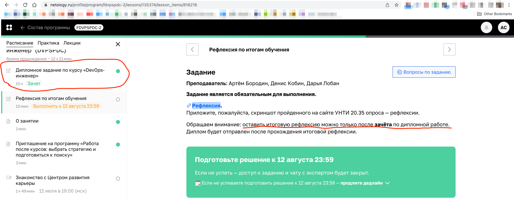
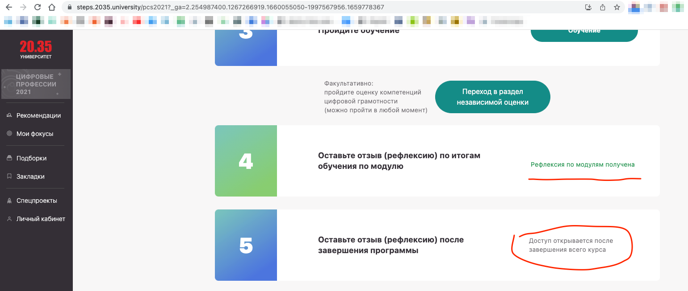
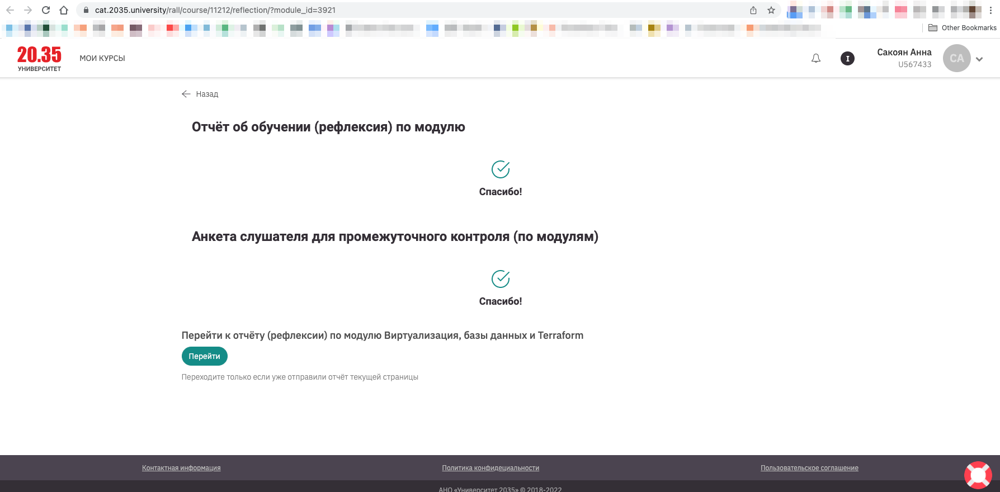
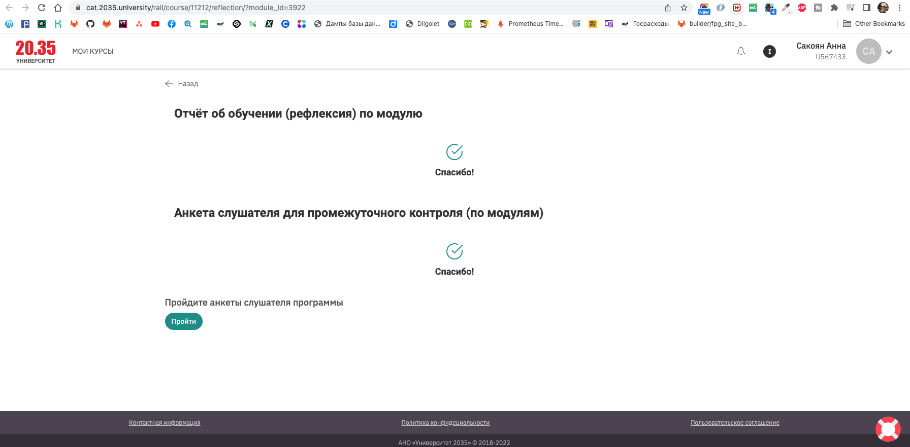

# Рефлексия по итогам обучения

В описании сказано, что выполнение доступно только после зачета по диплому. Зачет есть, 
но рефлексия на сайте УНТИ 2035 доступа к заполнению анкеты нет.

Рефлексия по основным модулям курса заполнена:

Первый модуль:

Второй модуль:

